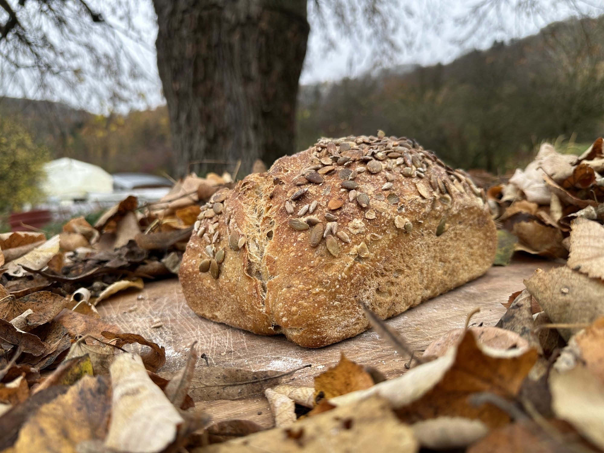
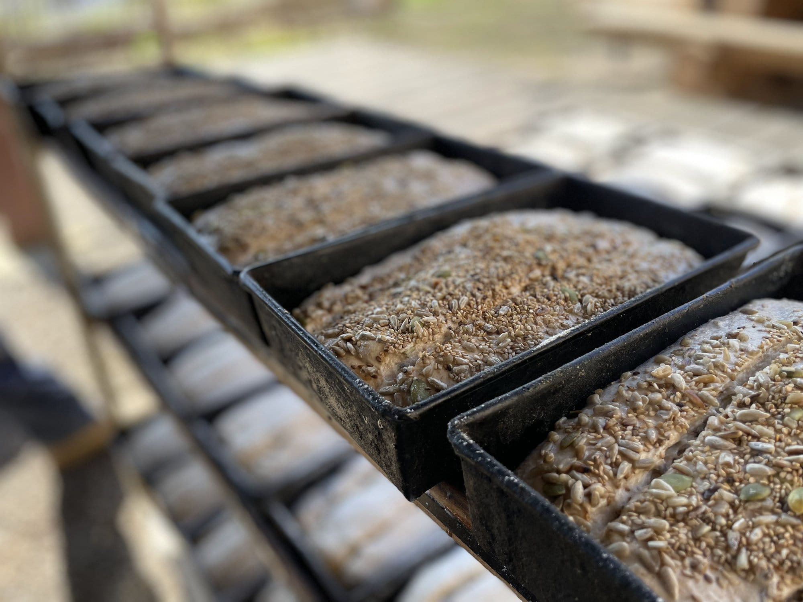

Vous avez toujours rêvé d’être un·e boulanger·e hors pair, qui parcourt le monde entier pour montrer son talent ? Non ? Alors simplement apprendre à confectionner du bon pain ? Oui ? Alors… 🍞

Pour cet atelier, on a du pain sur la planche… Une journée pour découvrir le processus de fabrication du pain dans la boulangerie des 4 Sources, du pétrissage, à l’enfournement en passant par le boulage.

Vous serez immergé dans une journée de boulangerie pour comprendre les processus de fermentation lorsqu’on prépare un pain au levain, les plis et replis, les bonnes recettes, le fonctionnement du four au feu de bois…

Pas de panique, nous serons dans le pétrin pour une bonne partie de la journée,  mais pour vivre un moment collectif et joyeux !

Chacun, chacune repart avec **deux pains** confectionnés par ses soins.

## En pratique

|  |  |  |  |
| --- | --- | --- | --- |
| **Durée** | **Nbre de pers.** | **Prix** | **A prévoir** |
| 9h – 17h | 8 pers. max | 360 € | Tablier(s) |

> 💁 Pour plus d’informations et pour réserver, envoie-nous un e-mail à [contact@les4sources.be](mailto:contact@les4sources.be). **Envie de loger sur place avant ou après l’activité ?** Découvre [nos hébergements](/sejours/hebergements-yvoir)

## D’autres activités à découvrir

