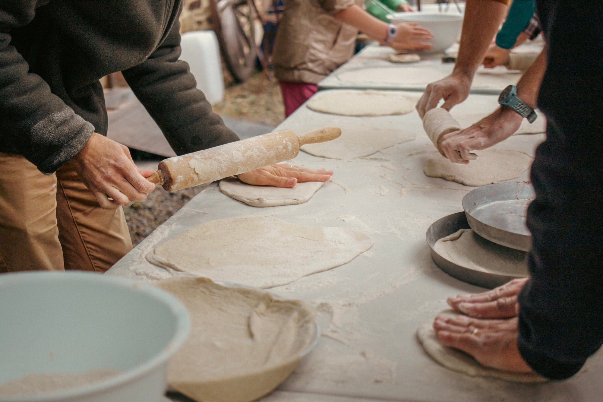

Vous avez toujours rêvé d’être un·e pizzaiolo hors pair, qui parcourt le monde entier pour montrer son talent ? Non ? Alors simplement apprendre à confectionner des vraies bonnes pizzas ? Oui ? Alors…

Des pizzas confectionnées à partir de produits locaux et des envies de chacun·e.

On prend une matinée ou une après-midi pour façonner les pâtons, comprendre comment les pâtes lèvent grâce à l’action du levain, apprendre à gérer le four à bois…

Aux 4 sources, nous travaillons nos pâtes au levain, voici une occasion pour découvrir comment les  processus de fermentation se passent et comment on entretient son levain pour refaire de bonnes pizzas à la maison.

Nous passons ensuite par l’étape de préparation des légumes avec des produits du coin ! Chaque pizza est unique.

Un moment de partage où chacun·e révèle ses talents de pizzaiolo tout en apprenant quelques bons gestes pour des pizzas originales.

## En pratique

|  |  |  |  |  |
| --- | --- | --- | --- | --- |
| **Durée** | **Nbre de pers.** | **Prix** | **A prévoir** | **Conditions** |
| 3h30 | 15 pers. | 210 € + 5€/pers. pour les ingrédients | Tablier | Pas possible les mardis et vendredis |

> 💁 Pour plus d’informations et pour réserver, envoie-nous un e-mail à [contact@les4sources.be](mailto:contact@les4sources.be). **Envie de loger sur place avant ou après l’activité ?** Découvre [nos hébergements](/sejours/hebergements-yvoir)

## D’autres activités à découvrir

