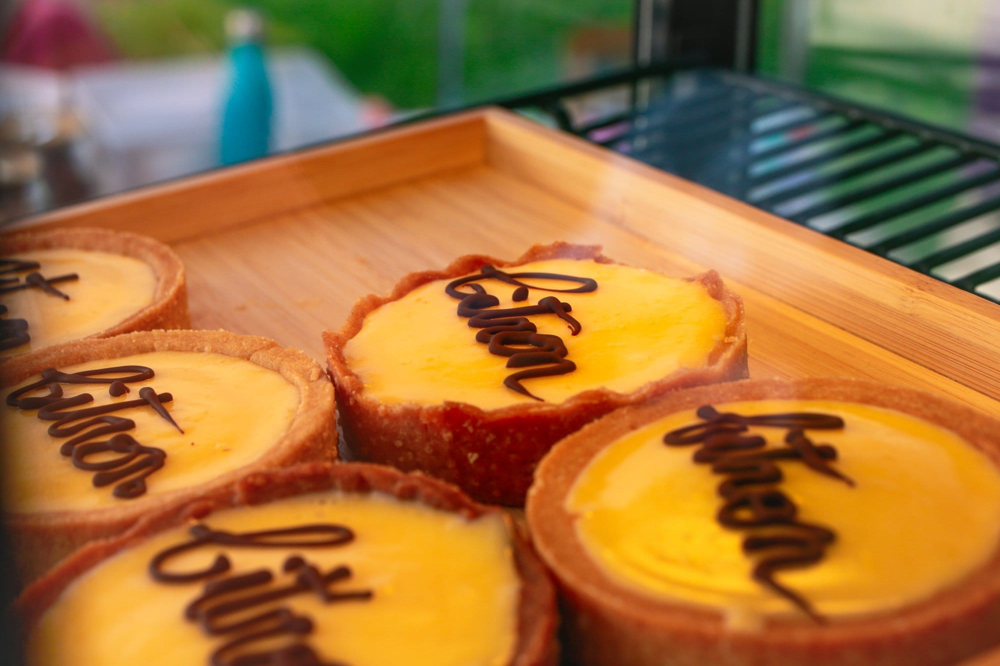

Atelier cuisine

Atelier cuisine

Nous sommes heureux de vous proposer plusieurs ateliers de cuisine autour de douceurs sucrées et salées, réalisées avec des ingrédients locaux, de saison et issus du circuit-court 🍰

Dans une ambiance conviviale et bienveillante, prenez le temps de découvrir, comprendre et créer ensemble des recettes simples, savoureuses et respectueuses de notre environnement. Ces moments sont une invitation à ralentir, à mettre les mains à la pâte et à (re)trouver le plaisir de cuisiner en conscience, en valorisant des produits de qualité et en limitant le gaspillage.

Les confections sont réalisées à partir de matières premières locales, de saison et sans additifs (ni conservateurs, ni colorants chimiques).

## **Atelier Desserts** 🥧

Vous pouvez avoir le choix entre :

- Un crumble aux fruits du moment et sa glace 🍦
- Une croûte aux fruits ou au caramel 🥧
- Un cheesecake speculoos 🥠
- Un gâteau de Savoie à la crème fraiche, macaron et fruits 🥮

|  |  |  |  |
| --- | --- | --- | --- |
| **Durée** | **Nbre de pers.** | **Prix** | **Autres conditions** |
| 2h | 4 à 6 personnes ou 2 à 3 duos parent-enfant | 120€+ 5 € / pers. pour les ingrédients | Les enfants de 6 à 12 ans participent obligatoirement en duo avec un adulte. |

## **Atelier biscuits et petits gâteaux de voyage** 🥠

Confection de 2 à 3 variétés de biscuits – possibilité de recettes sans gluten 🌾

|  |  |  |  |
| --- | --- | --- | --- |
| **Durée** | **Nbre de pers.** | **Prix** | **Autres conditions** |
| 2h | 4 à 10 personnes ou 2 à 4 duos parent-enfant | 120€+ 7.5€/pers. pour les ingrédients | Les enfants de 6 à 12 ans participent obligatoirement en duo avec un adulte. |

## **Atelier biscuits apéro et quiches** 🥮

Confection de biscuits apéritifs au fromage et de quiches (1/2/pers.)

|  |  |  |  |
| --- | --- | --- | --- |
| **Durée** | **Nbre de pers.** | **Prix** | **Autres conditions** |
| 2h | 4 à 6 personnes ou 2 à 3 duos parent-enfant | 120€+ 7.5€/pers. pour les ingrédients | Les enfants de 6 à 12 ans participent obligatoirement en duo avec un adulte. |

> 💁 **Envie de loger sur place avant ou après l’événement ?** Fais-nous part de ta demande à [contact@les4sources.be](mailto:contact@les4sources.be).

> 💁 Pour plus d’informations et pour réserver, envoie-nous un e-mail à [contact@les4sources.be](mailto:contact@les4sources.be). **Envie de loger sur place avant ou après l’activité ?** Découvre [nos hébergements](/sejours/hebergements-yvoir)

## D’autres activités à découvrir

