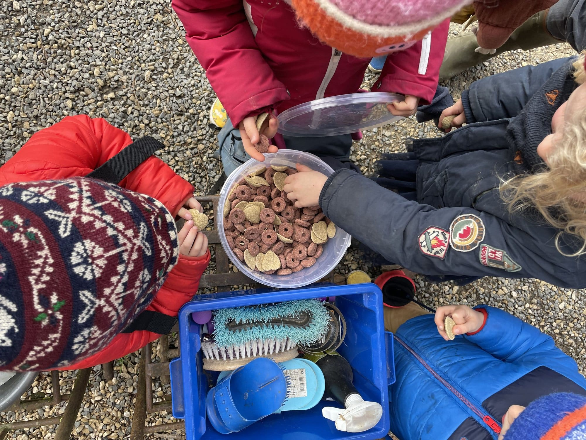

Appréciez la nature environnante en compagnie de nos ânes, un moment agréable et paisible à partager en famille, entre jeunes ou entre amis.

<!-- columns -->
<!-- column width="50%" -->

Vivez une expérience inoubliable en famille ou entre amis avec notre activité de balade avec un âne. Cette promenade vous permettra de vous reconnecter avec la nature tout en profitant de la compagnie de nos ânes doux et amicaux.

Les enfants adoreront interagir avec ces animaux, les brosser et les préparer pour la balade. Les adultes, quant à eux, apprécieront la tranquillité et le rythme paisible qu'offre cette activité. C'est une excellente occasion de passer du temps de qualité ensemble, dans la nature, loin de l'agitation de la vie quotidienne. Préparez-vous à faire le plein de souvenirs avec cette balade unique avec un âne.

<!-- column width="50%" -->

<!-- /columns -->

### En pratique

| Durée | 3 à 15 personnes |
| --- | --- |
| 2 heures | 120 € |
| 3 heures | 180 € |

> 💁 Pour plus d’informations et pour réserver, envoie-nous un e-mail à [contact@les4sources.be](mailto:contact@les4sources.be). **Envie de loger sur place avant ou après l’activité ?** Découvre [nos hébergements](/sejours/hebergements-yvoir)

## D’autres activités à découvrir

