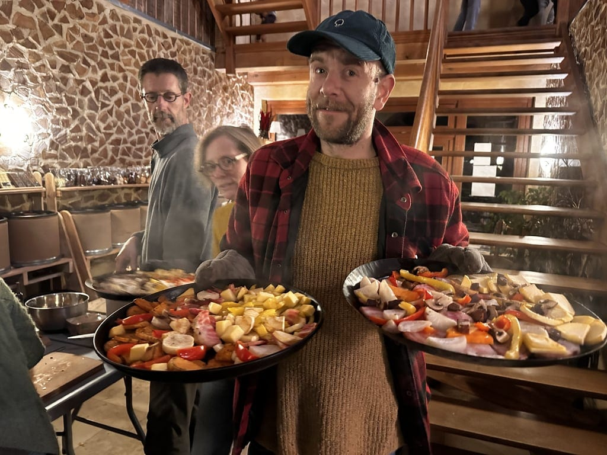
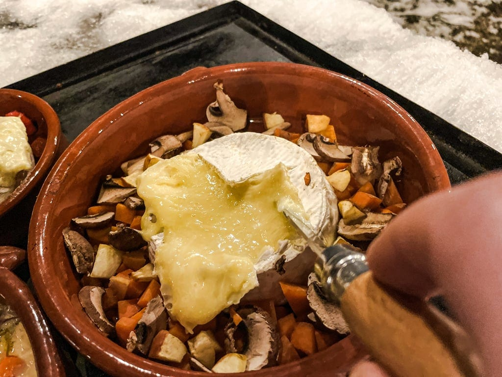

### Vivez un moment convivial, chaleureux et savoureux !

Découvrez cette mini-fondue sur mesure ! Trempez du pain frais dans votre fromage tout juste sorti du four à bois et dégoulinant à point. Agrémentez le tout avec des petits légumes croustillants.

Durant la journée, les boulangères vous auront préparé du pain et ce sont elles qui se chargeront de la cuisson de vos fromages et légumes dans le four à bois professionnel.

Un moment tout particulier dont vous vous souviendrez… On l’espère.

### En pratique

- Min. 10 personnes, excepté les jours de boulangerie (mardi et vendredi)
- **Durée** : les mardis et vendredis, le four est chauffé par la boulangerie. Les mercredis, jeudis, samedis et dimanches, prévoir 3h de votre temps pour lancer et chauffer le four avant l’enfournement 🔥
- Enfournement des fromages et légumes entre 19h à 20h, au moment où le four est encore chaud suite à la cuisson des pains
- À emporter : vos fromages et légumes préférés 🧄

### Tarifs

- 5€/pers pour le pain
- 40€ de forfait pour le four, le bois de chauffe et le matériel mis à disposition

> 💁 Pour plus d’informations et pour réserver, envoie-nous un e-mail à [contact@les4sources.be](mailto:contact@les4sources.be). **Envie de loger sur place avant ou après l’activité ?** Découvre [nos hébergements](/sejours/hebergements-yvoir)

## D’autres activités à découvrir

**Catalogue des activités**

- [🥖Atelier pain au levain](/catalogue/atelier-fabrication-de-pizza-1) — Production et transformation
- [🍕Atelier pizza](/catalogue/atelier-pizza) — Production et transformation
- [🥧Ateliers cuisine (sucré ou salé)](/catalogue/ateliers-cuisine-sucr-ou-sal) — Production et transformation
- [🐎Bain d’ânes](/catalogue/temps-avec-le-troupeau-d-anes) — Bien-être
- [🧀Camembert Party pour groupes](/catalogue/camembert-party) — Production et transformation
- [🖐🏻Chantier participatif](/catalogue/chantier-participatif)
- [🛞Construction d’objets en acier de récup’](/catalogue/cration-de-bijoux-en-matriaux-de-rcup) — Artisanat
- [🌾Construction de mini cabanes en terre-paille](/catalogue/construction-de-mini-cabanes-en-terre-paille) — Nature et environnement, Vie collective, Artisanat
- [🪵Création d’objets en palettes](/catalogue/cration-dobjets-en-palettes) — Artisanat
- [💎Création de bijoux en matériaux de récup’](/catalogue/construction-dobjets-en-acier-de-rcup) — Artisanat, Production et transformation
- [🥧Cuisine d’un repas ou d’un goûter aux plantes sauvages](/catalogue/cuisine-dun-repas-ou-dun-goter-aux-plantes-sauvages) — Production et transformation
- [🍴Echanges sur les 4 Sources autour d’un repas](/catalogue/echanges-sur-les-4-sources-autour-dun-repas) — Artisanat
- [🔥Fabrication d’allume-feux](/catalogue/fabrication-dallume-feux) — Artisanat
- [🌸Fabrication de bombes à graines](/catalogue/fabrication-de-bombes-graines) — Production et transformation
- [🪢Grimpe encadrée dans les arbres](/catalogue/grimpe-encadree-dans-les-arbres) — Nature et environnement
- [💫Initiation à l’astronomie et observation des étoiles](/catalogue/initiation-astronomie-etoiles-yvoir) — Nature et environnement
- [⚡Initiation à la soudure à l’arc](/catalogue/initiation-la-soudure) — Artisanat
- [🤾🏻‍♂️Initiation au Disc-golf](/catalogue/initiation-au-disc-golf) — Bien-être
- [🍄Initiation ou perfectionnement à l’identification de champignons](/catalogue/initiation-champignons-yvoir) — Nature et environnement
- [🍺Introduction à la zythologie](/catalogue/zythologie) — Production et transformation
- [🍕Pizza Party pour groupes](/catalogue/pizza-ou-camembert-party) — Production et transformation
- [🌀Présentation de la gouvernance par cycle](/catalogue/prsentation-de-la-gouvernance-par-cycle)
- [🍃Un tour à la découverte du projet des 4 Sources](/catalogue/decouverte-du-projet-des-4-sources) — Vie collective
- [🦙Visite de la micro-ferme](/catalogue/visite-de-la-micro-ferme) — Nature et environnement
- [🐷Visite de la micro-ferme pour les futurs éleveurs](/catalogue/visite-de-la-micro-ferme-pour-les-futurs-leveurs) — Nature et environnement
