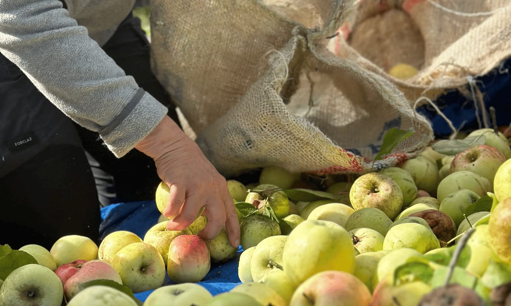

#### Pailler les boxes, placer une clôture, nettoyer le poulailler, réparer et construire, approvisionner, récolter…

Il y a tant de choses à faire aux 4 Sources !

Voici quelques heures ou chacun donne de soi au service du « nous ». Propositions variées, adaptées aux possibilités de chacun, d’actions au service du projet, essentiellement en extérieur. A vivre en groupe, entre amis, en famille, en équipe.

## En pratique

- Durée : 2h à 8h (avec pauses)
- Nombre de participant·es : maximum 20 personnes
- Conditions spéciales : présentez-nous votre groupe à l’avance afin que nous puissions préparer un chantier en adéquation avec vos envies et vos possibilités

> 💁 Pour plus d’informations et pour réserver, envoie-nous un e-mail à [contact@les4sources.be](mailto:contact@les4sources.be). **Envie de loger sur place avant ou après l’activité ?** Découvre [nos hébergements](/sejours/hebergements-yvoir)

## D’autres activités à découvrir

**Catalogue des activités**

- [🥖Atelier pain au levain](/catalogue/atelier-fabrication-de-pizza-1) — Production et transformation
- [🍕Atelier pizza](/catalogue/atelier-pizza) — Production et transformation
- [🥧Ateliers cuisine (sucré ou salé)](/catalogue/ateliers-cuisine-sucr-ou-sal) — Production et transformation
- [🐎Bain d’ânes](/catalogue/temps-avec-le-troupeau-d-anes) — Bien-être
- [🧀Camembert Party pour groupes](/catalogue/camembert-party) — Production et transformation
- [🖐🏻Chantier participatif](/catalogue/chantier-participatif)
- [🛞Construction d’objets en acier de récup’](/catalogue/cration-de-bijoux-en-matriaux-de-rcup) — Artisanat
- [🌾Construction de mini cabanes en terre-paille](/catalogue/construction-de-mini-cabanes-en-terre-paille) — Nature et environnement, Vie collective, Artisanat
- [🪵Création d’objets en palettes](/catalogue/cration-dobjets-en-palettes) — Artisanat
- [💎Création de bijoux en matériaux de récup’](/catalogue/construction-dobjets-en-acier-de-rcup) — Artisanat, Production et transformation
- [🥧Cuisine d’un repas ou d’un goûter aux plantes sauvages](/catalogue/cuisine-dun-repas-ou-dun-goter-aux-plantes-sauvages) — Production et transformation
- [🍴Echanges sur les 4 Sources autour d’un repas](/catalogue/echanges-sur-les-4-sources-autour-dun-repas) — Artisanat
- [🔥Fabrication d’allume-feux](/catalogue/fabrication-dallume-feux) — Artisanat
- [🌸Fabrication de bombes à graines](/catalogue/fabrication-de-bombes-graines) — Production et transformation
- [🪢Grimpe encadrée dans les arbres](/catalogue/grimpe-encadree-dans-les-arbres) — Nature et environnement
- [💫Initiation à l’astronomie et observation des étoiles](/catalogue/initiation-astronomie-etoiles-yvoir) — Nature et environnement
- [⚡Initiation à la soudure à l’arc](/catalogue/initiation-la-soudure) — Artisanat
- [🤾🏻‍♂️Initiation au Disc-golf](/catalogue/initiation-au-disc-golf) — Bien-être
- [🍄Initiation ou perfectionnement à l’identification de champignons](/catalogue/initiation-champignons-yvoir) — Nature et environnement
- [🍺Introduction à la zythologie](/catalogue/zythologie) — Production et transformation
- [🍕Pizza Party pour groupes](/catalogue/pizza-ou-camembert-party) — Production et transformation
- [🌀Présentation de la gouvernance par cycle](/catalogue/prsentation-de-la-gouvernance-par-cycle)
- [🍃Un tour à la découverte du projet des 4 Sources](/catalogue/decouverte-du-projet-des-4-sources) — Vie collective
- [🦙Visite de la micro-ferme](/catalogue/visite-de-la-micro-ferme) — Nature et environnement
- [🐷Visite de la micro-ferme pour les futurs éleveurs](/catalogue/visite-de-la-micro-ferme-pour-les-futurs-leveurs) — Nature et environnement
