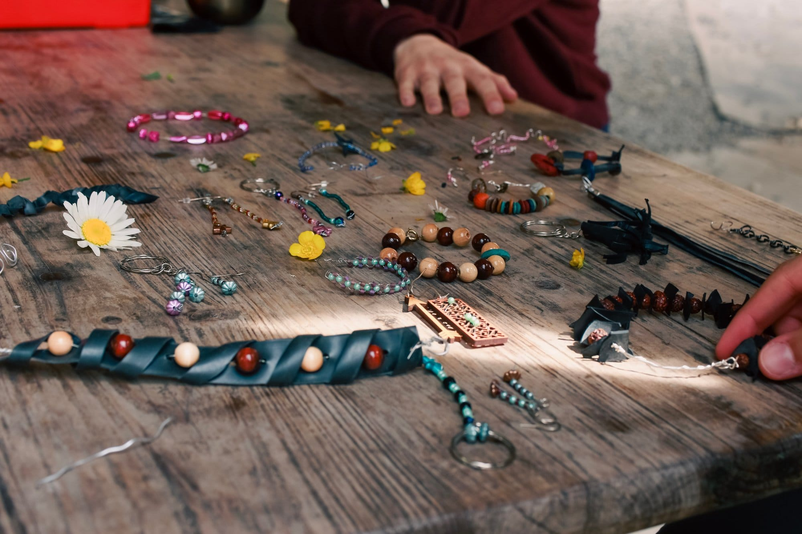
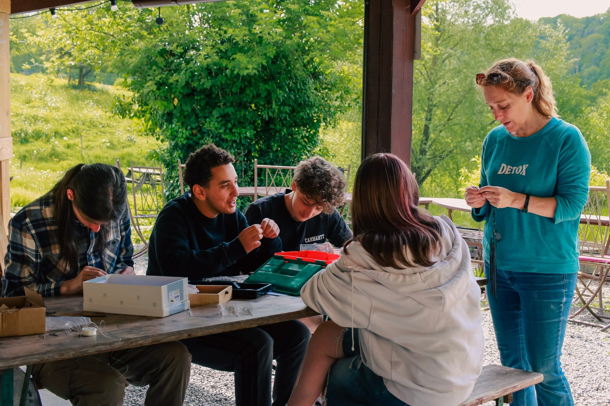

### Transformez des objets du quotidien en bijoux uniques et durables.

Venez découvrir l'art de transformer des matériaux de récupération en bijoux uniques !

Cet atelier vous permettra de donner une seconde vie à des objets du quotidien tout en laissant libre cours à votre créativité.

Aucune expérience préalable nécessaire, juste l'envie de créer et de s'amuser !

Nous fournissons tous les matériaux et outils nécessaires. C'est une excellente occasion d'apprendre de nouvelles compétences et de repartir avec un bijou unique que vous avez créé vous-même.

## En pratique

- Durée : 3h
- Maximum 10 personnes | âge minimum : 8 ans
- La durée de cet atelier peut s’adapter en fonction de votre disponibilité et/ou votre budget
- 180 € pour l’atelier

> 💁 Pour plus d’informations et pour réserver, envoie-nous un e-mail à [contact@les4sources.be](mailto:contact@les4sources.be). **Envie de loger sur place avant ou après l’activité ?** Découvre [nos hébergements](/sejours/hebergements-yvoir)

## D’autres activités à découvrir

