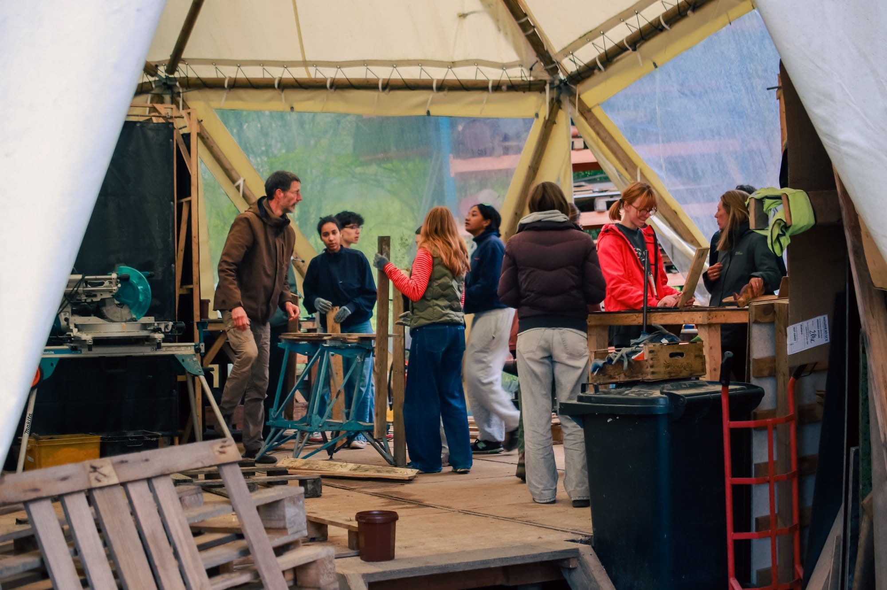
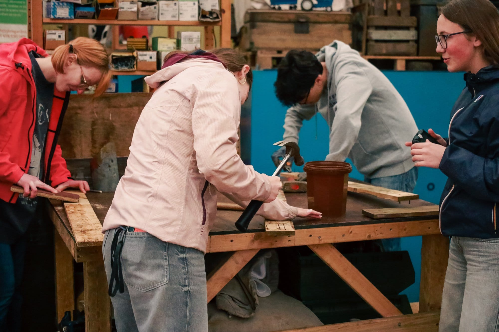

### Réalisez un objet sur mesure et venez vous faire la main !

Construction réalisée à partir de matériaux de récup’, notre artisan-designer Olivier sera là pour vous accompagner des techniques de démontage de palettes jusqu’à la réalisation de l’objet de votre choix. Tout est possible : jouet, petit mobilier, siège, déco de tables, nichoirs, porte-manteaux ou tout autre objet de la vie quotidienne !

Avec cet atelier, développez vos compétences avec ou sans pré-requis, partagez ensemble vos expériences et développez votre créativité !

### En pratique

- Durée : 3h
- Maximum 10 personnes | âge minimum : 8 ans
- A prévoir : chaussures fermées et vêtements pouvant être salis
- Prix : 180€

> 💁 Pour plus d’informations et pour réserver, envoie-nous un e-mail à [contact@les4sources.be](mailto:contact@les4sources.be). **Envie de loger sur place avant ou après l’activité ?** Découvre [nos hébergements](/sejours/hebergements-yvoir)

## D’autres activités à découvrir

