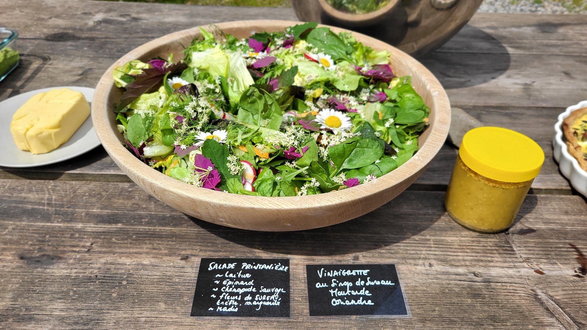
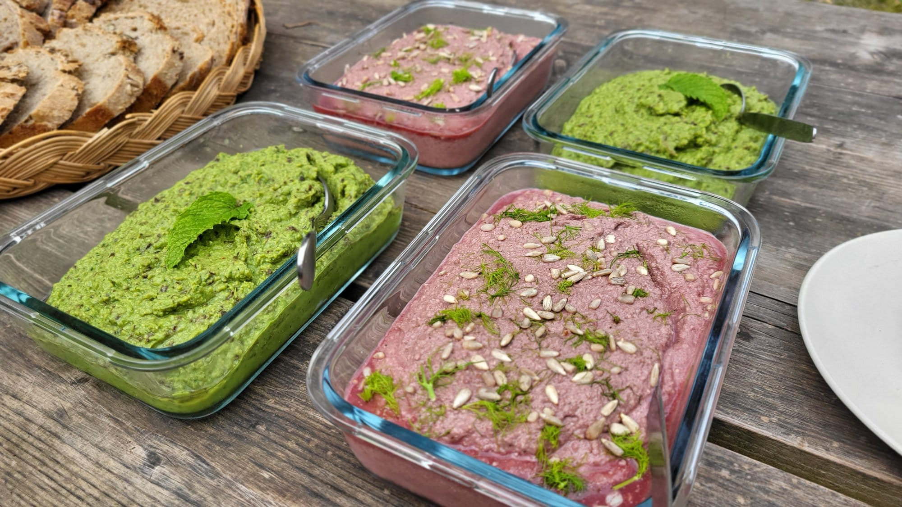
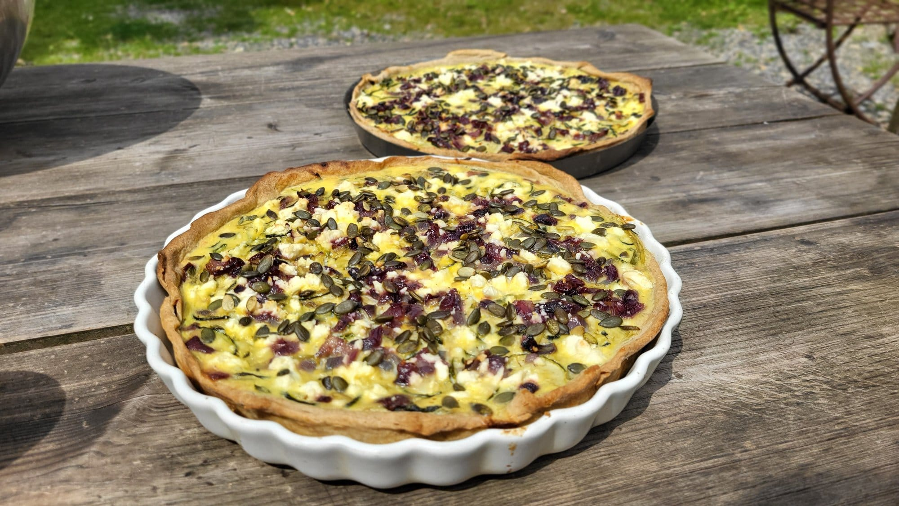

### Activité de saison : mi-avril à septembre (saison des plantes sauvages) 🌿

#### Vivez une expérience culinaire unique et enrichissante en cuisinant un repas ou un goûter avec des plantes sauvages récoltées le jour-même.

Cuisinez un repas ou un goûter en utilisant des plantes sauvages et apprenez à les reconnaître et à les utiliser. C'est une excellente occasion de passer du temps en plein air, d'apprendre de nouvelles compétences et de savourer des plats délicieux et sains. Cet atelier est parfait pour les groupes de jeunes, les associations et les familles qui cherchent une activité à la fois éducative et ludique.

En plus de la cuisine, cet atelier offre également une occasion unique d'éducation environnementale. Vous aurez l'opportunité de comprendre l'importance de la biodiversité locale et comment la nature peut fournir une alimentation saine et diversifiée. Vous apprendrez quels types de plantes sont comestibles, comment en identifier quelques-unes et où les trouver.

Dans une ambiance conviviale et détendue, vous pourrez également partager vos expériences, discuter de vos découvertes et poser toutes vos questions à notre animateur.ice expert.e en plantes sauvages. À la fin de l'atelier, vous repartirez non seulement avec des recettes originales à base de plantes sauvages, mais aussi avec une meilleure connaissance et appréciation de la nature qui nous entoure.

Cet atelier est organisé en collaboration avec [Empreintes ASBL](https://www.empreintes.be/).

### En pratique

- Atelier réalisable **d’avril à septembre** (= saison des plantes sauvages 🌿)
- Durée : 3h
- Maximum 12 personnes (et âge minimum 12 ans)
- Prévoir des vêtements adaptés à l’extérieur
- Tarif : 180 € + 5€/pers pour les consommables

> 💁 Pour plus d’informations et pour réserver, envoie-nous un e-mail à [contact@les4sources.be](mailto:contact@les4sources.be). **Envie de loger sur place avant ou après l’activité ?** Découvre [nos hébergements](/sejours/hebergements-yvoir)

## D’autres activités à découvrir

