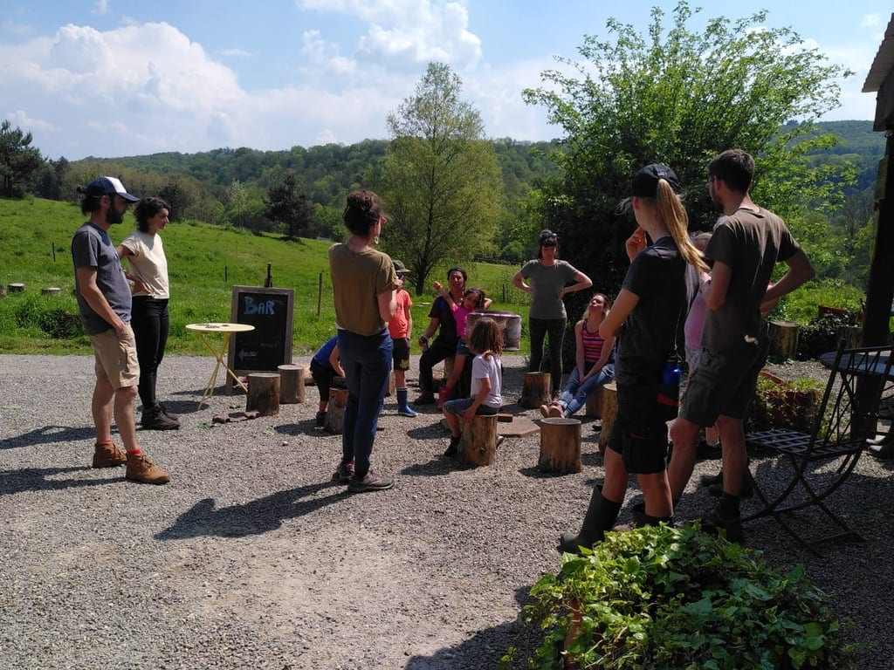

#### Plonge au cœur de ce projet collectif !

Découvre son histoire, sa raison d’être, ses valeurs et sa façon de s’incarner concrètement à Yvoir aujourd’hui. Perçois toutes ses facettes, son évolution et la manière dont il se déploie aujourd’hui.

Un moment riche en partages et transmissions, qui permet d’apercevoir un peu plus les coulisses d’un projet comme celui-ci.

<!-- columns -->
<!-- column width="50%" -->

> *Merci du fond du cœur. Magnifique projet, source de beaucoup d’espoir, de paix intérieure, d’ouverture.*

> *J’ai envie de croire que le monde peut rester beau, humain!*

<!-- column width="50%" -->

> *Un endroit où il fait bon vivre. Authentique.*

> *Nous essayons de créer notre vie, mais c’est pas facile tous les jours. Merci à vous, merci de nous inspirer.*
<!-- /columns -->

### En pratique

- Durée : 2h
- Nombre de personnes : maximum 30 personnnes
- A prévoir : des vêtements pour l’extérieur
- Tarif : 120€

> 💁 Pour plus d’informations et pour réserver, envoie-nous un e-mail à [contact@les4sources.be](mailto:contact@les4sources.be). **Envie de loger sur place avant ou après l’activité ?** Découvre [nos hébergements](/sejours/hebergements-yvoir)

## D’autres activités à découvrir

**Catalogue des activités**

- [🥖Atelier pain au levain](/catalogue/atelier-fabrication-de-pizza-1) — Production et transformation
- [🍕Atelier pizza](/catalogue/atelier-pizza) — Production et transformation
- [🥧Ateliers cuisine (sucré ou salé)](/catalogue/ateliers-cuisine-sucr-ou-sal) — Production et transformation
- [🐎Bain d’ânes](/catalogue/temps-avec-le-troupeau-d-anes) — Bien-être
- [🧀Camembert Party pour groupes](/catalogue/camembert-party) — Production et transformation
- [🖐🏻Chantier participatif](/catalogue/chantier-participatif)
- [🛞Construction d’objets en acier de récup’](/catalogue/cration-de-bijoux-en-matriaux-de-rcup) — Artisanat
- [🌾Construction de mini cabanes en terre-paille](/catalogue/construction-de-mini-cabanes-en-terre-paille) — Nature et environnement, Vie collective, Artisanat
- [🪵Création d’objets en palettes](/catalogue/cration-dobjets-en-palettes) — Artisanat
- [💎Création de bijoux en matériaux de récup’](/catalogue/construction-dobjets-en-acier-de-rcup) — Artisanat, Production et transformation
- [🥧Cuisine d’un repas ou d’un goûter aux plantes sauvages](/catalogue/cuisine-dun-repas-ou-dun-goter-aux-plantes-sauvages) — Production et transformation
- [🍴Echanges sur les 4 Sources autour d’un repas](/catalogue/echanges-sur-les-4-sources-autour-dun-repas) — Artisanat
- [🔥Fabrication d’allume-feux](/catalogue/fabrication-dallume-feux) — Artisanat
- [🌸Fabrication de bombes à graines](/catalogue/fabrication-de-bombes-graines) — Production et transformation
- [🪢Grimpe encadrée dans les arbres](/catalogue/grimpe-encadree-dans-les-arbres) — Nature et environnement
- [💫Initiation à l’astronomie et observation des étoiles](/catalogue/initiation-astronomie-etoiles-yvoir) — Nature et environnement
- [⚡Initiation à la soudure à l’arc](/catalogue/initiation-la-soudure) — Artisanat
- [🤾🏻‍♂️Initiation au Disc-golf](/catalogue/initiation-au-disc-golf) — Bien-être
- [🍄Initiation ou perfectionnement à l’identification de champignons](/catalogue/initiation-champignons-yvoir) — Nature et environnement
- [🍺Introduction à la zythologie](/catalogue/zythologie) — Production et transformation
- [🍕Pizza Party pour groupes](/catalogue/pizza-ou-camembert-party) — Production et transformation
- [🌀Présentation de la gouvernance par cycle](/catalogue/prsentation-de-la-gouvernance-par-cycle)
- [🍃Un tour à la découverte du projet des 4 Sources](/catalogue/decouverte-du-projet-des-4-sources) — Vie collective
- [🦙Visite de la micro-ferme](/catalogue/visite-de-la-micro-ferme) — Nature et environnement
- [🐷Visite de la micro-ferme pour les futurs éleveurs](/catalogue/visite-de-la-micro-ferme-pour-les-futurs-leveurs) — Nature et environnement
