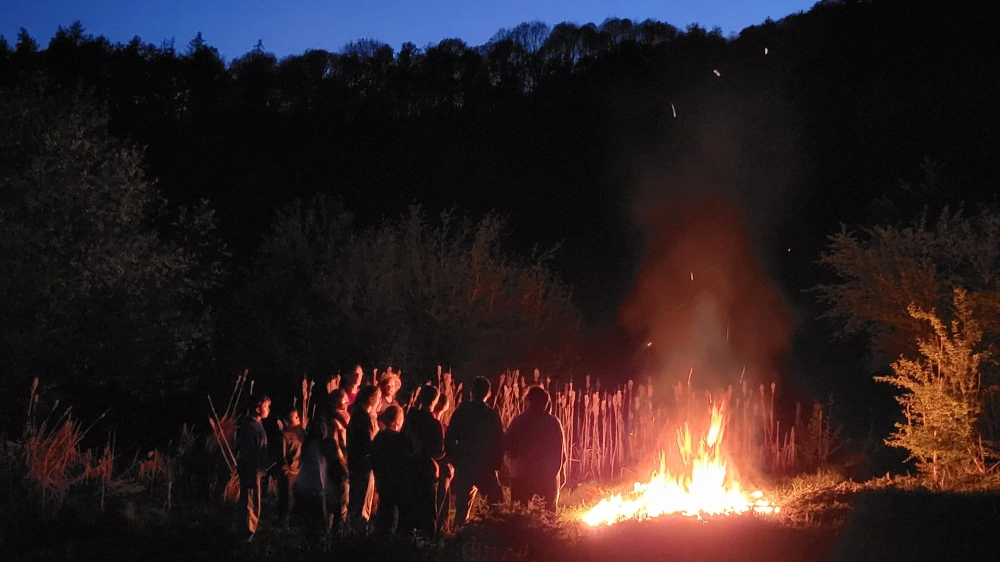

### Lors de votre visite aux 4 sources venez vous ambiancer autour d’une activité courte mais ludique : fabriquez des allume-feux !

Vous repartez avec ces petites boules de cire et de copeaux de bois qui sont vos alliées de choix pour allumer votre feu, votre cuisinière à bois, votre barbecue, avec l’aisance d’un Robinson.

Ce sera également l’occasion de tester les réchauds et cuisinières à bois low-tech fabriquées aux 4 Sources.

## En pratique

- Durée : 1h30
- Nombre de participant·es : 1 à 20 personnes
- A prévoir : vêtements pour bricoler et pour être à l’extérieur Si vous avez des vieilles bougies, amenez-les ! 🕯️
- Prix : 90€

> 💁 Pour plus d’informations et pour réserver, envoie-nous un e-mail à [contact@les4sources.be](mailto:contact@les4sources.be). **Envie de loger sur place avant ou après l’activité ?** Découvre [nos hébergements](/sejours/hebergements-yvoir)

## D’autres activités à découvrir

