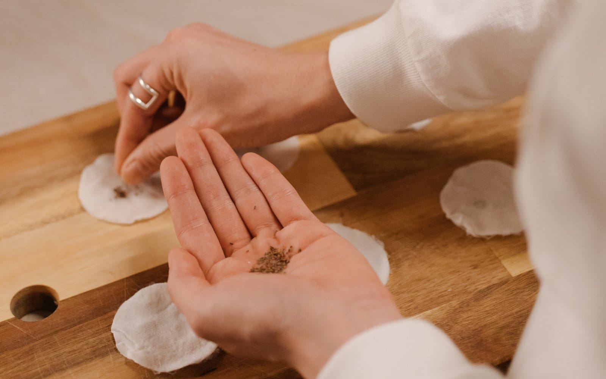

### Activité de saison : printemps, été, automne 🌻

#### Lors de votre visite aux 4 sources, venez vous ambiancer autour d’une activité courte mais ludique : fabriquer des bombes à graines !

Vous repartirez avec ces petites boules d’argile, de terre et de graines. Lancées dans une friche, un terrain vague, un endroit abandonné de la ville, elles sèment la nature et la joie dans les endroits délaissés.

### En pratique

- Durée : 1h30
- Maximum 20 personnes
- Prévoir des vêtements adaptés à l’extérieur
- Tarif : 90€

> 💁 Pour plus d’informations et pour réserver, envoie-nous un e-mail à [contact@les4sources.be](mailto:contact@les4sources.be). **Envie de loger sur place avant ou après l’activité ?** Découvre [nos hébergements](/sejours/hebergements-yvoir)

## D’autres activités à découvrir

