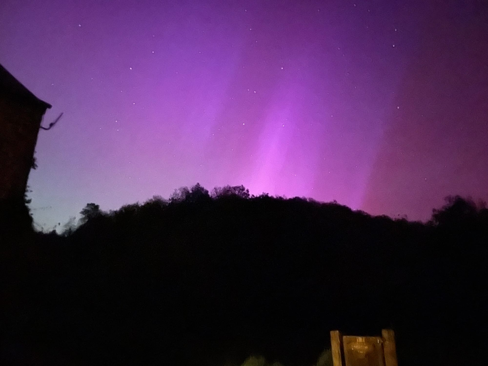
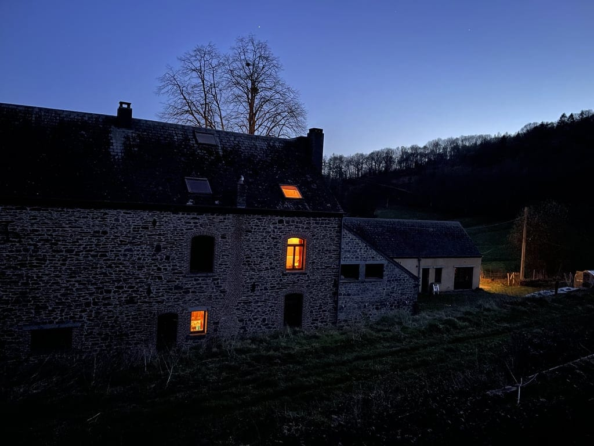

### Découvrez les merveilles de l'univers et approfondissez vos connaissances en astronomie lors de notre atelier d'observation des étoiles.

<!-- columns -->
<!-- column width="62.5%" -->

Apprenez à identifier les constellations, à comprendre les phases de la lune ou à découvrir les secrets des étoiles. Que vous soyez des amateur·ices d'astronomie en herbe ou des passionné·es du ciel étoilé, cet atelier est une excellente occasion de se rassembler et d'apprendre ensemble.

<!-- column width="37.5%" -->

> *”C’est incroyable de découvrir toutes les facettes de notre univers! Merci pour tout cet apport théorique et pratique!”*
<!-- /columns -->

En toute saison en Belgique, un ciel dégagé n'est jamais garanti.

Notez que les risques de ciel nébuleux sont plus grands en hiver qu'en été. Cependant, si le ciel est plus souvent dégagé en été, la nuit tombe également plus tard à cette période et se fait moins noire pendant toute une période allant environ de fin mai à mi-juillet. Bien qu'il soit toujours possible d'observer le ciel et ses astres à cette période, sachez que le soleil se couchera fort tard et que nous ne verrons les étoiles que bien après qu'il soit couché et en moins grand nombre (car il n'y a pas ce que les astronomes appellent le crépuscule astronomique). Ce n'est donc pas une période idéale pour l'observation.

Il redevient intéressant d'observer les étoiles dès la fin juillet - début août (retour du crépuscule astronomique), avec une date particulièrement intéressante vers la mi-août avec la nuit des étoiles filantes. A partir de là, les nuits redeviennent plus longues, plus sombres et tombent plus tôt.

- **de la ⁠fin d'automne jusqu’au début du printemps :** risque de ciel couvert plus grand
- **de ⁠fin mai à mi-juillet :** la nuit arrive plus tard et la nuit complète (crépuscule astronomique) n'arrive jamais : l'observation ne commencera pas avant 22h30 - 23h30 selon la date
- **mi-août :** nuit des étoiles filantes ! 💫 grand nombre d'étoiles filantes observables, soirée idéale

### En pratique

- Durée : 3h
- Nombre de participant·es : 2 à 8 personnes
- A prévoir : vêtements adaptés à l’extérieur
- Tarif : 180 € + 22.5€ / pers. jusqu’à 20 pers.

> 💁 En cas de ciel couvert, l'animation consistera en une présentation théorique qui peut être suivie de la marche du système solaire : une exploration à l'échelle depuis notre Soleil jusqu'à la lointaine Neptune, avec un arrêt à chaque planète pour la présenter.

#### À quelle période ?

En toute saison en Belgique, un ciel dégagé n'est jamais garanti.

Notez que les risques de ciel nébuleux sont plus grands en hiver qu'en été. Cependant, si le ciel est plus souvent dégagé en été, la nuit tombe également plus tard à cette période et se fait moins noire pendant toute une période allant environ de fin mai à mi-juillet. Bien qu'il soit toujours possible d'observer le ciel et ses astres à cette période, sachez que le soleil se couchera fort tard et que nous ne verrons les étoiles que bien après qu'il soit couché et en moins grand nombre (car il n'y a pas ce que les astronomes appellent le crépuscule astronomique). Ce n'est donc pas une période idéale pour l'observation.

Il redevient intéressant d'observer les étoiles dès la fin juillet - début août (retour du crépuscule astronomique), avec une date particulièrement intéressante vers la mi-août avec la nuit des étoiles filantes. A partir de là, les nuits redeviennent plus longues, plus sombres et tombent plus tôt.

- **de la ⁠fin d'automne jusqu’au début du printemps :** risque de ciel couvert plus grand
- **de ⁠fin mai à mi-juillet :** la nuit arrive plus tard et la nuit complète (crépuscule astronomique) n'arrive jamais : l'observation ne commencera pas avant 22h30 - 23h30 selon la date
- **⁠mi-août :** nuit des étoiles filantes ! 💫 Grand nombre d'étoiles filantes observables, soirée idéale

| **Durée de l’activité** | **2 à 8 personnes** | **Entre 8 et 20 personnes** |
| --- | --- | --- |
| 2h | 120€ | \+ 15€/personne |
| 3h | 180€ | \+ 22,5€/personne |
| 4h | 240€ | \+ 30€/personne |

Photo : l’aurore boréale de la Pizza Party du 11 mai 2024 à 0h57

> 💁 Pour plus d’informations et pour réserver, envoie-nous un e-mail à [contact@les4sources.be](mailto:contact@les4sources.be). **Envie de loger sur place avant ou après l’activité ?** Découvre [nos hébergements](/sejours/hebergements-yvoir)

## D’autres activités à découvrir

**Catalogue des activités**

- [🥖Atelier pain au levain](/catalogue/atelier-fabrication-de-pizza-1) — Production et transformation
- [🍕Atelier pizza](/catalogue/atelier-pizza) — Production et transformation
- [🥧Ateliers cuisine (sucré ou salé)](/catalogue/ateliers-cuisine-sucr-ou-sal) — Production et transformation
- [🐎Bain d’ânes](/catalogue/temps-avec-le-troupeau-d-anes) — Bien-être
- [🧀Camembert Party pour groupes](/catalogue/camembert-party) — Production et transformation
- [🖐🏻Chantier participatif](/catalogue/chantier-participatif)
- [🛞Construction d’objets en acier de récup’](/catalogue/cration-de-bijoux-en-matriaux-de-rcup) — Artisanat
- [🌾Construction de mini cabanes en terre-paille](/catalogue/construction-de-mini-cabanes-en-terre-paille) — Nature et environnement, Vie collective, Artisanat
- [🪵Création d’objets en palettes](/catalogue/cration-dobjets-en-palettes) — Artisanat
- [💎Création de bijoux en matériaux de récup’](/catalogue/construction-dobjets-en-acier-de-rcup) — Artisanat, Production et transformation
- [🥧Cuisine d’un repas ou d’un goûter aux plantes sauvages](/catalogue/cuisine-dun-repas-ou-dun-goter-aux-plantes-sauvages) — Production et transformation
- [🍴Echanges sur les 4 Sources autour d’un repas](/catalogue/echanges-sur-les-4-sources-autour-dun-repas) — Artisanat
- [🔥Fabrication d’allume-feux](/catalogue/fabrication-dallume-feux) — Artisanat
- [🌸Fabrication de bombes à graines](/catalogue/fabrication-de-bombes-graines) — Production et transformation
- [🪢Grimpe encadrée dans les arbres](/catalogue/grimpe-encadree-dans-les-arbres) — Nature et environnement
- [💫Initiation à l’astronomie et observation des étoiles](/catalogue/initiation-astronomie-etoiles-yvoir) — Nature et environnement
- [⚡Initiation à la soudure à l’arc](/catalogue/initiation-la-soudure) — Artisanat
- [🤾🏻‍♂️Initiation au Disc-golf](/catalogue/initiation-au-disc-golf) — Bien-être
- [🍄Initiation ou perfectionnement à l’identification de champignons](/catalogue/initiation-champignons-yvoir) — Nature et environnement
- [🍺Introduction à la zythologie](/catalogue/zythologie) — Production et transformation
- [🍕Pizza Party pour groupes](/catalogue/pizza-ou-camembert-party) — Production et transformation
- [🌀Présentation de la gouvernance par cycle](/catalogue/prsentation-de-la-gouvernance-par-cycle)
- [🍃Un tour à la découverte du projet des 4 Sources](/catalogue/decouverte-du-projet-des-4-sources) — Vie collective
- [🦙Visite de la micro-ferme](/catalogue/visite-de-la-micro-ferme) — Nature et environnement
- [🐷Visite de la micro-ferme pour les futurs éleveurs](/catalogue/visite-de-la-micro-ferme-pour-les-futurs-leveurs) — Nature et environnement
