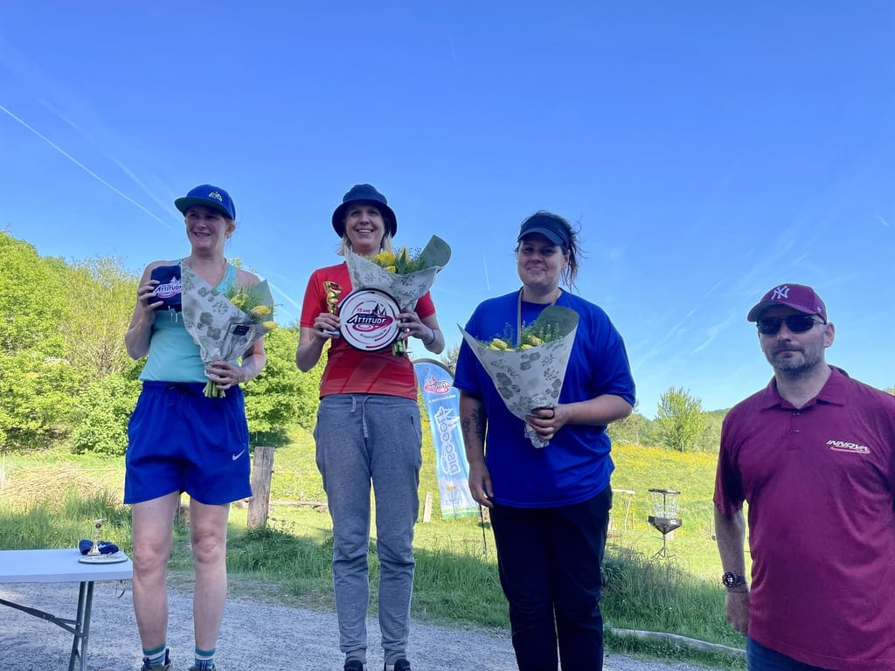
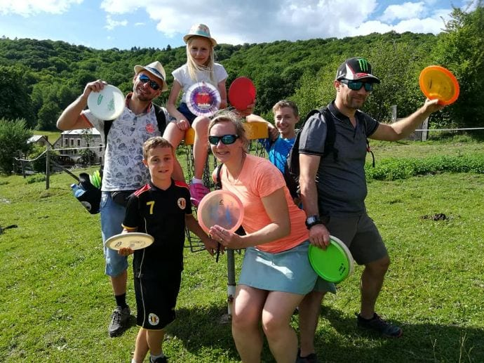

#### Découvrez le disc-golf, un jeu passionnant qui combine la précision du golf et l'esprit du frisbee, et partagez un moment inoubliable entre amis, collègues ou en famille dans un cadre naturel et convivial !

Initiez-vous au disc-golf, une activité ludique et sportive qui saura rassembler les jeunes, les collègues, les groupes d'amis, les associations et les familles ! Dans un cadre convivial et naturel, venez découvrir ce jeu qui combine la précision du golf et l'esprit du frisbee. Que vous soyez novices ou joueur.euses aguerri.es, ce moment de partage et de compétition amicale vous promet des souvenirs inoubliables. Alors n'hésitez plus, rejoignez-nous pour une initiation !

Après une brève introduction aux règles du disc-golf, vous serez prêt.es à vous lancer dans l'aventure. À travers un parcours unique en son genre, vous devrez faire preuve de stratégie et de précision pour lancer votre disque et atteindre les cibles. Chaque cible est une nouvelle occasion de se surpasser et de s'amuser ensemble. Quel que soit votre niveau, l'important est de participer et de profiter de l'expérience.

### En pratique

| **Durée de l’activité** | **Entre 5 et 15 personnes** | A prévoir |
| --- | --- | --- |
| 2h30 | 16€/personne | vêtements confortables (pour l’extérieur) |

> 💁 Pour plus d’informations et pour réserver, envoie-nous un e-mail à [contact@les4sources.be](mailto:contact@les4sources.be). **Envie de loger sur place avant ou après l’activité ?** Découvre [nos hébergements](/sejours/hebergements-yvoir)

## D’autres activités à découvrir

**Catalogue des activités**

- [🥖Atelier pain au levain](/catalogue/atelier-fabrication-de-pizza-1) — Production et transformation
- [🍕Atelier pizza](/catalogue/atelier-pizza) — Production et transformation
- [🥧Ateliers cuisine (sucré ou salé)](/catalogue/ateliers-cuisine-sucr-ou-sal) — Production et transformation
- [🐎Bain d’ânes](/catalogue/temps-avec-le-troupeau-d-anes) — Bien-être
- [🧀Camembert Party pour groupes](/catalogue/camembert-party) — Production et transformation
- [🖐🏻Chantier participatif](/catalogue/chantier-participatif)
- [🛞Construction d’objets en acier de récup’](/catalogue/cration-de-bijoux-en-matriaux-de-rcup) — Artisanat
- [🌾Construction de mini cabanes en terre-paille](/catalogue/construction-de-mini-cabanes-en-terre-paille) — Nature et environnement, Vie collective, Artisanat
- [🪵Création d’objets en palettes](/catalogue/cration-dobjets-en-palettes) — Artisanat
- [💎Création de bijoux en matériaux de récup’](/catalogue/construction-dobjets-en-acier-de-rcup) — Artisanat, Production et transformation
- [🥧Cuisine d’un repas ou d’un goûter aux plantes sauvages](/catalogue/cuisine-dun-repas-ou-dun-goter-aux-plantes-sauvages) — Production et transformation
- [🍴Echanges sur les 4 Sources autour d’un repas](/catalogue/echanges-sur-les-4-sources-autour-dun-repas) — Artisanat
- [🔥Fabrication d’allume-feux](/catalogue/fabrication-dallume-feux) — Artisanat
- [🌸Fabrication de bombes à graines](/catalogue/fabrication-de-bombes-graines) — Production et transformation
- [🪢Grimpe encadrée dans les arbres](/catalogue/grimpe-encadree-dans-les-arbres) — Nature et environnement
- [💫Initiation à l’astronomie et observation des étoiles](/catalogue/initiation-astronomie-etoiles-yvoir) — Nature et environnement
- [⚡Initiation à la soudure à l’arc](/catalogue/initiation-la-soudure) — Artisanat
- [🤾🏻‍♂️Initiation au Disc-golf](/catalogue/initiation-au-disc-golf) — Bien-être
- [🍄Initiation ou perfectionnement à l’identification de champignons](/catalogue/initiation-champignons-yvoir) — Nature et environnement
- [🍺Introduction à la zythologie](/catalogue/zythologie) — Production et transformation
- [🍕Pizza Party pour groupes](/catalogue/pizza-ou-camembert-party) — Production et transformation
- [🌀Présentation de la gouvernance par cycle](/catalogue/prsentation-de-la-gouvernance-par-cycle)
- [🍃Un tour à la découverte du projet des 4 Sources](/catalogue/decouverte-du-projet-des-4-sources) — Vie collective
- [🦙Visite de la micro-ferme](/catalogue/visite-de-la-micro-ferme) — Nature et environnement
- [🐷Visite de la micro-ferme pour les futurs éleveurs](/catalogue/visite-de-la-micro-ferme-pour-les-futurs-leveurs) — Nature et environnement
