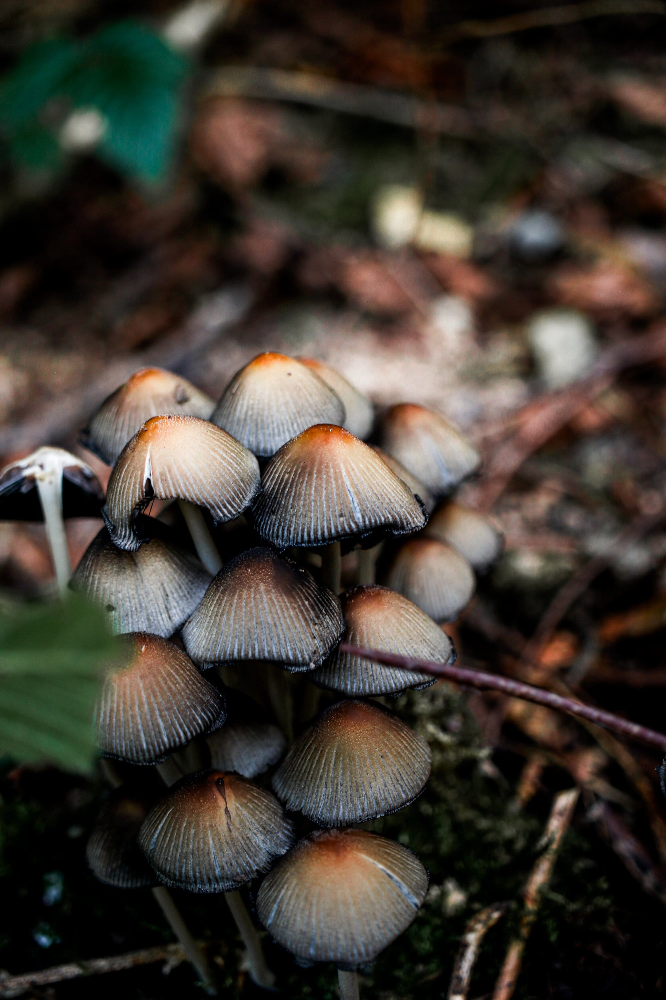
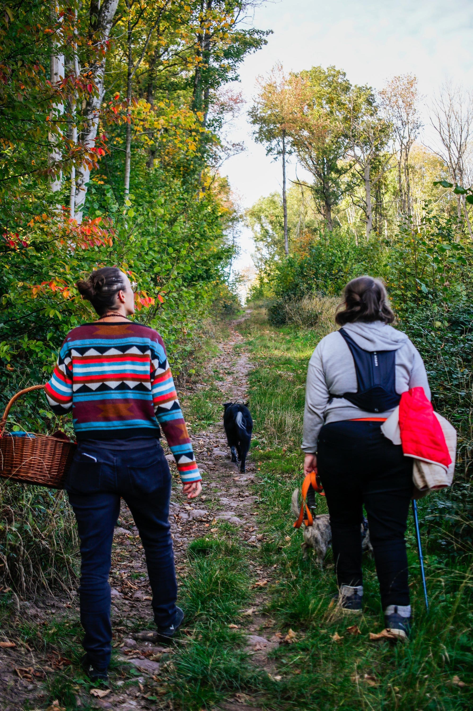

## Activité de saison : automne 🍂

### Cet atelier automnal est conçu pour vous familiariser avec le monde fascinant des champignons.

Vous découvrirez quelques champignons lors d’une balade, apprendrez à reconnaître les caractéristiques clés qui vous aideront à les identifier et comprendrez leur rôle essentiel dans l'écosystème. Que vous soyez des novices complet.es ou que vous ayez déjà une certaine expérience en mycologie, cet événement est une excellente occasion d'approfondir vos connaissances et vos compétences.

Nous commencerons par une introduction générale sur les champignons, suivie d'une session pratique d'identification en forêt pour mettre en pratique ce que nous aurons appris.

### En pratique

- Durée : 3h
- Nombre de participant-es : 2 à 8 personnes
- Vêtements adaptés à la saison, et en extérieur
- Prix : 180 € au total + 22.5€ / pers. jusqu’à 16 pers.

> 💁 Pour plus d’informations et pour réserver, envoie-nous un e-mail à [contact@les4sources.be](mailto:contact@les4sources.be). **Envie de loger sur place avant ou après l’activité ?** Découvre [nos hébergements](/sejours/hebergements-yvoir)

## D’autres activités à découvrir

