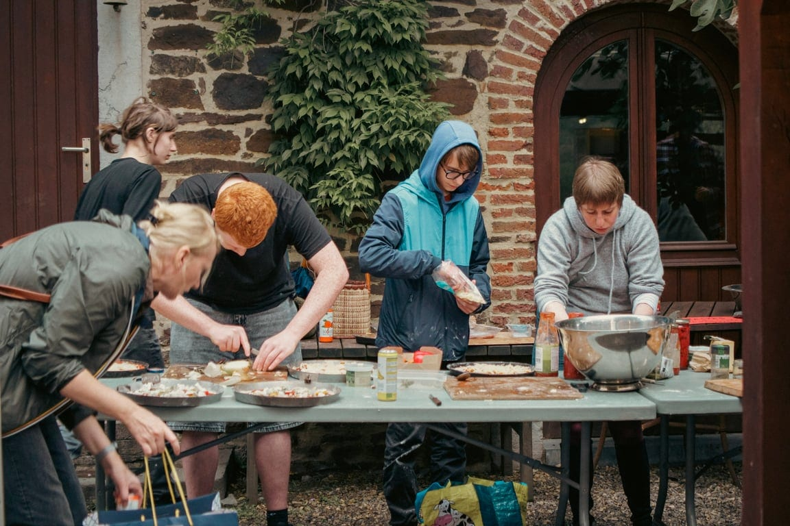
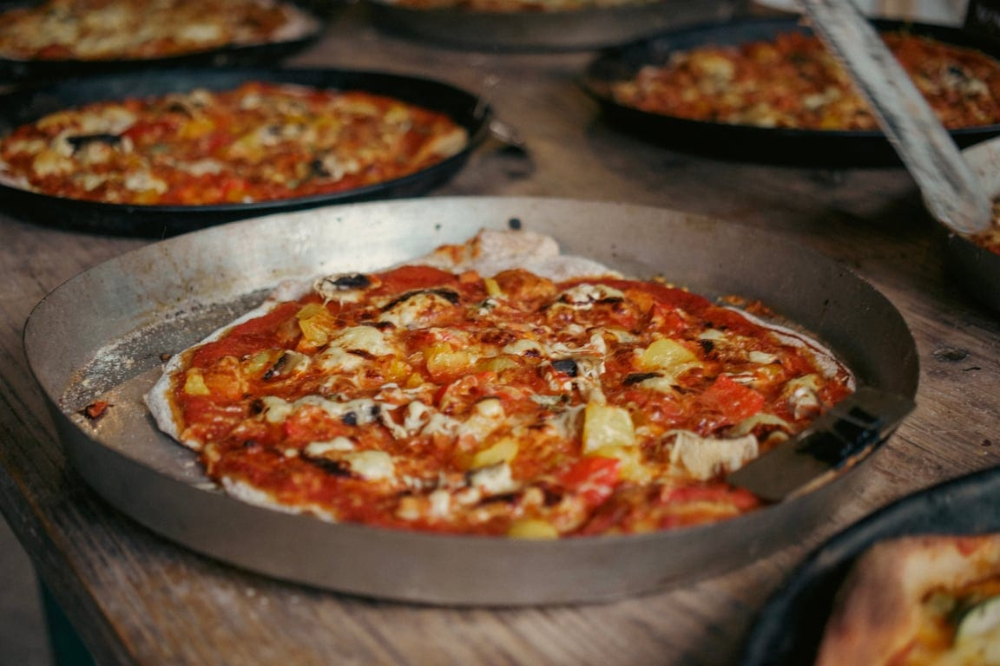
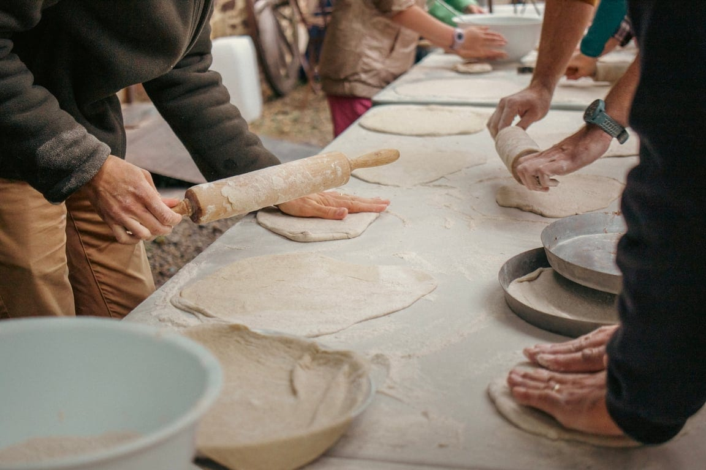

### Rien de tel qu’une Pizza Party pour souder ton groupe autour d’un délicieux repas ! 😋

Un moment convivial où chacun·e met la main à la pâte.

Les boulangères te concoctent des pâtons au levain et mettent à ta disposition tout le matériel de cuisson 🔥 Tu amènes de quoi garnir la pâte et profites d’une cuisson au feu de bois dans le four professionnel des boulangères.

Tu gères le feu et la cuisson du four, te permettant d’enfourner 30 pizzas à la fois ! De quoi te régaler et permettre à chacun·e de partager ses talents culinaires !

Que la meilleure pizza … soit dégustée comme il se doit ! 🍕

### En pratique

- De **8 à 80 personnes**
- En soirée, **le mardi et le vendredi** : les jours de boulangerie, quand le four est déjà chaud et l’équipe présente. Quelques autres dates sont ouvertes en plus ; le calendrier de réservation dit lesquelles.
- Demande ta date **au moins 10 jours à l’avance** : l’équipe a besoin de ce délai pour te répondre et préparer la pâte.
- Tu amènes tous tes ingrédients pour garnir tes pâtes à pizzas : passata, légumes, fromages…

### Tarifs

- Forfait de 40€ pour la préparation, le bois, l’utilisation du matériel et la mise en place
- 5€/pâton

> 💁 Pour réserver, fais ta demande sur [la page Pizza Party privée de Tranches de Vie](https://tranchesdevie.les4sources.be/pizza-party-privee) : choisis ta date, la boulangerie te répond par e-mail et tu règles quelques jours avant la party. **Envie de loger sur place avant ou après l’activité ?** Découvre [nos hébergements](/sejours/hebergements-yvoir)

## D’autres activités à découvrir

