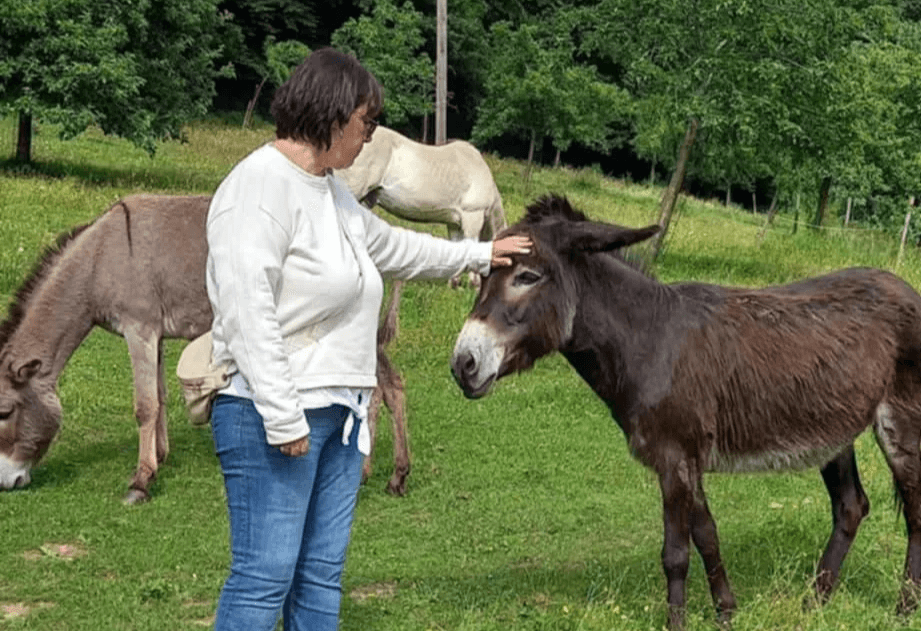
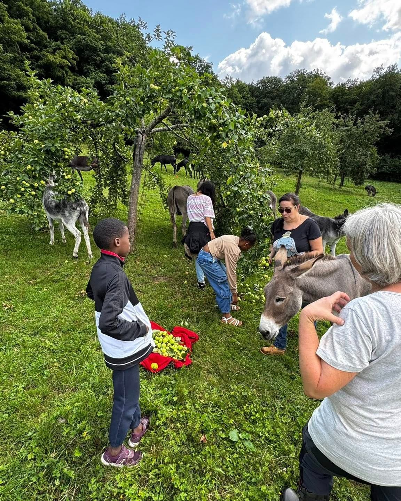

### Vivez une expérience unique et apaisante en parfaite harmonie avec la nature et notre troupeau de 24 ânes !

Venez passer un moment inoubliable en compagnie de notre troupeau d’ânes. Cette activité s'adresse à tous : groupes d'ami.es, familles, groupes de jeunes, associations et collègues. C'est une occasion unique de se ressourcer et de profiter des bienfaits apportés par la présence de ces animaux doux et affectueux.

Au contact des ânes, vous pourrez vous détendre et vous déconnecter du stress quotidien. Les ânes sont des animaux très apaisants, connus pour leur douceur et leur patience. Leur simple présence a un effet calmant et thérapeutique.

Que vous veniez entre amis pour partager une expérience différente, en famille pour une sortie ludique et éducative, ou en groupe de travail pour un team building original, cette activité vous offrira un moment de détente et de bien-être. Venez faire le plein de sérénité en compagnie de notre troupeau d'ânes.

### En pratique

- Durée : 2h
- Nombre de personnes : maximum 12 personnes | ⚠️ présence de minimum 1 adulte pour 2 enfants de moins de 6 ans
- A prévoir : bottes ou bottines fermées 👢 | vêtements adaptés pour l’extérieur
- Tarif : 120€

> 💁 Pour plus d’informations et pour réserver, envoie-nous un e-mail à [contact@les4sources.be](mailto:contact@les4sources.be). **Envie de loger sur place avant ou après l’activité ?** Découvre [nos hébergements](/sejours/hebergements-yvoir)

## D’autres activités à découvrir

