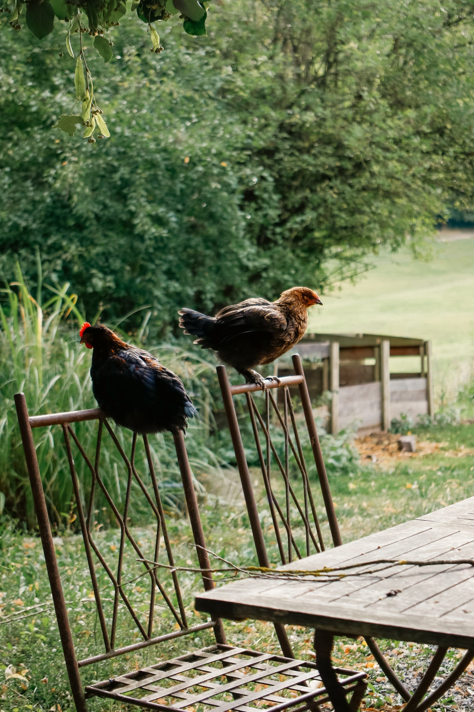
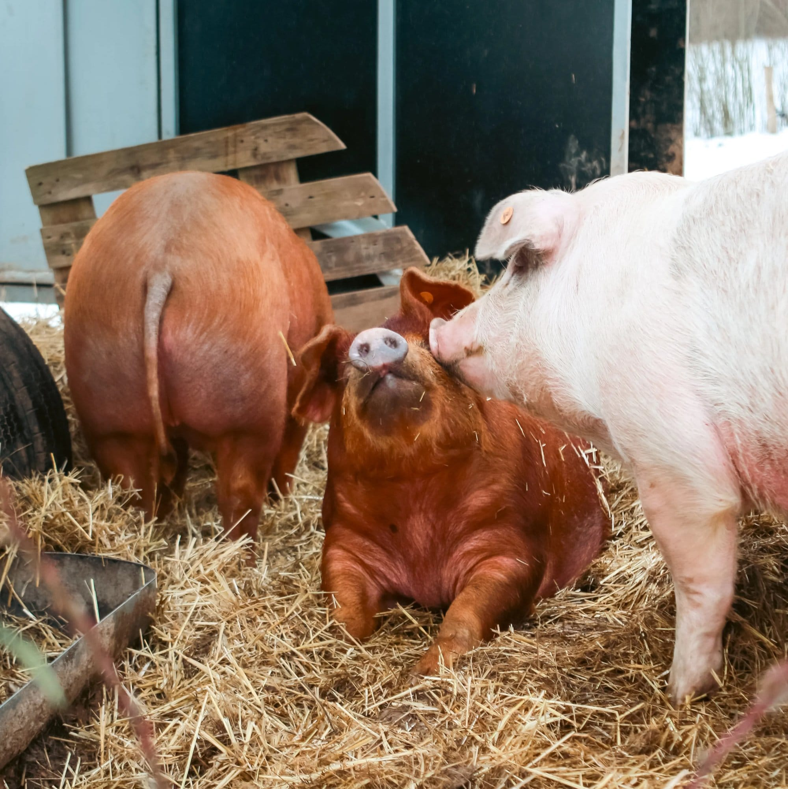

### Ici, pas question de formation professionnalisante, mais un échange entre éleveur avec au centre la passion et l’expérimentation.

<!-- columns -->
<!-- column width="50%" -->

<!-- column width="50%" -->

Embarquez pour une visite des différents espaces d’élevage.

Bavardage sur les besoins des animaux, leurs comportements, leur bien-être, les abris, les enclos, le temps à consacrer, les normes, le matériel, les impacts sur la biodiversité et toutes les questions que vous vous posez, vous qui avez l’idée d’accueillir des poules ou des cochons, pour votre propre consommation d’œufs ou de chair.
<!-- /columns -->

## En pratique :

- Durée : 3h
- Nombre de participant·es : 1 à 10 personnes
- A prévoir : bottes ou bottines fermées | vêtements d’extérieur pouvant être salis
- **Conditions spéciales** : PAS de chiens, même tenus en laisse. Réserver minimum 2 semaines à l’avance
- Prix : 180€

> 💁 Pour plus d’informations et pour réserver, envoie-nous un e-mail à [contact@les4sources.be](mailto:contact@les4sources.be). **Envie de loger sur place avant ou après l’activité ?** Découvre [nos hébergements](/sejours/hebergements-yvoir)

## D’autres activités à découvrir

