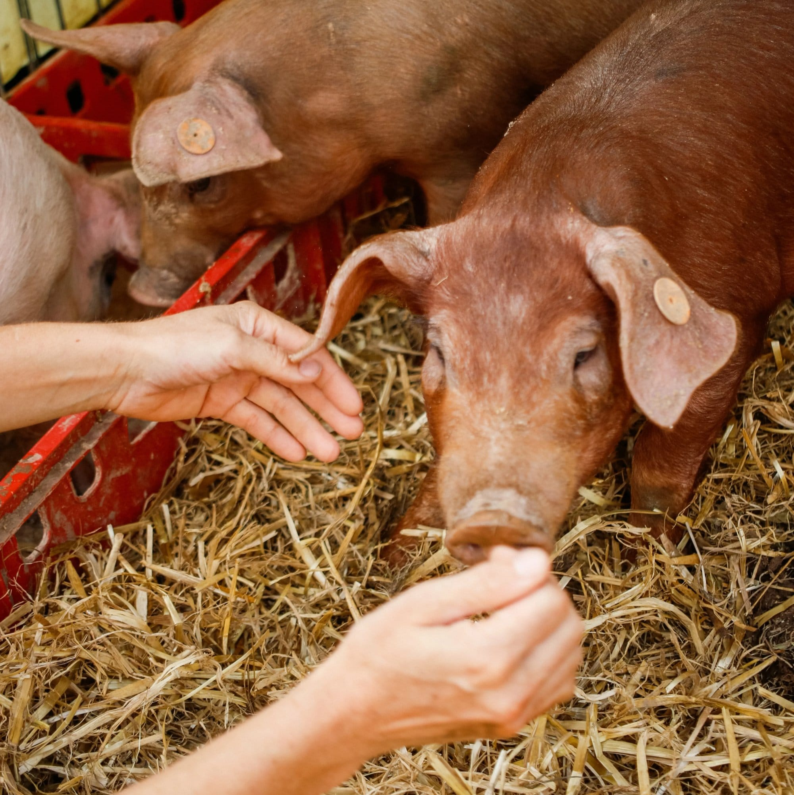
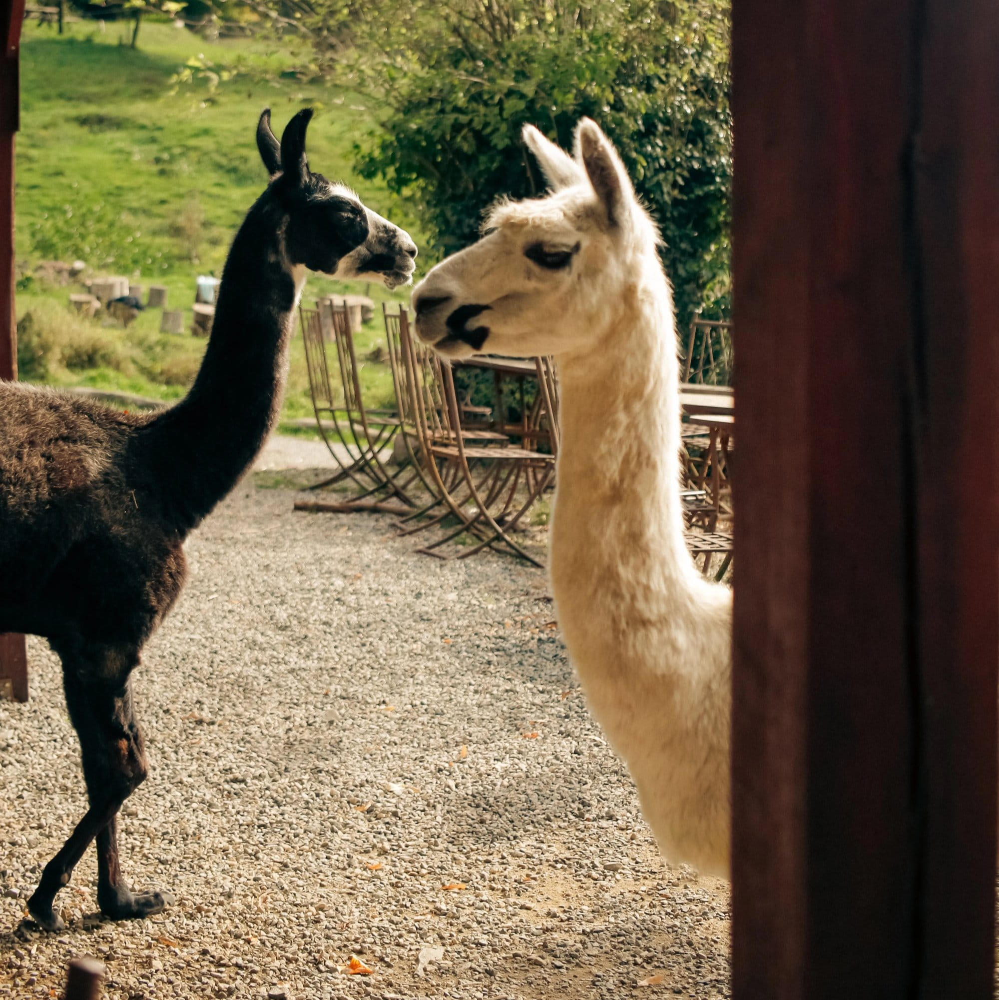
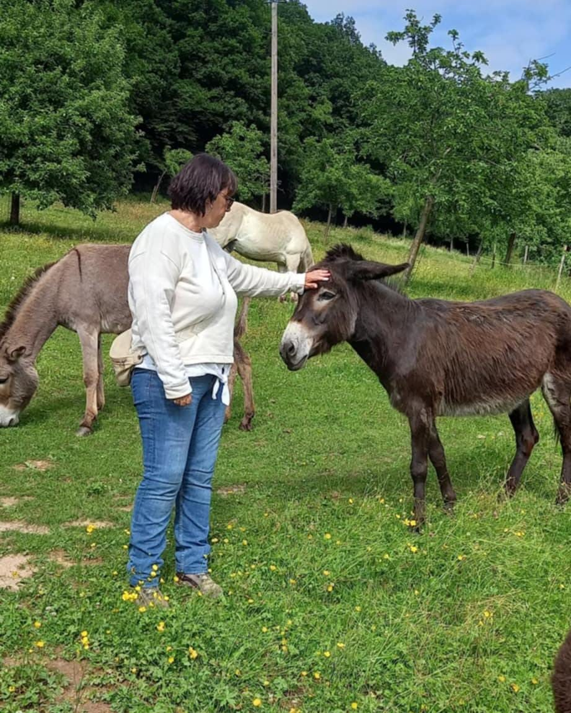
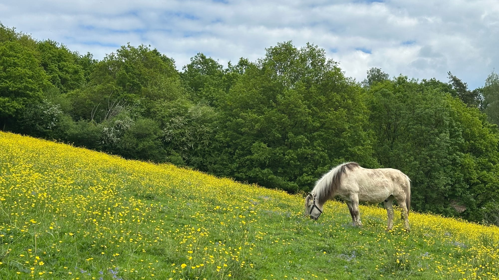

### Venez à la rencontre des animaux de ferme des 4 Sources.

<!-- columns -->
<!-- column width="50%" -->

<!-- column width="50%" -->

**Qui sera ton meilleur ami aujourd'hui ?**

Préparez-vous à craquer. Sérieusement.

Dans les prairies des 4 Sources, une bande de personnages hauts en couleur vous attendent, et ils ont déjà hâte de faire votre connaissance (ou peut-être ont-ils d’autres choses en tête comme de la géopolitique?)

**Les cochons ? Des stars.** Ils le savent, et ils assument. Plutôt sociables, ils rappliquent en trottinant, le groin en avant, prêts à renifler chaussures, mains, et probablement un sandwich dans un sac. Attachants, expressifs, et franchement irrésistibles. 🐷

**Les poules ? Des divas.** Elles font semblant de ne pas vous voir, mais elles viennent quand même. Écoutez leur petit caquetage permanent, elles ont toujours quelque chose à raconter, même si personne ne sait exactement quoi. 🐔

**Les lamas ? Des princes.** Grand, majestueux, légèrement condescendant… et pourtant tellement fascinant. Quand un lama accepte de se laisser caresser, c'est un privilège. 🦙 Parfois, ils font barrage routier, sur le chemin qui mène aux 4 Sources, mais ne procèdent pas au test du ballon.

**Les ânes ? Les meilleurs.** Oreilles géantes, regard tendre, poil doux comme un canapé. L'âne est philosophe : il prend la vie comme elle vient, et il nous rappelle que nous aussi, on pourrait se détendre un peu. Poser sa main sur son encolure et se laisser convaincre.

Une promenade à travers les prairies des 4 Sources, c'est la garantie de rentrer chez soi avec le sourire, plein de poils (et de plumes ? étrange) sur les vêtements, et l'envie secrète d'adopter tout le monde.
<!-- /columns -->

## En pratique :

- Durée : 2h
- Nombre de participant·es : 1 à 20 personnes
- A prévoir : bottes ou bottines fermées | vêtements d’extérieur pouvant être salis
- Conditions spéciales : PAS de chiens, même tenus en laisse. Petits enfants accompagnés d’un adulte chacun
- Prix : 120€

> 💁 Pour plus d’informations et pour réserver, envoie-nous un e-mail à [contact@les4sources.be](mailto:contact@les4sources.be). **Envie de loger sur place avant ou après l’activité ?** Découvre [nos hébergements](/sejours/hebergements-yvoir)

## D’autres activités à découvrir

