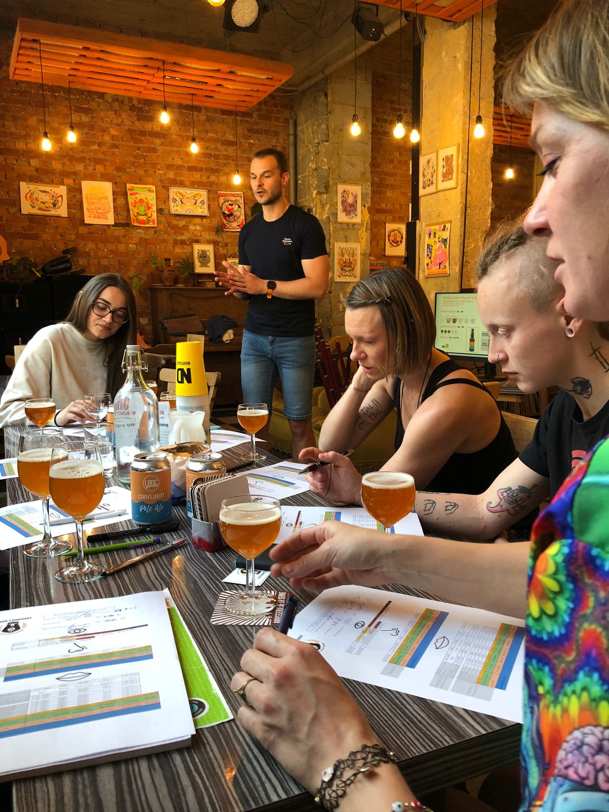
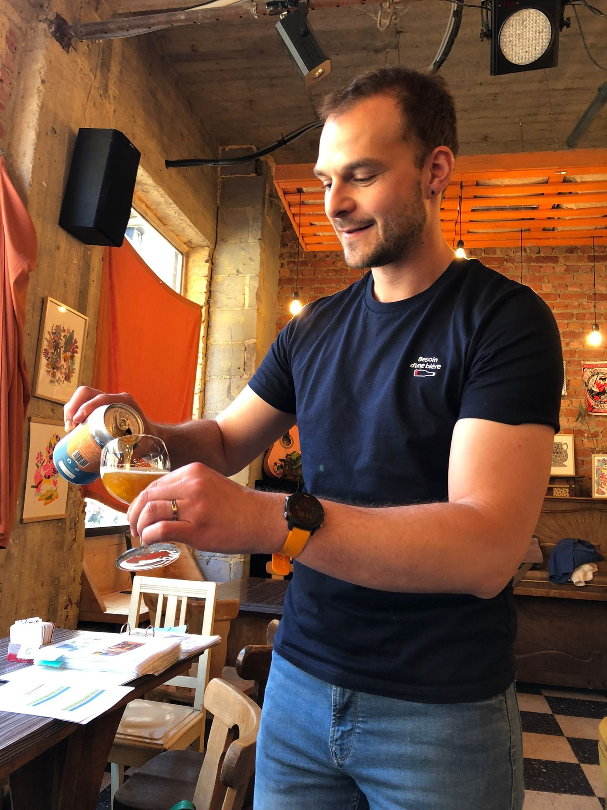

### **Avez-vous déjà entendu parler de la zythologie ?**

Il s’agit de l’art de déguster une bière afin d’en découvrir les moindres arômes, saveurs et, encore mieux, l’associer avec un bon repas. Si vous êtes un·e grand·e (ou petit·e) amateur·ice de bières, cette activité est faite pour vous.

À expérimenter en famille ou entre ami·e·s, bien évidemment 🍻

Pas besoin de connaissance préalable, juste l’envie de découvrir, d’ouvrir ses sens et de passer un moment convivial. Ah oui, et de la curiosité pour ce breuvage 😊

Il vous arrive de vous sentir perdu·e au milieu d’un rayon ou magasin de bières ? C’est vrai qu’entre des indications comme EBC, IBU, dry-hopping ou des termes comme IPA, NEIPA, gose, gueuze, barriqué, il y a de quoi perdre la tête. Pour déchiffrer un peu tout cela, quoi de mieux que de suivre une initiation à la zythologie, l’art de déguster la bière ?

Entre amis, membres de la famille ou seule·e avec vous-même, vous y apprendrez les ingrédients de base d’une bière, leur influence sur ce liquide parfois amer, parfois acide, parfois sucré et parfois les trois ! Le tout, encadré par un zythologue et cervalobelophile passionné, Nicolas de The Beer Linguist.

Aux 4 Sources, Nico de Beer Linguist se fera un plaisir d'animer vos événements en famille, entre amis ou avec vos collègues, accompagné de sa collection atypique : celle des étiquettes de bière. 🏷️Il déchiffre avec vous les drôles d'inscriptions que peuvent afficher certaines bouteilles, comme NEIPA, Gose, Lambiek, Weissbier ou encore Imperial Milk Sout (si, si, ça existe !).

🤔 Le Beer Linguist aime tellement partager sa passion qu'il n'a pas peur des défis et se pliera même à des styles (alcoolisés ou non) que vous proposerez.

Bref, vous parlerez bière, dégusterez bière, apprendrez bière, le tout dans une ambiance bon enfant. Que demander de plus ? 🍺

## En pratique

- Durée : 2h
- Nombre de participant**·**es : maximum 25 personnes
- Tarif : 120 € au total + 7€/pers.

> 💁 Pour plus d’informations et pour réserver, envoie-nous un e-mail à [contact@les4sources.be](mailto:contact@les4sources.be). **Envie de loger sur place avant ou après l’activité ?** Découvre [nos hébergements](/sejours/hebergements-yvoir)

## D’autres activités à découvrir

