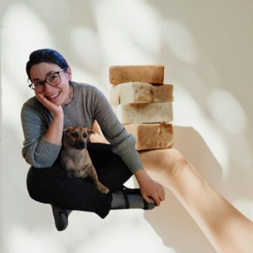

<!-- columns -->
<!-- column width="50%" -->

**Emilie** est avant tout la maman de Flint, petit chien très sympathique mais très bruyant, mais aussi de Oka, grand bébé chien dynamique et silencieuse. Si Flint est présent aux 4 Sources, vous ne pourrez donc pas la louper, à moins d’être complètement sourd.

Emilie est aussi la créatrice de Snoap, la marque de savons que vous retrouverez bientôt dans tous les bons magasins, d’Anvers à Marseille - détrônant ainsi le célèbre savon de la ville. En attendant, les savons sont disponibles à la boutique !

Enfin, aux 4 Sources, Emilie est aux mains de la communication. C’est elle qui met en lumière les événements et la vie sur le lieu, notamment sur ces chers réseaux sociaux.

**[Snoap.be](https://snoap.be)**

Pour contacter Emilie : [communication@les4sources.be](mailto:comm@les4sources.be)

<!-- column width="50%" -->

<!-- /columns -->
