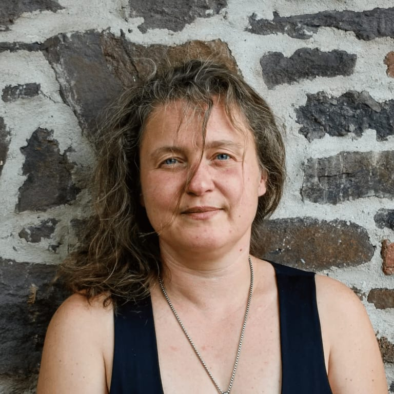

<!-- columns -->
<!-- column width="50%" -->

Gaëlle amène la culture et le bien-être aux 4 Sources. Elle est aussi la fondatrice d’Arts Emoi, une association qui propose des cours de musique et de conscience corporelle.

→ [artsemoi.be](http://artsemoi.be/)

··· [gaelle@les4sources.be](mailto:gaelle@les4sources.be)

<!-- column width="50%" -->

<!-- /columns -->
