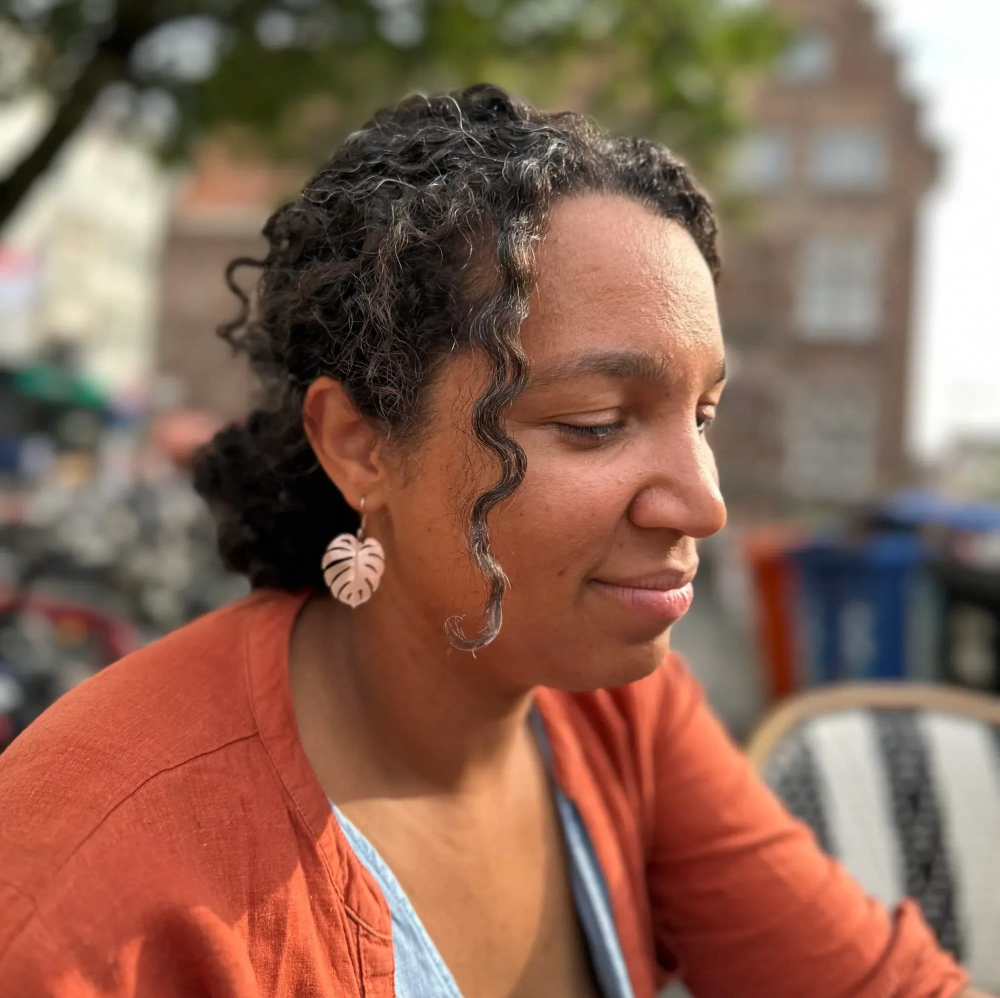

<!-- columns -->
<!-- column width="50%" -->

Malau est la fondatrice de Petit Kiwi, le dépôt-vente pour les 0 à 18 ans qui livre en Belgique et en France. Elle gère l’épicerie et les séjours des 4 Sources.

→ [Petit Kiwi](https://www.petitkiwi.be)

··· [malau@les4sources.be](mailto:malau@les4sources.be)

<!-- column width="50%" -->

<!-- /columns -->
