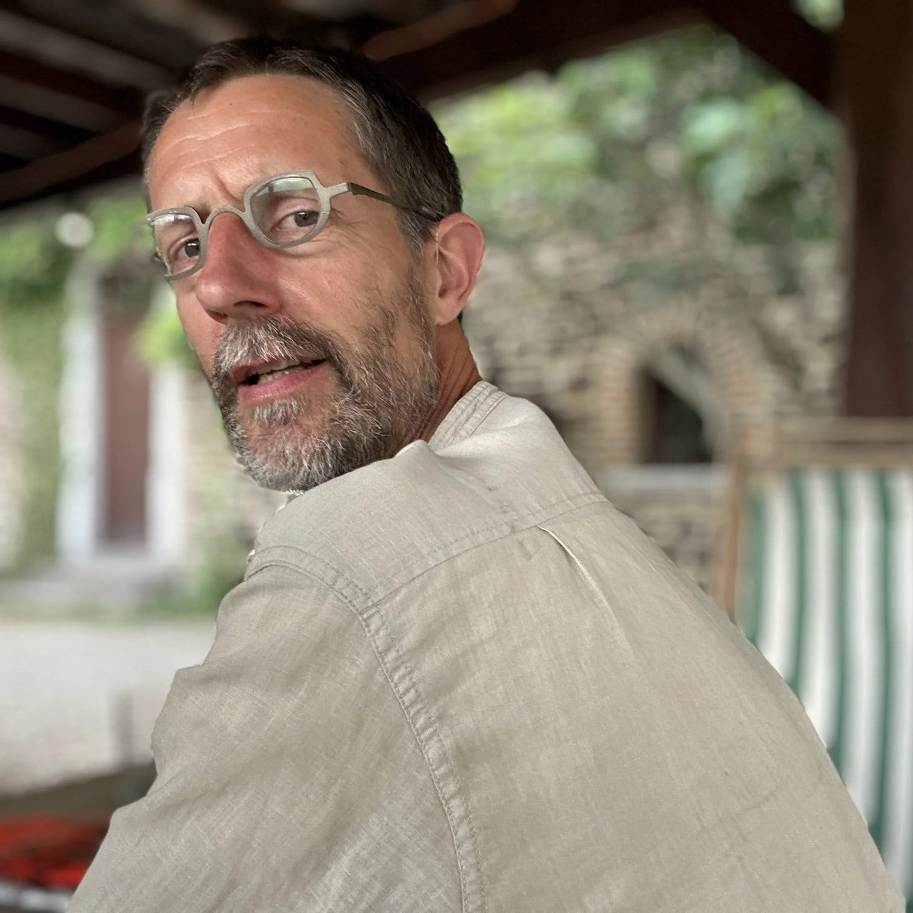

<!-- columns -->
<!-- column width="50%" -->

Olivier est un artisan-designer et arboriste-grimpeur curieux et passionné. Vous retrouvez ses créations dans les gites, les salles et à l’épicerie.

Il est celui qui donne envie de toucher les choses : créer du beau mobilier, aménager des espaces en bois de forêt ou de récup, réparer ce qui peut l'être, et réfléchir ensemble à la manière dont on prend soin de nos espaces verts. Coupes de bois, clôtures, abreuvoirs… il a l'œil et les mains 👐🏻

Son parcours dit beaucoup de lui : scout, designer, pédagogue, élagueur grimpeur. Un homme de terrain autant que de réflexion, avec un grand intérêt pour l'humain, la nature et les beaux objets.

Papa de 3 enfants - avec Stéphanie, ils ont choisi l'instruction en famille - et engagé dans des projets collectifs depuis près de 20 ans. Les arbres, le bois, la créativité, les rencontres authentiques… et aussi les patins à roulettes, les échasses, et un paquet de chips avec une bonne bière. 🍺

On a rarement vu quelqu'un d'aussi sérieux dans ses engagements et aussi peu prise de tête dans la vie.

[debranchesenplanches.be](https://debranchesenplanches.be/)

[\[email protected\]](mailto:)

<!-- column width="50%" -->

<!-- /columns -->
