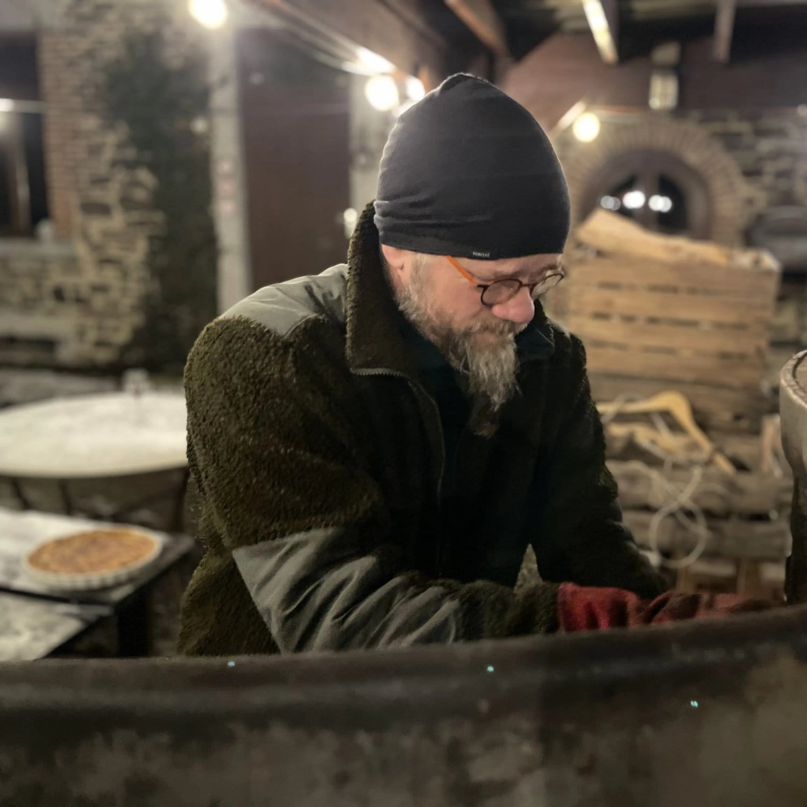

<!-- columns -->
<!-- column width="50%" -->

Seb est notre artisan-ferronnier passionné de lowtech. Il réalise toute structure métallique et propose régulièrement des ateliers pour apprendre la soudure et des stages low-tech.

✉️ Pour contacter Seb : [seb@les4sources.be](mailto:seb@les4sources.be)

<!-- column width="50%" -->

<!-- /columns -->
