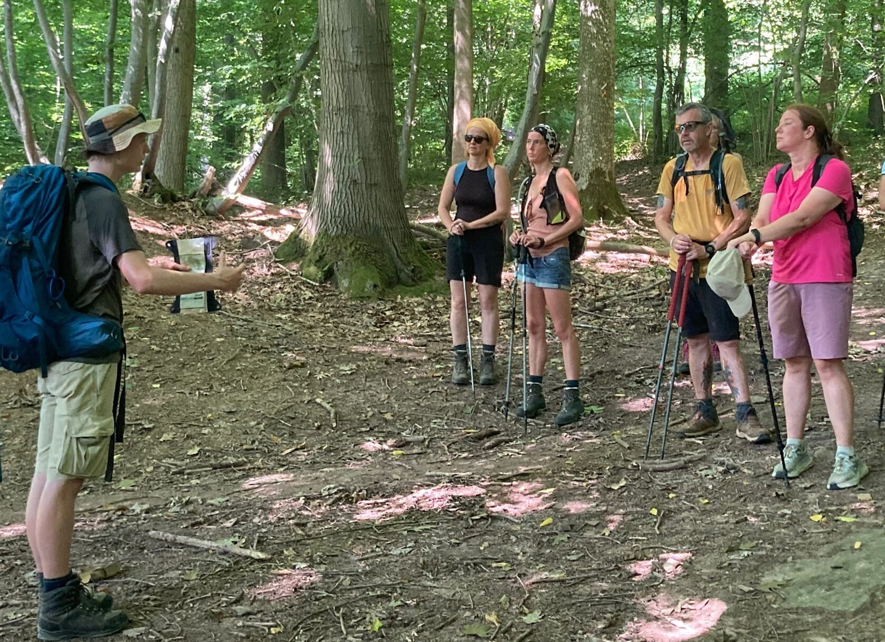
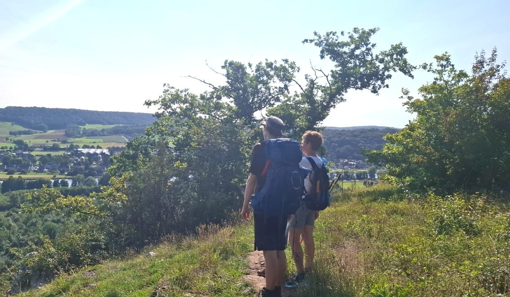

Colin vous propose un questionnement sur notre rapport à la nature, à nos choix, et notre culture, à travers la beauté et la complexité que celle-ci nous permet de contempler.

Cette balade est organisée par Colin Vanhamme, dans le cadre d’un TFF de la Formation *[Interprète Nature et Environnement](https://www.education-environnement.be/formation.php?idc=2&c=interprete-nature-et-environnement-guide-nature-cnb-de-liege)* du CRIE de Liège.

## **Infos pratiques**

- Balade gratuite ouverte aux adultes (contacter Colin pour la participation d’enfants)
- Inscription obligatoire
- 3 km de balade
- le 24 juin de 14h à 18h
- Rendez-vous sur la terrasse des 4 Sources
- À prendre avec toi : ta gourde, des vêtements adaptés à la météo, des chaussures de marche (facultatif : jumelles, bloc-notes, collation)

<a class="button" href="https://forms.gle/vajVYqhdwnJHJea37">🥾 Je remplis le formulaire d'inscription</a>

> 🆕 Une info complémentaire ? Appelle Colin au 0489/36.90.18, ou par e-mail à [vanhammecolin@gmail.com](mailto:vanhammecolin@gmail.com).

#### Prévisions météo

<iframe title="Contenu intégré" src="https://api.wo-cloud.com/content/widget/?geoObjectKey=4775569&amp;language=fr&amp;region=BE&amp;timeFormat=HH:mm&amp;windUnit=kmh&amp;systemOfMeasurement=metric&amp;temperatureUnit=celsius" name="CW2" width="318" height="318"></iframe>
