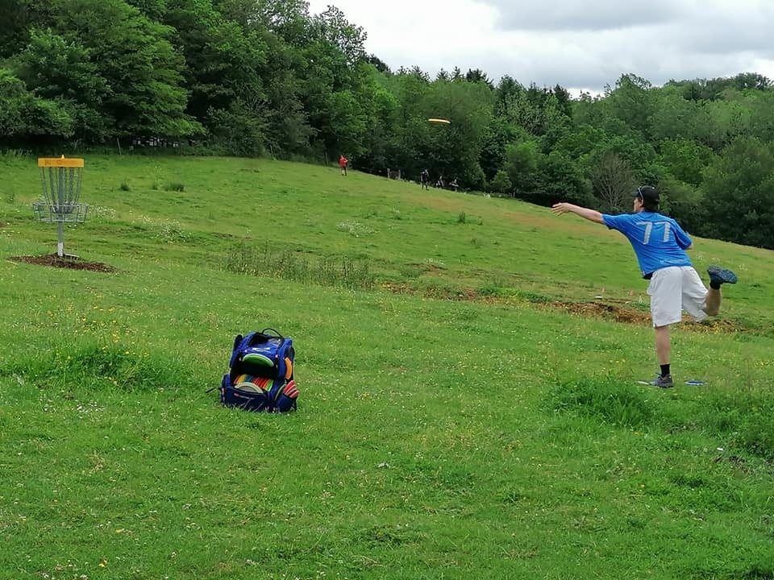
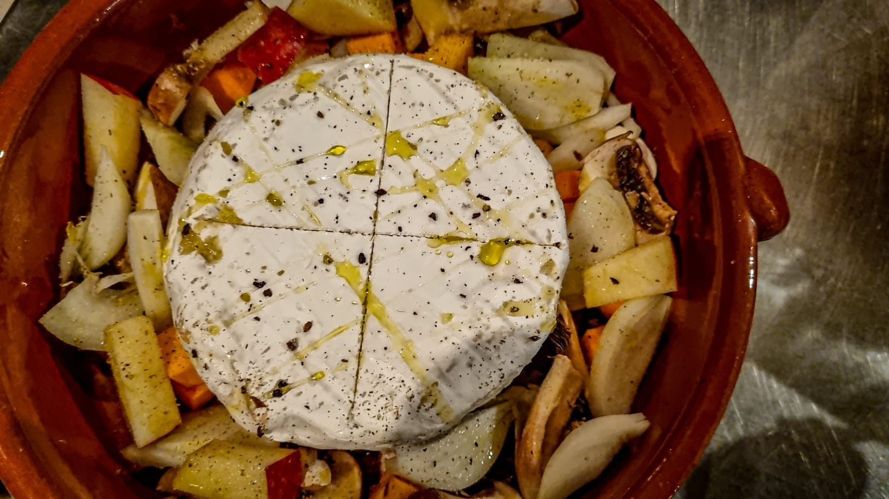

## Le concept de la Camembert Party ?

Viens déguster une "mini-fondue" en trempant du pain frais dans ton fromage tout juste sorti du four et dégoulinant à point ! 😋 Le tout accompagné de tes petits légumes préférés !

Bienvenue **ce 13 mars, dès 18h30** :

- tu amènes…

- ton fromage un ou autre petit plat mijoté dans sa mini-cocotte (max 10 cm de diamètre)
- tes petits légumes

- nous mettons à ta disposition…

- de délicieuses tranches de pain au froment cuit du jour, à tremper dans ton fromage fondu
- des planches à découper et des platines de cuisson
- le four de la boulangerie chauffé au bois pour cuire tes légumes et ton fromage
- la grande salle des 4 Sources

## Et pour cette édition, notre partenaire [DiscGolf](https://www.discgolfattitude.be/) propose…

Au programme : la mythique Camembert Party (attention aux drives bien coulants) suivie d'un petit Glow Contest après le repas. L'occasion parfaite de tester vos plus belles lignes... même dans la nuit !

Que votre putting soit aussi précis que votre découpe de fromage !

Cerise sur le panier : le club a réussi un joli coup (presque un ace !) en achetant des disques Glow à prix très intéressant : ils seront en vente pendant le souper au prix d'achat de 14 €. De quoi illuminer vos prochains parcours !

Vous pouvez donc participer, ou non, à une session de disc-golf ce 13 mars ! Pas besoin d’inscription si ce n’est celle de la Camembert Party.

<a class="button" href="https://www.billetweb.fr/camembert-party-de-mars-2026">🧀 Je prends ma place !</a>

## À emporter avec toi

- Ton fromage contenu dans un emballage en bois (cf. photo de l'événement ; bienvenu aux camemberts, vacherins, chaumes, etc.)

- Pas très fromage ? Apporte quelque chose d'équivalent si tu le souhaites ou d'autres ingrédients pour accompagner tes légumes.

- Tes légumes et/ou féculents (ex.: courges, champignons, topinambours, chicons, épinards, fenouils, oignons, patates, patates douces) ou salades froides à manger à côté + assaisonnement

<a class="button" href="https://www.billetweb.fr/camembert-party-de-mars-2026">🧀 Je prends ma place !</a>

## **Infos pratiques**

- Tarif : 7 € par personne + cash pour le bar
- À emporter

- ton fromage ou un autre petit plat mijoté dans sa mini-cocotte (max 10 cm de diamètre) 🧀
- tes petits légumes 🍆
- tes ami·e·s 👯

- Bar avec boissons bios/locales/de saison sur place 🍹

Les enfournements dans le four de tes préparations ont lieu entre 19h et 19h30.

<a class="button" href="https://www.billetweb.fr/camembert-party-de-mars-2026">🧀 Je prends ma place !</a>
