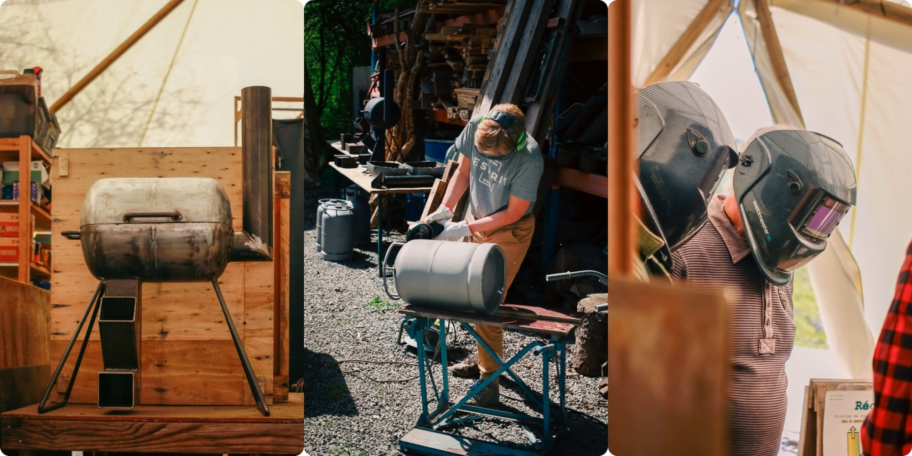
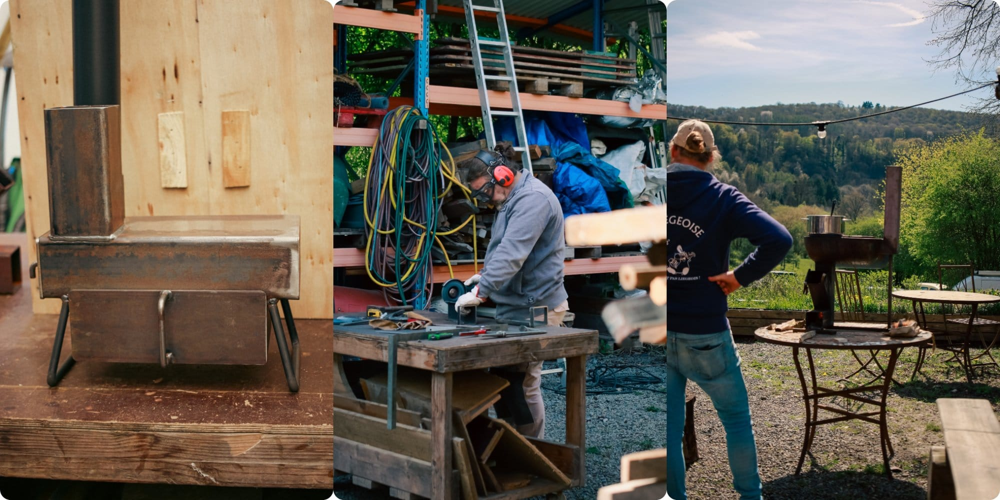
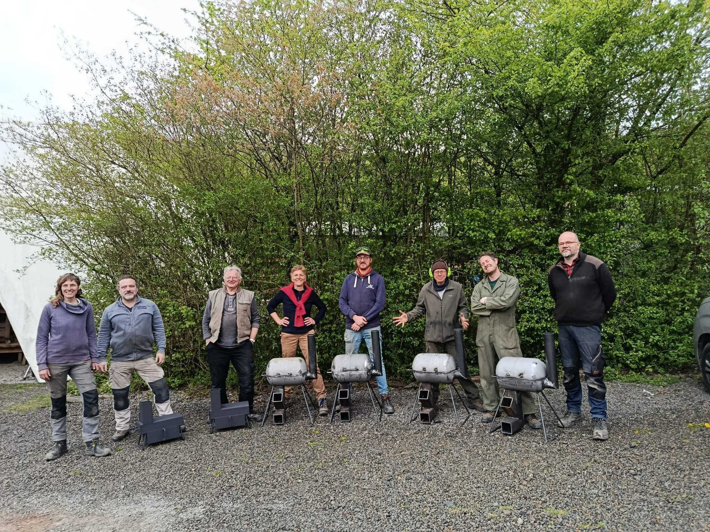
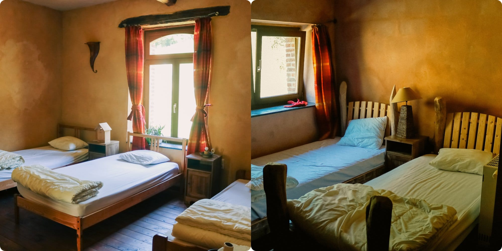
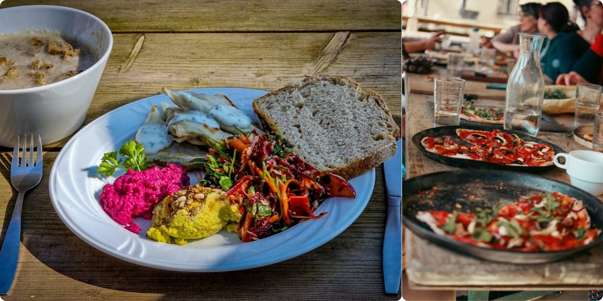
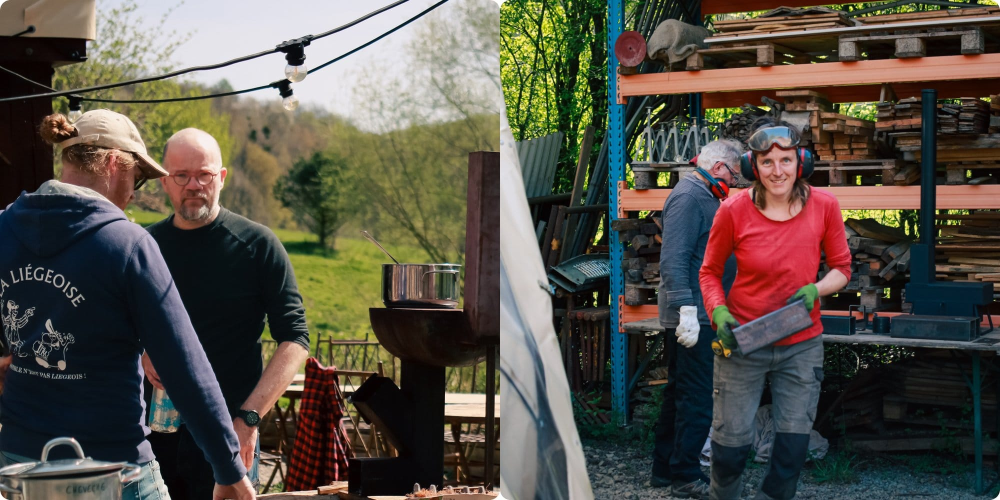

## **Trois journées - 8, 9 et 10 octobre - pour construire et tester ta cuisinière, s’initier aux low-techs et au travail du métal.**

- Initiation à la soudure et à la construction métallique
- Convivialité et repas : auberge espagnole le jeudi midi, pizza party privée le vendredi soir 🍕

**Tu repars avec ta propre cuisinière au terme des 3 journées d’apprentissage** 🔥

## **Choisis parmi 2 modèles de cuisinière**

## **👉🏻 La Bonbonne : une cuisinière réalisée au départ d'une bonbonne de gaz…**

Capot ouvert, elle permet de mettre à chauffer une grande casserole ou 2 petites. Capot fermé, elle se transforme en four d'un volume d'environ 15L, permettant d'utiliser les grands plats pour four standards (L 39cm, l 25 cm)

ou…

## **👉🏻 La Nomade : une cuisinière compacte.**

Elle permet de réchauffer simultanément : sur le dessus, une petite casserole, et dans le tiroir four, un petit plat pour four standard (L 27cm, l 17 cm). Sa compacité permet de la déplacer facilement.

💡 *Ces 2 modèles disposent d'un four et permettent d'utiliser votre batterie de cuisine habituelle sans les noircir (pas de contact entre la flamme et les casseroles).*

## **Participation**

**485 € pour les trois journées**, tout compris :

- l’encadrement et l’accompagnement par 2 artisans en ferronnerie et menuiserie ⚡
- les 2 nuitées aux 4 Sources 💫
- les repas frais préparés par la Cuisine des 4 Sources et la Pizza Party privée 🥪
- les collations 🥠 le café et la tisane à volonté 🍵
- les fournitures pour ta cuisinière 🔨

**Café, tisane, fruits et biscuits !**

*Nos heureux participants du stage d’avril !*

## **Inscription**

Le lien arrive bientôt

## **Hébergement**

Tu logeras en chambre partagée aux 4 Sources avec l’ensemble du groupe, l’idéal pour faire connaissance et continuer à partager des idées et connaissances jusqu’en soirée.

L’hébergement comprend 2 chambres de 4 lits (prévois tes draps de lit), avec une salle de douche par chambre.

## **Repas**

En dehors de l’auberge espagnole et de la Pizza Party privée, les repas sont végétariens et préparés par Stéphanie dans la Cuisine des 4 Sources. Des produits ultra-frais, des plats colorés et du bon pain, que demander de plus ? Mais oui bien sûr : une délicieuse collation pour le milieu d’après-midi ! 🙂

## **En pratique**

👥 Maximum 6 participants

⏰ Horaire des journées :

- Le jeudi de 9h à 18h
- Le vendredi de 9h à 18h
- Le samedi de 9h à 18h

🧳 À prévoir :

- Un plat à partager pour l’auberge espagnole du jeudi midi 🧀
- Des vêtements adaptés à la météo ☔
- Ton set de draps de lit pour un lit simple 🛌🏻
- Une boisson sympa à partager jeudi soir 🧉

## Facilitateur·rice

2 artisan-es passionné-es par la ferronnerie et les low-techs, qui ont la transmission dans le sang !

*Sébastien et Magali, tous deux membres des 4 Sources*

> 💁 **Envie de loger sur place avant ou après l’événement ?** Fais-nous part de ta demande à [contact@les4sources.be](mailto:contact@les4sources.be).
