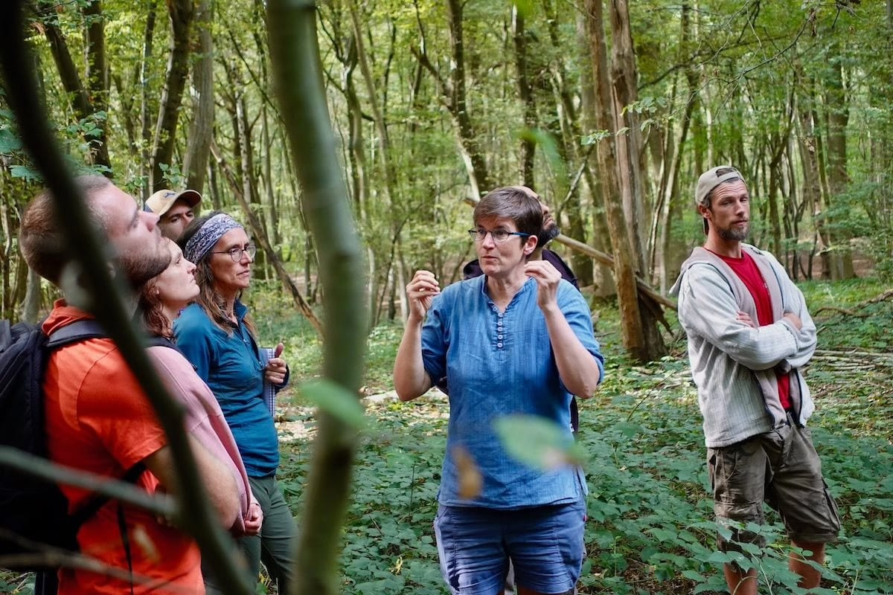

## En pratique

#### **Une semaine intensive - du 17 au 21 novembre - pour démarrer ou progresser dans ton projet de forêt-jardin, organisée par notre partenaire** **[Semisto](https://www.semisto.org/poles/formations-semisto/toutes-les-formations/focus-jardin-foret)****.**

Entre le moment “WOW” à la lecture d’un livre ou après avoir regardé une vidéo inspirante et les récoltes abondantes, il y a quelques étapes qui relèvent parfois du parcours du combattant.

Nous concevons des designs avec notre bureau d’études et il faut bien l’avouer : concevoir un projet avec une équipe de designers revient à minimum 5.000€. C’est beaucoup d’argent et nous voulons explorer d’autres pistes, et notamment soutenir les porteur·euse·s de projet qui veulent prendre pleinement part à la création et à l’implantation.

Semisto, avec son collectif aux expertises multiples et son réseau, soutiendra les porteur·euse·s de projet pendant 5 journées de formation et d’accompagnement sur la raison d’être de chaque projet, ses limites, ses objectifs et ses fonctions. Nos experts en design, permaculture et écologie partageront des clés permettant de créer des projets alignés avec chaque vision, avec un phasage réalisable et de nombreux conseils pour réussir l’implantation.

Tu pourras découvrir les nombreuses fonctions de la forêt-jardin, approfondir tes connaissances en matière de biodiversité, expérimenter en pratique le design et **repartir avec plus de confiance pour concrétiser ton projet (c’est notre objectif principal !)**.

Pendant cette semaine résidentielle, il y aura des moments de **travail individuel**, des **séances de coaching** avec les designers Semisto et des **échanges en grand groupe** avec les autres porteurs de projet. Les formateurs-designers Semisto et plusieurs designers de notre [bureau d’études](https://www.semisto.org/poles/bureau-d-etudes-semisto) seront là tout au long de ces journées pour prendre le temps d’analyser avec toi ton projet.

Tu trouveras tous les détails concernant cette semaine de formation [sur le site web de Semisto](https://www.semisto.org/poles/formations-semisto/toutes-les-formations/focus-jardin-foret).

<a class="button" href="https://www.semisto.org/poles/formations-semisto/toutes-les-formations/focus-jardin-foret">Tous les détails sur cette semaine de formation</a>

> 🗞️ Pour être informé·e des prochains événements aux 4 Sources, [inscris-toi à notre newsletter mensuelle](/newsletter).
