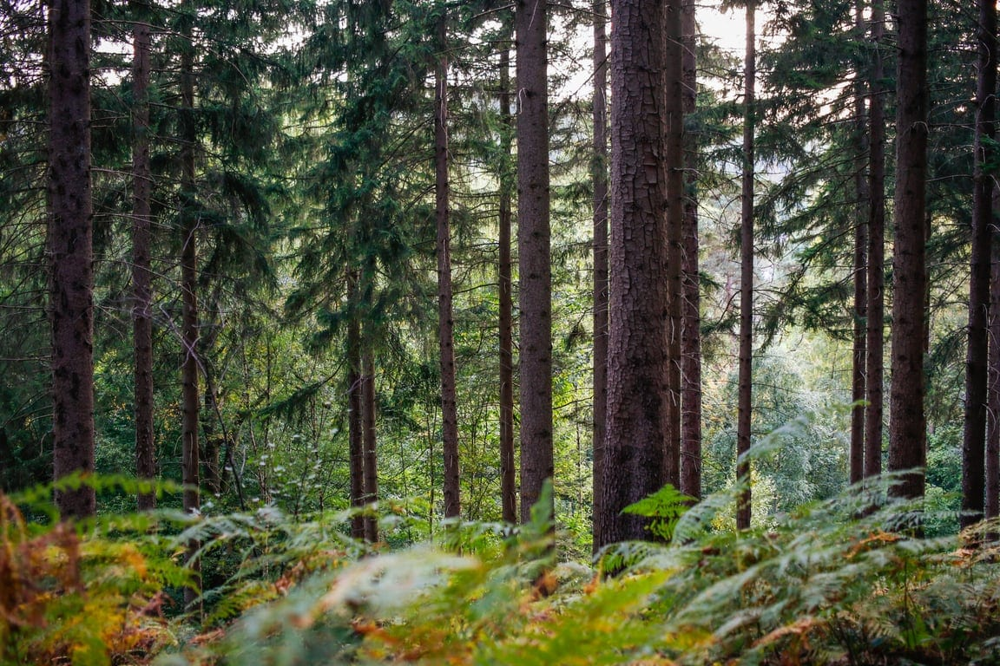

Un atelier proposé par notre partenaire Semisto **les vendredi 3 et samedi 4 avril** : avec comme intervenantes Laurence Delahaye et Laurence Thiry.

## **Ralentir et s'immerger dans l'intelligence des forêts**

Une invitation à ralentir et à s'immerger dans l'intelligence des forêts. Face aux perturbations, la forêt ne se contente pas de résister : elle s'adapte, coopère et se régénère. Cet atelier de deux jours est une rencontre entre la science forestière et la psychologie humaine. C’est une invitation à observer ces mécanismes et à les transposer à ta propre vie. Au travers d’apports théoriques, de moments sensoriels et de pratiques créatives, viens esquisser ton propre écosystème de ressources.

📍 **Lieu :** *À l’Aurée des Sous-bois* - écolieu de transmission et de formation à Godinne dans la vallée de la Meuse (entre Namur et Dinant)

### **Pourquoi rejoindre cet atelier ?**

La forêt est le plus ancien modèle de résilience sur Terre. En rencontrant ses cycles, on change de regard sur nos propres transitions.

- **Comprendre la résilience via les stratégies du vivant** (diversité, coopération, temps long)
- **Se reconnecter à soi** par une immersion sensorielle et une écoute sensible de la nature
- **Transformer son récit** grâce aux métaphores sylvestres et à la création d'un carnet personnel
- **Partager et échanger au sein d'un groupe bienveillant** pour nourrir sa pratique professionnelle ou son cheminement personnel

#### **À qui s'adresse cet atelier?**

Ce temps de pause a été pensé pour toute personne souhaitant renforcer sa capacité d'adaptation et trouver de nouveaux ancrages :

- Adultes en quête de développement personnel et de sens
- Personnes en phase de reconversion ou de transition de vie
- Accompagnants (formateurs, coachs, professionnels de la santé) souhaitant intégrer la métaphore de la forêt dans leur pratique

<a class="button" href="https://semisto.punchpass.com/series/46262">🖍️ Pour s'inscrire, c'est par là</a>

## **Le fil conducteur des deux journées**

#### **Introduction : rencontre avec les cycles de la vie**

- La forêt en libre évolution : cycles de vie, de mort et de régénération
- Parallèles entre résilience écologique et résilience humaine
- Les échelles de résilience : de l'individu au collectif

#### **Première partie :** **<u>La forêt comme miroir de soi</u>**

- Retrouver ses ressources intérieures en s'inspirant des processus naturels
- Utiliser les récits de la forêt pour accompagner son propre parcours de transformation

#### **Seconde partie :** **<u>La forêt comme nature enseignante</u>**

- Observation des stratégies de résilience des écosystèmes (souplesse, adaptation)
- Translation de ces dynamiques en inspirations concrètes pour son quotidien

### **Nos méthodes de partage**

Pédagogie par l'analogie *La forêt comme modèle, miroir et terrain d'expérience*

Immersion sensorielle *Balades d'observation et temps de pleine conscience*

Pratiques créatives *Utilisation d'un carnet comme outil d'exploration (dessin, écriture, collage)*

Intelligence collective *Cercles de parole pour relier le vivant à l'humain*

Rituel symbolique *Un moment collectif pour ancrer l'expérience*

**Matériel fourni :**

- Supports pédagogiques visuels (infographies)
- Carnet créatif vierge et matériel de base pour les activités (crayons, feutres, colles, magazines pour collage, etc.)
- Tout le matériel nécessaire aux activités en forêt et au rituel collectif (plantation symbolique ou création de cairn)

**À prévoir :**

- Vêtements et chaussures adaptés à une immersion en forêt (quel que soit le temps)
- Un coussin ou un plaid pour plus de confort pendant les temps assis en cercle
- Ton pique-nique pour le repas de midi convivial. Tisanes et petites douceurs offertes sur place.

<a class="button" href="https://semisto.punchpass.com/series/46262">🖍️ Pour s'inscrire, c'est par là</a>

> 🗞️ Pour être informé·e des prochains événements aux 4 Sources, [inscris-toi à notre newsletter mensuelle](/newsletter).
