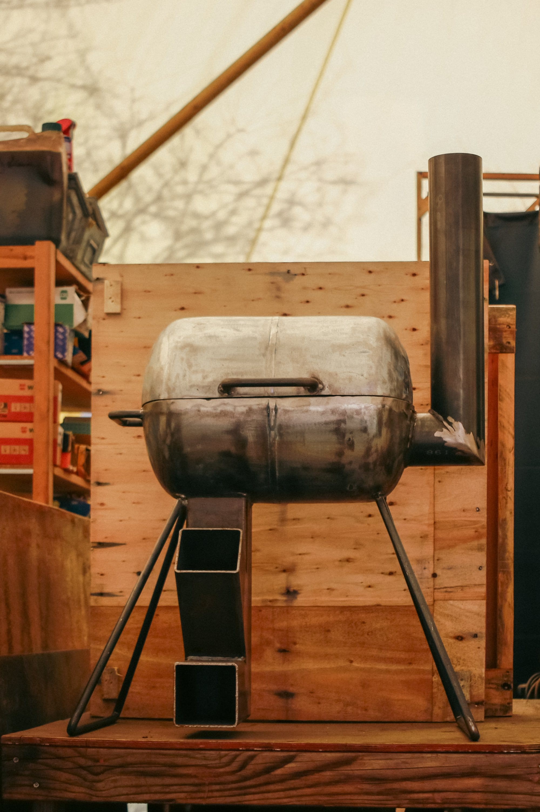
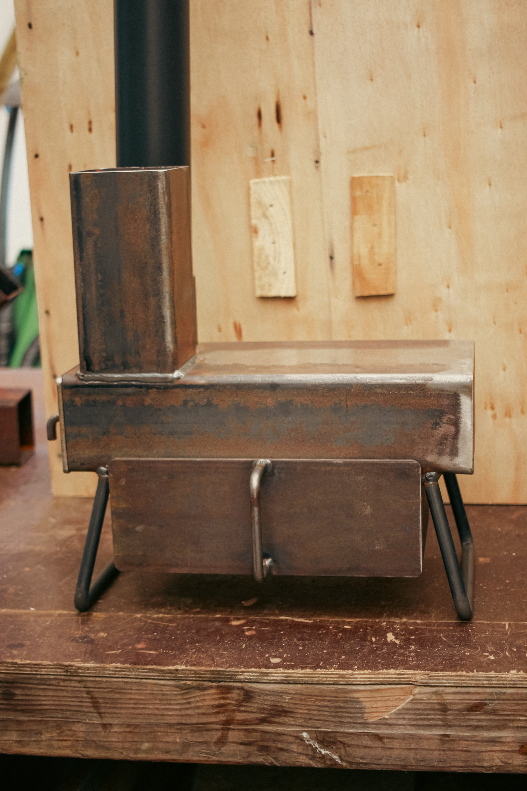
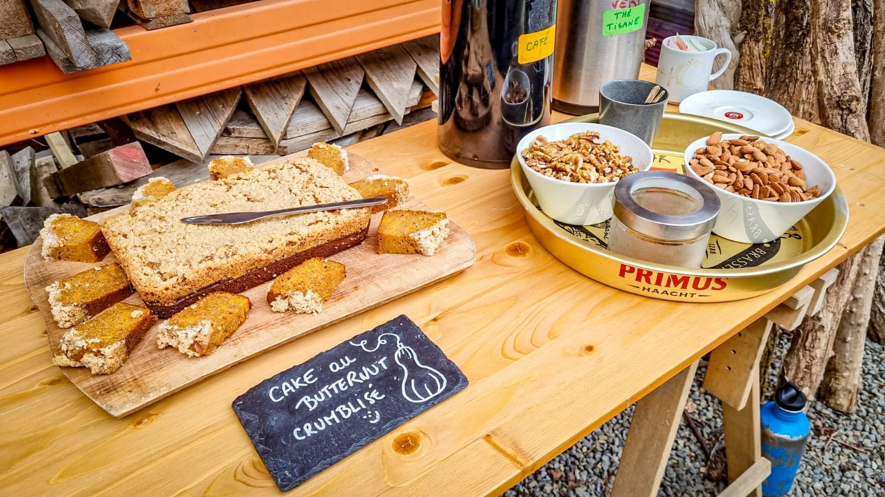
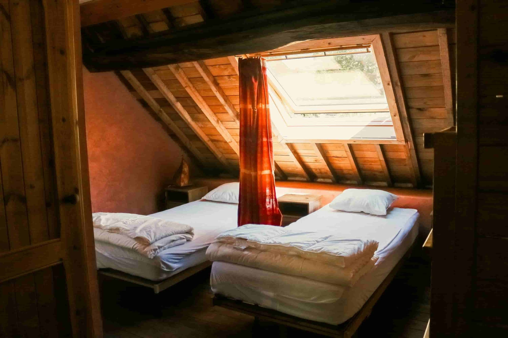
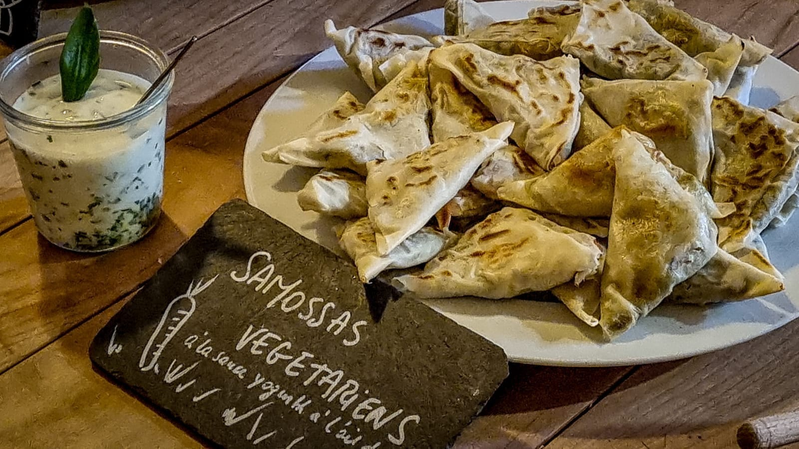
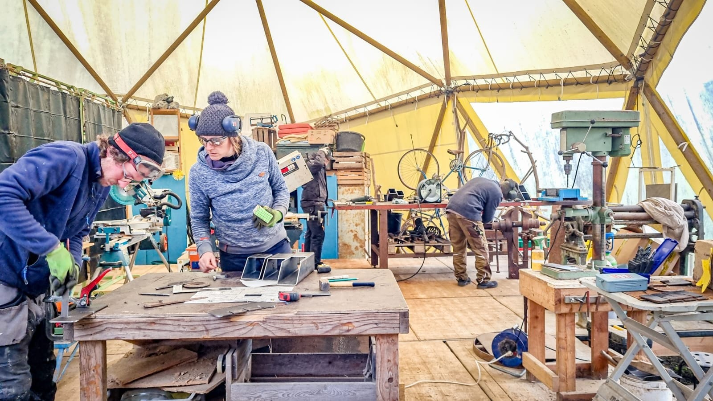
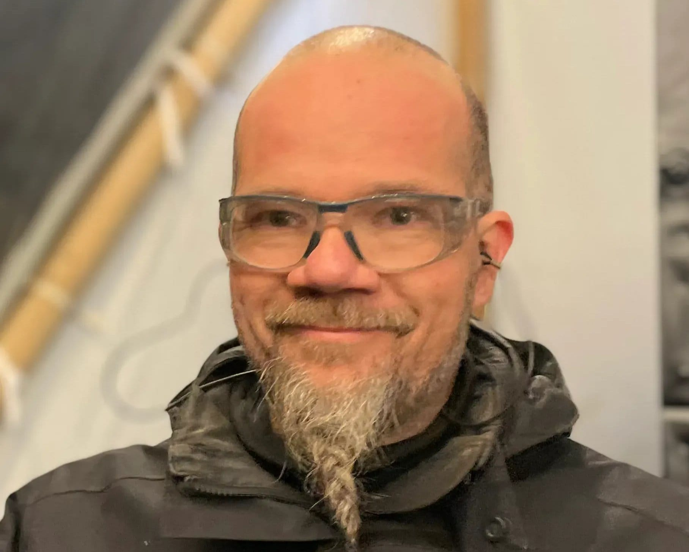
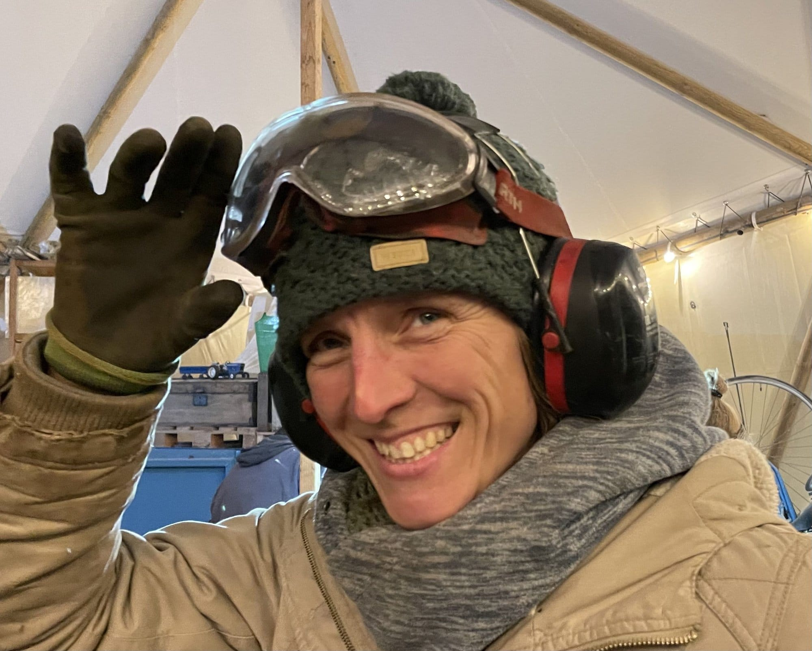

> 🔥 Le stage est complet ! D’autres dates arriveront bientôt

### **Trois journées - 9, 10 et 11 avril - pour construire et tester ta cuisinière, s’initier aux low-techs et au travail du métal.**

- Initiation à la soudure et à la construction métallique
- Convivialité et repas : auberge espagnole le jeudi midi, pizza party le vendredi soir 🍕

**Tu repars avec ta propre cuisinière au terme des 3 journées d’apprentissage** 🔥

### Choisis parmi 2 modèles de cuisinière

<!-- columns -->
<!-- column width="50%" -->

<!-- column width="50%" -->

### 👉🏻 La Bonbonne : u**ne cuisinière réalisée au départ d'une bonbonne de gaz…**

Capot ouvert, elle permet de mettre à chauffer une grande casserole ou 2 petites. Capot fermé, elle se transforme en four d'un volume d'environ 15L, permettant d'utiliser les grands plats pour four standards (L 39cm, l 25 cm)
<!-- /columns -->

ou…

<!-- columns -->
<!-- column width="50%" -->

### 👉🏻 La Nomade : u**ne cuisinière compacte.**

Elle permet de réchauffer simultanément : sur le dessus, une petite casserole, et dans le tiroir four, un petit plat pour four standard (L 27cm, l 17 cm). Sa compacité permet de la déplacer facilement.

<!-- column width="50%" -->

<!-- /columns -->

💡 Ces 2 modèles disposent d'un four et permettent d'utiliser votre batterie de cuisine habituelle sans les noircir (pas de contact entre la flamme et les casseroles).

### Participation

**485 € pour les trois journées**, tout compris :

- l’encadrement et l’accompagnement par 2 artisans en ferronnerie et menuiserie ⚡
- les 2 nuitées aux 4 Sources 💫
- les repas frais préparés par la Cuisine des 4 Sources et la Pizza Party 🥪
- les collations 🥠 le café et la tisane à volonté 🍵
- les fournitures pour ta cuisinière 🔨

<!-- columns -->
<!-- column width="50%" -->

> *Un tout grand merci pour l'invitation, la préparation, l'apprentissage, les échanges et l'ambiance ! C'est une réussite tant pour la fabrication d'un réchaud au bois portatif que pour le remue-méninge du low-tech. Merci aussi aux "étudiants" pour la bonne ambiance de travail et d'échanges.*
>
> *À nous de propager au mieux les connaissances et l'esprit de cette rencontre.* — André, (heureux) participant au stage du Réchaud Rocket Stove, octobre 2025

<!-- column width="50%" -->

**Café, tisane, fruits et biscuits !**
<!-- /columns -->

### Inscription

<a class="button" href="https://www.billetweb.fr/low-tech-cuisiniere">🤩 ça a l'air super, je prends ma place !</a>

### Hébergement

<!-- columns -->
<!-- column width="50%" -->

<!-- column width="50%" -->

Tu logeras en chambre partagée aux 4 Sources avec l’ensemble du groupe, l’idéal pour faire connaissance et continuer à partager des idées et connaissances jusqu’en soirée.

L’hébergement comprend 2 chambres de 4 lits (prévois tes draps de lit), avec une salle de douche par chambre.
<!-- /columns -->

### Repas

<!-- columns -->
<!-- column width="50%" -->

<!-- column width="50%" -->

En dehors de l’auberge espagnole et de la Pizza Party, les repas sont végétariens et préparés par Stéphanie dans la Cuisine des 4 Sources. Des produits ultra-frais, des plats colorés et du bon pain, que demander de plus ? Mais oui bien sûr : une délicieuse collation pour le milieu d’après-midi ! 🙂
<!-- /columns -->

### En pratique

👥 Maximum 6 participants

⏰ Horaire des journées :

- Le jeudi de 9h à 18h
- Le vendredi de 9h à 18h
- Le samedi de 9h à 18h

🧳 À prévoir :

- Un plat à partager pour l’auberge espagnole du jeudi midi 🧀
- Des vêtements adaptés à la météo ☔
- Ton set de draps de lit pour un lit simple 🛌🏻
- Une boisson sympa à partager jeudi soir 🧉

### L’équipe

2 artisan-es passionné-es par la ferronnerie et les low-techs, qui ont la transmission dans le sang !

<!-- columns -->
<!-- column width="50%" -->

*Sebastien, membre des 4 Sources*

<!-- column width="50%" -->

*Magali, membre des 4 Sources*
<!-- /columns -->

### Plus d’infos ?

N’hésite pas à prendre contact avec Sébastien Frennet, facilitateur des Ateliers Low-Tech des 4 Sources.

📞 Tél : 0471 59 11 20 📬 E-mail : [seb@les4sources.be](mailto:seb@les4sources.be)
