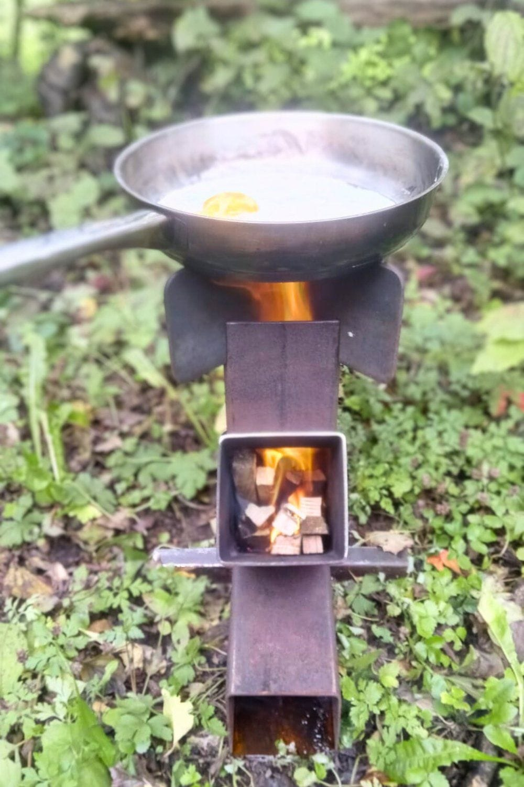
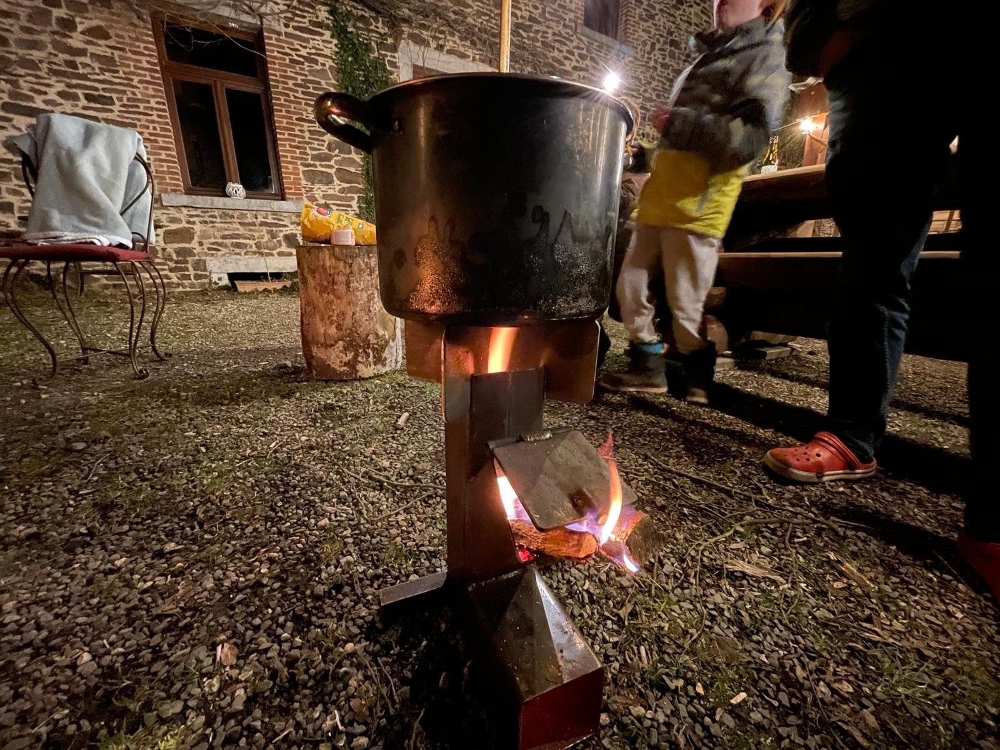

### **Au programme**

<!-- columns -->
<!-- column width="50%" -->

#### **Deux journées pour construire, comprendre et tester ton réchaud Rocket Stove, s’initier aux low-techs et au travail du métal.**

- Initiation à la soudure et à la construction métallique
- Échanges de savoirs sur le principe de combustion et sur les low-techs en général
- Convivialité et préparation de repas en mode low-tech

**Et tu repars avec ton propre réchaud au terme du week-end** 🔥

<!-- column width="50%" -->

<!-- /columns -->

<!-- columns -->
<!-- column width="50%" -->

<!-- column width="50%" -->

### Participation

255 € pour les deux journées, comprenant :

- l’encadrement et l’accompagnement par 3 artisans en ferronnerie et menuiserie
- les repas du samedi soir, dimanche matin et dimanche midi cuisinés ensemble en mode low-tech
- les collations
- les fournitures pour ton réchaud
<!-- /columns -->

### Inscription

Via [le formulaire d’inscription avec paiement en ligne](https://les4sources.punchpass.com/classes/16300562) (1 inscription par participant·e)

### Hébergement

L’hébergement sur place est conseillé du samedi au dimanche. Tu logeras en chambre de 4 personnes, et le tarif est de 30 €/personne/nuit.

Il est possible de rester loger également avant et après la formation.

Réservations de l’hébergement par e-mail à [sejours@les4sources.be](mailto:sejours@les4sources.be).

### En pratique

- Horaire des journées

- Le samedi de 10h à 18h
- Le dimanche de 9h à 18h

- À prévoir

- Un plat à partager pour l’auberge espagnole du samedi midi
- Des vêtements adaptés à la météo

### Plus d’info ?

Prends contact avec Sébastien Frennet, facilitateur des Ateliers Low-Tech des 4 Sources.

📞 Tél : 0471 59 11 20 📬 E-mail : [sebastien.frennet@skynet.be](mailto:sebastien.frennet@skynet.be)
