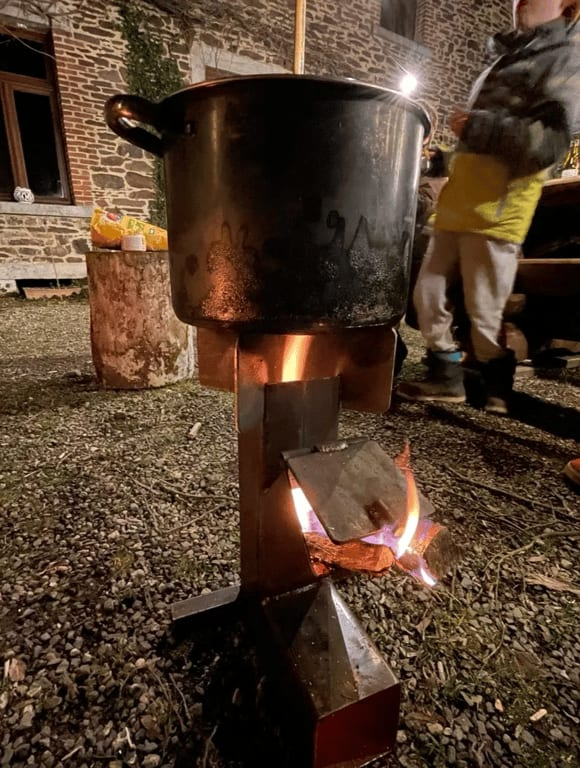
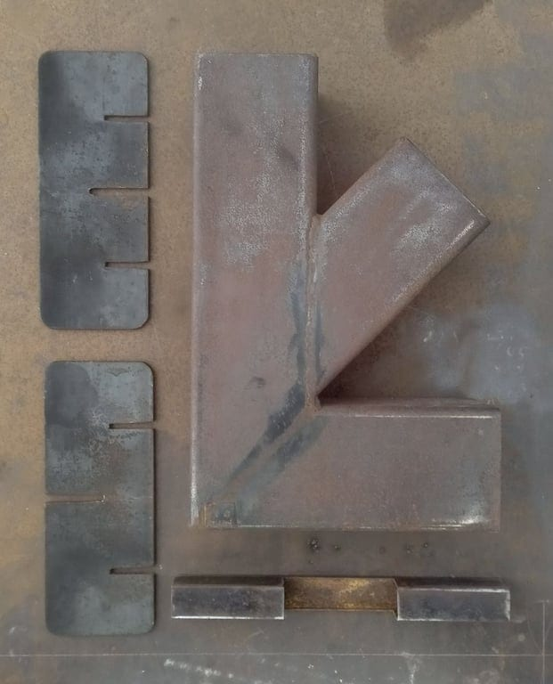
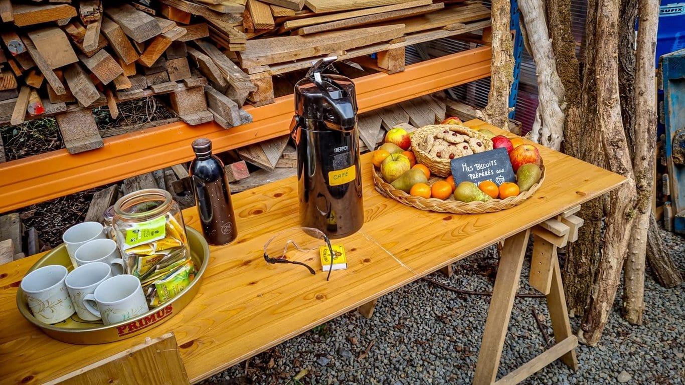
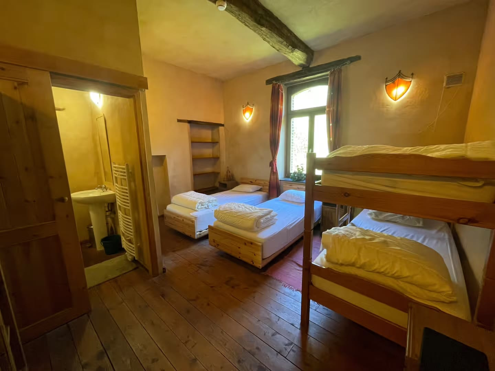
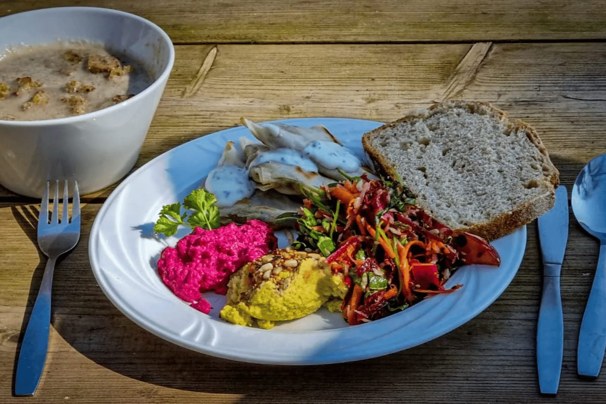
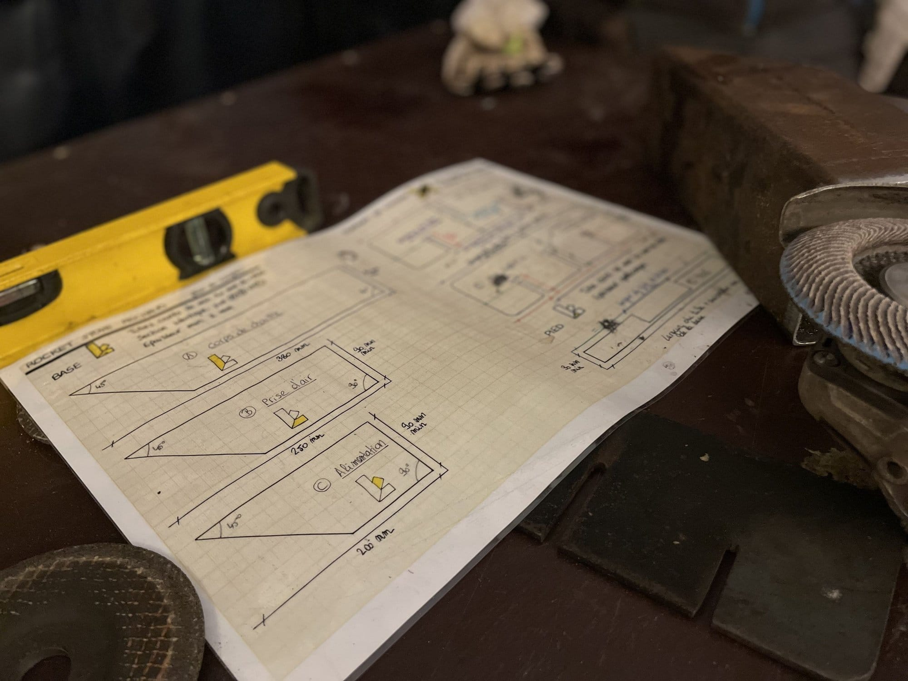
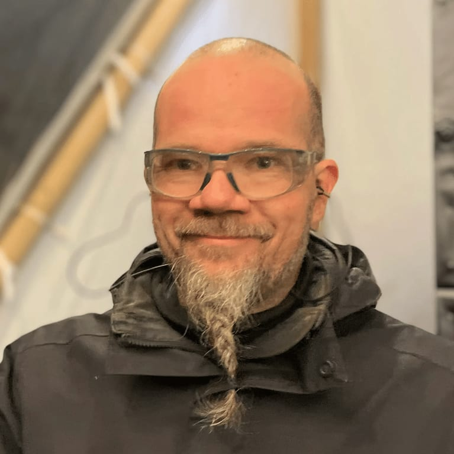
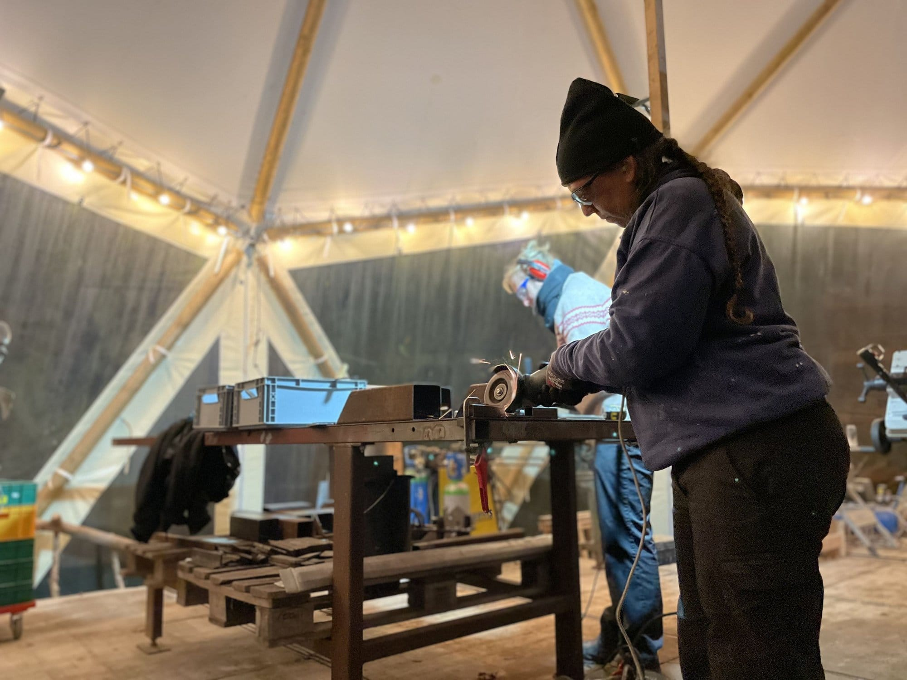

<!-- columns -->
<!-- column width="62.5%" -->

#### **Deux journées - les 17 et 18 octobre - pour construire, comprendre et tester ton réchaud Rocket Stove, s’initier aux low-techs et au travail du métal.**

- Initiation à la soudure et à la construction métallique
- Échanges de savoirs sur le principe de combustion et sur les low-techs en général
- Convivialité et préparation de repas en mode low-tech

**Et tu repars avec ton propre réchaud au terme des 2 journées d’apprentissage** 🔥

<!-- column width="37.5%" -->

<!-- /columns -->

<!-- columns -->
<!-- column width="50%" -->

<!-- column width="50%" -->

### Participation

**295 € pour les deux journées**, tout compris :

- l’encadrement et l’accompagnement par 3 artisans en ferronnerie et menuiserie
- la nuitée aux 4 Sources
- les repas frais préparés par la Cuisine des 4 Sources
- les collations
- le café et la tisane à volonté
- les fournitures pour ton réchaud
<!-- /columns -->

<!-- columns -->
<!-- column width="62.5%" -->

> *Un tout grand merci pour l'invitation, la préparation, l'apprentissage, les échanges et l'ambiance ! C'est une réussite tant pour la fabrication d'un réchaud au bois portatif que pour le remue-méninge du low-tech. Merci aussi aux "étudiants" pour la bonne ambiance de travail et d'échanges.*
>
> *À nous de propager au mieux les connaissances et l'esprit de cette rencontre.* — André, participant (heureux) au stage

<!-- column width="37.5%" -->

**Café, tisane, fruits et biscuits !**
<!-- /columns -->

### Inscription

**[Je m’inscris à ce super stage low-tech !](https://les4sources.punchpass.com/series/42607)**

### Hébergement

<!-- columns -->
<!-- column width="50%" -->

<!-- column width="50%" -->

Tu logeras en chambre partagée aux 4 Sources avec l’ensemble du groupe, l’idéal pour faire connaissance et continuer à partager des idées et connaissances jusqu’en soirée.

L’hébergement comprend 2 chambres de 4 lits (prévois tes draps de lit), avec une salle de douche par chambre.
<!-- /columns -->

### Repas

<!-- columns -->
<!-- column width="50%" -->

<!-- column width="50%" -->

Les repas - végétariens - sont préparés par Stéphanie dans la Cuisine des 4 Sources. Des produits ultra-frais, des plats colorés et du bon pain, que demander de plus ?

Mais oui bien sûr : une délicieuse collation pour le milieu d’après-midi ! 🙂
<!-- /columns -->

### En pratique

- Maximum 6 participants
- Horaire des journées

- Le vendredi de 9h30 à 18h
- Le samedi de 9h à 18h

- À prévoir

- Un plat à partager pour l’auberge espagnole du vendredi midi
- Des vêtements adaptés à la météo
- Ton set de draps de lit pour un lit simple
- Une boisson sympa à partager vendredi soir 😌

### L’équipe

**2 artisan-es passionné-es par la ferronnerie, la menuiserie et les low-techs, qui ont la transmission dans le sang !**

<!-- columns -->
<!-- column width="50%" -->

*Seb*

<!-- column width="50%" -->

*Magali*
<!-- /columns -->

### Plus d’infos ?

N’hésite pas à prendre contact avec Sébastien Frennet, facilitateur des Ateliers Low-Tech des 4 Sources.

📞 Tél : 0471 59 11 20 📬 E-mail : [seb@les4sources.be](mailto:seb@les4sources.be)

