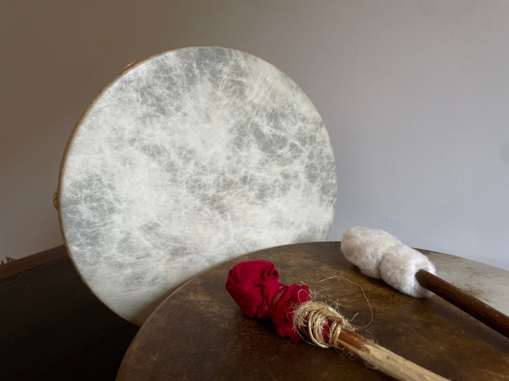

**Célèbre cette nouvelle lune, accompagné.e par les vibrations de tambours et profite d'un moment intense qui favorise la connexion à soi, aux autres et au Vivant.**

## En pratique

- **Inscription nécessaire** via le formulaire accessible en bas de page
- **Tarif en conscience** : prix indicatif de 15€/personne à payer en liquide sur place
- **Prérequis** : aucun

### À emporter

- tambour.s si vous en avez ;
- autre.s instrument.s de percussion
- boissons/encas
- vêtements confortables et chaussures tous-terrains adaptés au temps extérieur ou intérieur (choix du lieu en fonction de la météo et du nombre de personnes présentes)

<!-- columns -->
<!-- column width="50%" -->

## Facilitatrices

Cet événement est facilité par Manon et Claire, membres des 4 Sources.

<!-- column width="50%" -->

<!-- /columns -->

> 💁 **Envie de loger sur place avant ou après l’événement ?** Fais-nous part de ta demande à [contact@les4sources.be](mailto:contact@les4sources.be).

## Inscription

→ [Inscris-toi en complétant le formulaire sur notre page Punchpass](https://les4sources.punchpass.com/classes/15334517?embed=true)
