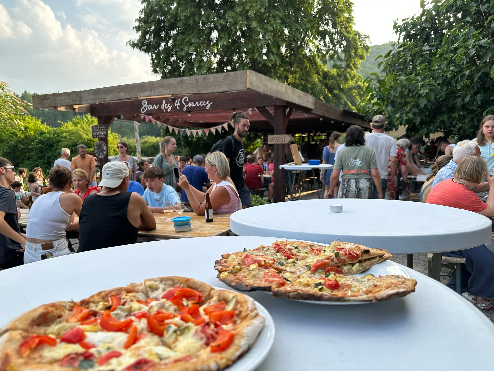

Viens déguster de délicieuses pizzas tout juste sorties du four, faire des rencontres et profiter d’une ambiance décontractée ! Bienvenue **ce 7 août, dès 18h30** :

- nos boulangères préparent de délicieux pâtons au levain le jour même
- tu amènes ta garniture en fonction de tes envies
- nous cuisons les pizzas au feu de bois entre 19h et 20h
- et vous les dégustez en terrasse plein sud, 360°C nature !
- en cas de pluie, on se réfugie dans la grande salle des 4 Sources 🙂

👍 Le four de boulangerie est chauffé au bois 👍 Les pâtons sont bio et au levain 👍 Et les gens sont super cools !

## Infos pratiques

- Inscription indispensable jusqu’au jeudi midi avant l'événement, ce qui nous permet de préparer le bon nombre de pâtons
- Participation : 7 € par personne
- Bar avec boissons bios/locales/de saison sur place 🍹
- Paiement des consommations en cash ou par virement sur place

Les enfournements dans le four de tes pizzas ont lieu entre 18h45 et 20h30, lorsque le four est encore chaud de la journée.

Le lien de l’inscription arrive bientôt ❤️

> 🆕 L’inscription se passe désormais via billetweb.fr ce qui permet de réserver plusieurs participations en une seule fois. Pour le paiement par Bancontact, vous devrez introduire le numéro de votre carte de banque ou passer par l’app Payconiq.

### Prévisions météo

<iframe title="Contenu intégré" src="https://api.wo-cloud.com/content/widget/?geoObjectKey=4775569&amp;language=fr&amp;region=BE&amp;timeFormat=HH:mm&amp;windUnit=kmh&amp;systemOfMeasurement=metric&amp;temperatureUnit=celsius" name="CW2" width="318" height="318"></iframe>
