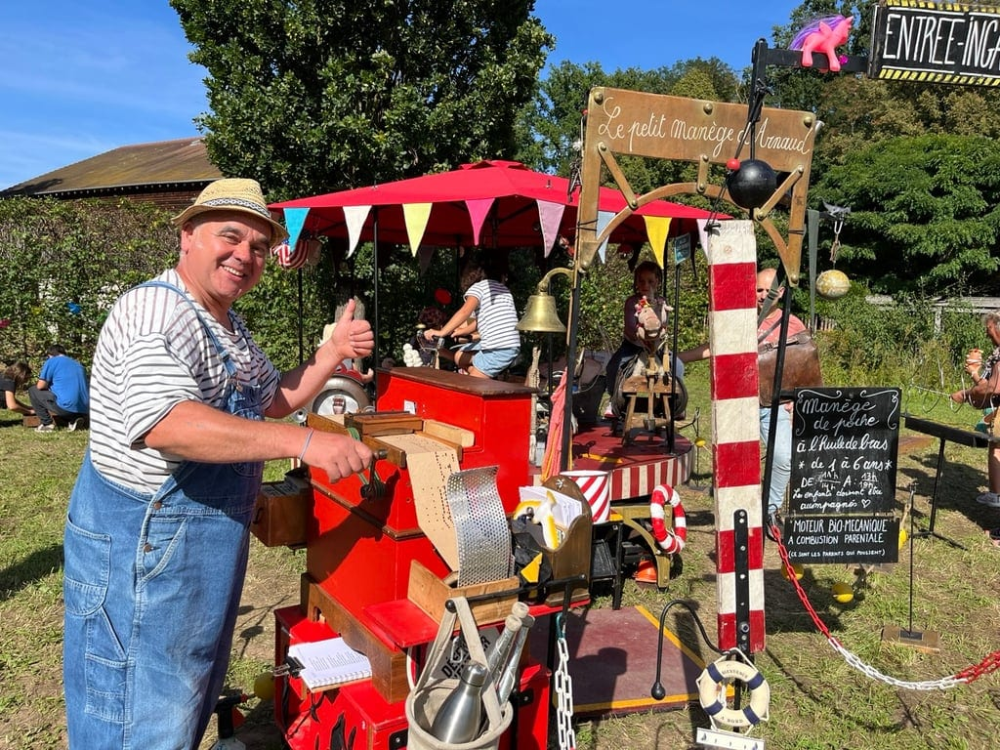
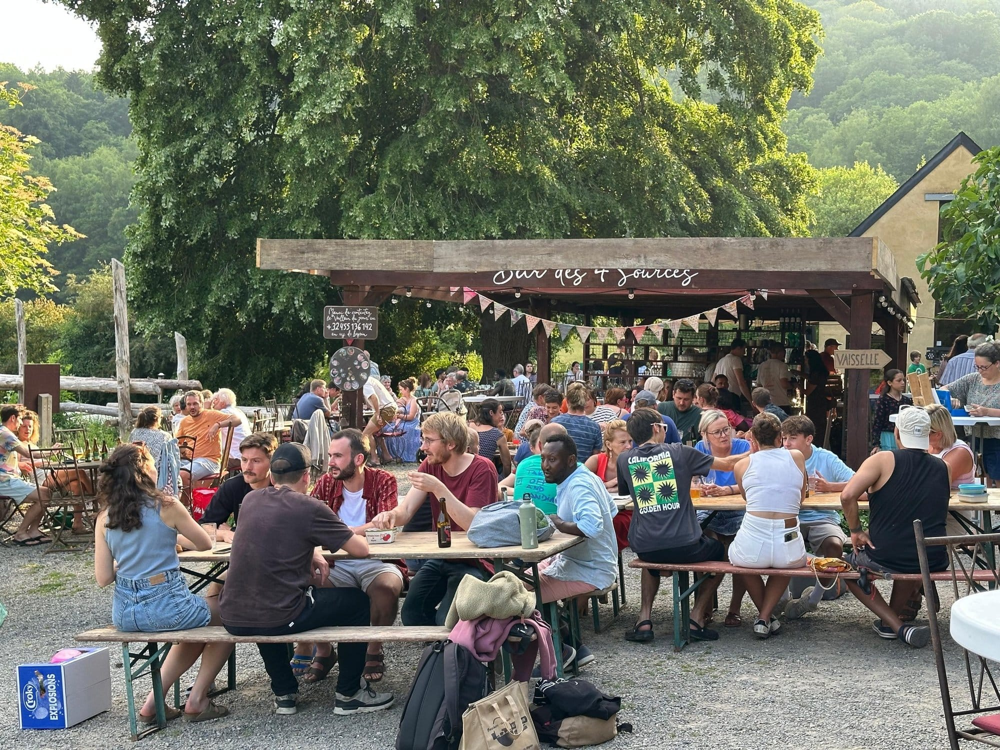
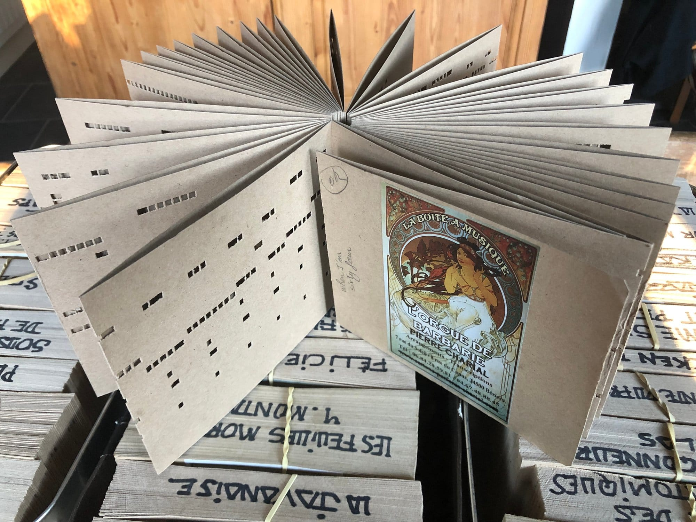

**Edition complète !**

Chers vous tous-tes, nous sommes archi-complets pour la Pizza Party de ce vendredi. Nous avons établi une limite fixée par notre capacité à produire des pâtons 🍕

Bienvenue pour un verre à partir de 20h30 🍹, mais pas de possibilité d'improviser des pizzas en plus pour les non inscrits. Merci de votre compréhension et à vendredi ! ☺️

Prochaine PP le 17 juillet ⬇️

Wahoo, on fête nos 5 ans le 12 juin 🎉 Pour célébrer notre anniversaire en toute convivialité, nous avons invité le P’tit orgue d’Arnaud 🪗

Un orgue de Barbarie artisanal, 27 flûtes en bois, et une sonorité qui réchauffe tout de suite l'ambiance. 🎶

Véritable ancêtre de la programmation musicale, cet instrument fascinant éveille la curiosité des petits comme des grands, et rappelle que la musique, c'est fait pour être partagée.

Avec ses 88 cartons perforés, Arnaud promène un répertoire généreux d'airs populaires... et des chansonniers sont mis à dispo pour chanter tous ensemble !

Une belle façon de se retrouver, de sourire et de laisser la bonne humeur faire son chemin. 🎵

Viens déguster de délicieuses pizzas tout juste sorties du four, faire des rencontres et profiter d’une ambiance décontractée ! Bienvenue **ce vendredi 12 juin, dès 18h30** :

- nos boulangères préparent de délicieux pâtons au levain le jour même
- tu amènes ta garniture en fonction de tes envies
- nous cuisons les pizzas au feu de bois entre 19h et 20h
- et vous les dégustez en terrasse plein sud, 360°C nature !
- en cas de pluie, on se réfugie dans la grande salle des 4 Sources 🙂

👍 Le four de boulangerie est chauffé au bois 👍 Les pâtons sont bio et au levain 👍 Et les gens sont super cools !

## Infos pratiques

- Inscription indispensable <u>jusqu’au jeudi 16h avant l'événement</u>, ce qui nous permet de préparer le bon nombre de pâtons
- Participation : 10€/adulte et 6€/enfant
- Bar avec boissons bios/locales/de saison sur place 🍹
- Paiement des consommations en cash ou par virement sur place

Les enfournements dans le four de tes pizzas ont lieu entre 18h45 et 20h30, lorsque le four est encore chaud de la journée.

## Olé olé, je m’inscris !

<a title="Vente de billets en ligne" href="https://www.billetweb.fr/shop.php?event=pizza-party-des-5-ans" class="shop_frame" target="_blank" data-src="https://www.billetweb.fr/shop.php?event=pizza-party-des-5-ans" data-max-width="100%" data-initial-height="600" data-scrolling="no" data-id="pizza-party-des-5-ans" data-resize="1">Vente de billets en ligne</a>

### Prévisions météo

<iframe title="Contenu intégré" src="https://api.wo-cloud.com/content/widget/?geoObjectKey=4775569&amp;language=fr&amp;region=BE&amp;timeFormat=HH:mm&amp;windUnit=kmh&amp;systemOfMeasurement=metric&amp;temperatureUnit=celsius" name="CW2" width="318" height="318"></iframe>
