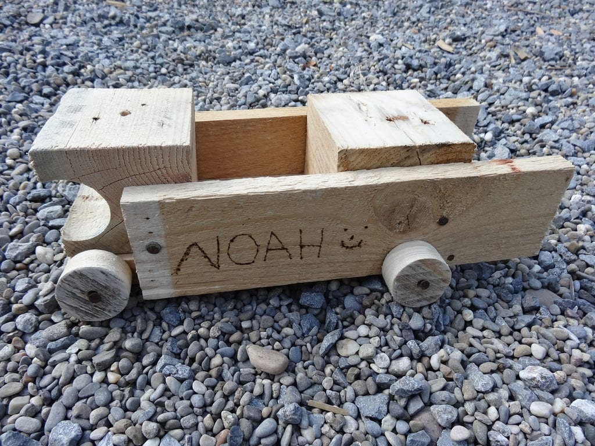
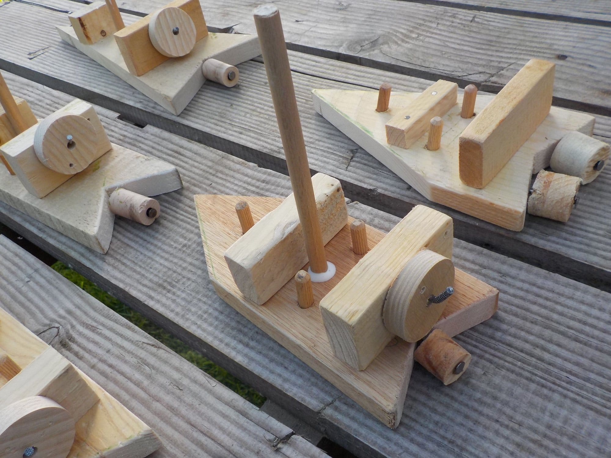
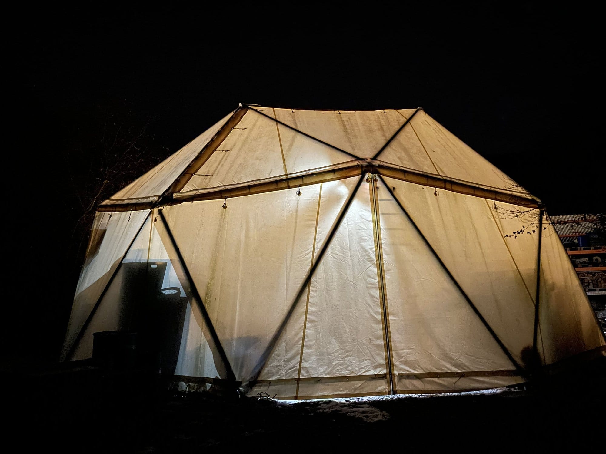
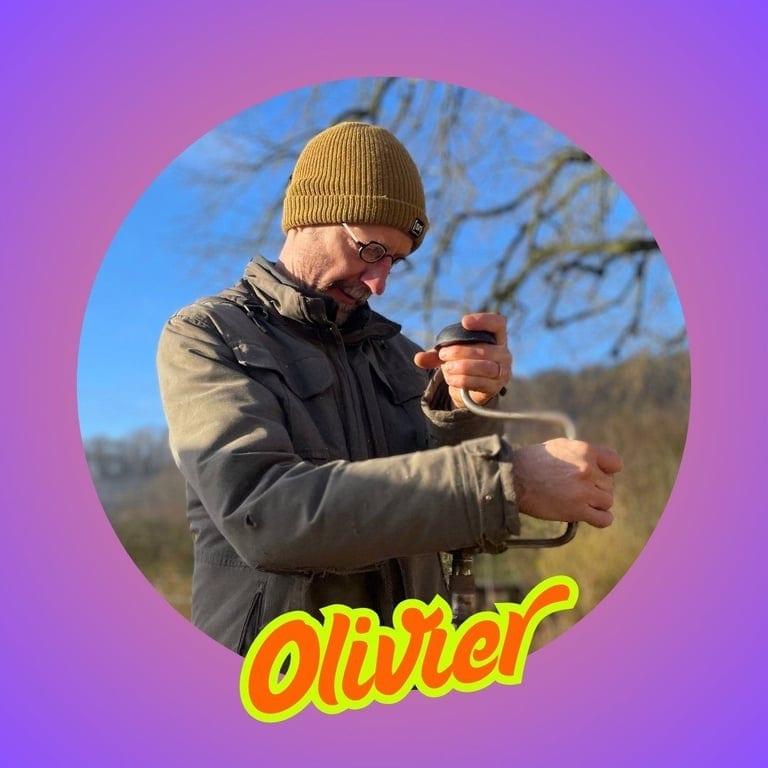
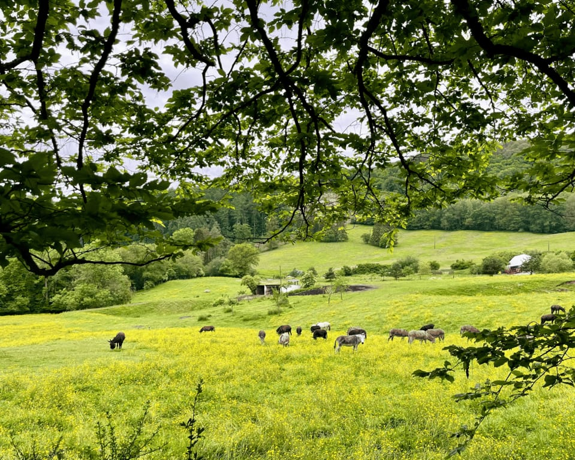

## En pratique

**Cette semaine de stage, une première aux 4 Sources, offre à votre enfant de 8 à 12 ans un cadre d’expérimentation et de découvertes dans un superbe lieu de nature.**

Chaque matinée est consacrée à la construction d’objets en bois de récup’ dans le Dôme, un espace de travail adapté aux enfants, avec nos artisans Magali et Olivier.

Différentes activités passionnantes sont organisées l’après-midi, portées par Magali, Olivier et les jeunes des 4 Sources.

<!-- columns -->
<!-- column width="50%" -->

<!-- column width="50%" -->

<!-- /columns -->

En fin de semaine :

- Chaque enfant repart avec une ou plusieurs réalisations personnelles en bois de récup’.
- Chaque enfant repart avec des compétences techniques (utilisation de scie, équerre, marteau, visseuse…), acquière de l’autonomie et de la confiance en soi et apprend les gestes de bases de construction et réparation (de précieuses compétences !).
- Chaque enfant aura expérimenté au choix : de la grimpe d’arbre, du disc-golf, de la robotique, de la création de bijoux, des jeux dans les bois, de la construction de cabanes, la rencontre avec le troupeau d’ânes…
- Et bien sûr, chaque enfant sera en demande de revenir ! 🙂

### Horaires

- de 9h à 12h : constructions en bois de récup’
- de 12h à 13h : repas
- de 13h à 16h : activités variées aux 4 Sources

### À prendre avec soi

- Son pique-nique pour le midi + un p’tit goûter
- Sa gourde
- Ses vêtements adaptés à la saison
- Des chaussures fermées

## Un espace de travail trop cool !

<!-- columns -->
<!-- column width="50%" -->

Est-ce une navette spatiale, un igloo géant ou un animal géant préhistorique endormi ? Eh non, c’est **le Dôme des 4 Sources** !

Cet espace lumineux accueille les p’tits menuisiers avec du matériel et des plans de travail adaptés à leur âge.

<!-- column width="50%" -->

<!-- /columns -->

## Des animateurs motivés

**Nos animateurs partagent leurs passions, leurs talents et leurs valeurs de transformation ! Pour les temps “menuiserie” du matin, deux animateurs chevronnés encadreront maximum 7 enfants chacun.**

<!-- columns -->
<!-- column width="50%" -->

### Magali

Habitante des 4 Sources, **Magali** est la femme-orchestre du Dôme, maitrisant chaque outil et connaissant chaque tiroir de vis, de boulons et de rondelles comme sa poche.

<!-- column width="50%" -->

### Olivier

Habitant des 4 Sources, designer, pédagogue et élagueur-grimpeur de formation, **Olivier** possède une grande expérience d’animation. Passionné par le bois, de l’arbre à la planche, il adore accompagner enfants et adultes dans la créativité.
<!-- /columns -->

## Les derniers p’tits détails

- Pour les enfants de 8 à 12 ans
- Garderie de 8h à 9h et de 16h à 17h (5€/jour)
- Vendredi de 16h à 17h, graaaaande présentation aux parents ! 😎

## Des questions concernant ce stage ?

Contacte-nous à [contact@les4sources.be](mailto:contact@les4sources.be). Nous y répondrons avec plaisir !

## Inscription

**L’inscription à ce stage de 5 jours limité à 14 participants (7 enfants par artisan) est accessible au prix de 175 €/enfant.**

<!-- columns -->
<!-- column width="87.5%" -->

Suis ce lien pour charger le formulaire d’inscription avec paiement en ligne par Bancontact ou carte de crédit.

<a class="button" href="https://les4sources.punchpass.com/series/40686?source=cal">Inscription au stage</a>

<!-- column width="12.5%" -->

<!-- /columns -->
