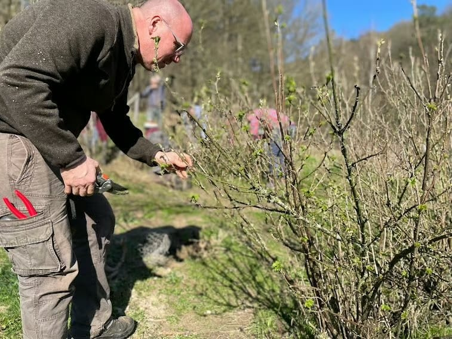

**Rejoins-nous pour une journée immersive dans l'art de la taille des arbres fruitiers, spécifiquement les pommiers et poiriers en ce début mars, dans le magnifique cadre du pré-verger conservatoire d’arbres hautes tiges des 4 Sources à Yvoir.**

Cette journée de formation t’offre l'opportunité de développer des compétences essentielles pour prendre soin de tes arbres fruitiers, assurant leur santé et leur productivité pour les années à venir.

### Pourquoi la taille est-elle cruciale ?

La taille est un élément essentiel dans la gestion d'un verger. Elle influence non seulement la future récolte mais aussi la santé globale de l'arbre. Savoir quand et comment tailler permet de maximiser la production de fruits et d'assurer une croissance équilibrée et durable.

### Ce que tu apprendras

- **Utilisation des outils de taille** Familiarise-toi avec les outils nécessaires et apprends à les manier avec précision et sécurité.
- **Lecture de l’arbre** Comprends la structure unique de chaque arbre fruitier et identifie les meilleures branches à tailler pour favoriser une croissance saine.
- **Techniques de taille** Maitrise les techniques de coupe pour favoriser la fructification et prévenir les maladies.
- **Entretien préventif** Apprends à détecter les signes de maladies ou de faiblesses et à intervenir pour maintenir tes arbres en bonne santé.

<!-- columns -->
<!-- column width="50%" -->

La journée sera rythmée par des ateliers pratiques en petits groupes, encadrés par Michael Dossin, expert en arboriculture. Tu auras l'occasion de mettre en pratique immédiatement tes nouvelles compétences sur les arbres du pré-verger. Cette approche pratique garantit une expérience d'apprentissage complète et engageante.

<!-- column width="50%" -->

<!-- /columns -->

Cette formation est ouverte à tous, des jardiniers amateurs aux professionnels de l'agroforesterie. Que tu aies un petit verger familial ou que tu envisages de développer un projet de permaculture à plus grande échelle, cette journée te fournira les connaissances et compétences nécessaires pour bien démarrer.

**Rejoins-nous pour une journée riche en apprentissages et en partages, et repars avec la confiance et les compétences nécessaires pour prendre soin de tes pommiers et poiriers.**

## Facilitateur

<!-- columns -->
<!-- column width="56.3%" -->

**Michaël Dossin** expérimente un mode de vie respectueux de la Terre depuis plus de dix ans. En 2009, il quitte un poste de gérant pour embrasser une passion incommensurable : cultiver des repas sains pour sa famille.

Son parcours l'a conduit à créer la Micro-ferme du Bout du Monde, un véritable havre de paix à Spa. Fruits, légumes et plantes médicinales y prospèrent en harmonie avec notre écosystème, favorisant une biodiversité florissante.

Ex-professeur d'horticulture, formateur en permaculture et conseiller en projets de production alimentaire, son objectif est de partager ses connaissances et d'encourager un style de vie respectueux de la Terre.

[michaeldossin.be](https://www.michaeldossin.be/)

<!-- column width="43.8%" -->

<!-- /columns -->

## En pratique

- **Quand?** Le samedi **22 mars 2025** de 9h30 à 17h
- **À quel prix?** Cette riche journée est accessible au prix de 50€ TVAC
- **Où?** [Les 4 Sources](/a-propos/acces-ahinvaux) - Fonds d’Ahinvaux 1, 5330 Yvoir
- **Du matériel spécifique à prévoir?** Tout matériel de taille à ta disposition

## Pour s’inscrire

Cet événement est organisé par notre partenaire Semisto. Rends-toi [sur le site web de Semisto](https://www.semisto.org/poles/formations-semisto/toutes-les-formations/taille-de-fruitiers-avec-michael-dossin-mars-2025) pour plus d’informations et pour t’y inscrire.

> 💁 **Envie de loger sur place avant ou après l’événement ?** Fais-nous part de ta demande à [sejours@les4sources.be](mailto:sejours@les4sources.be).
