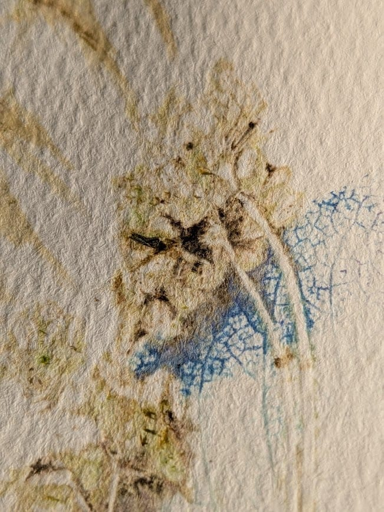
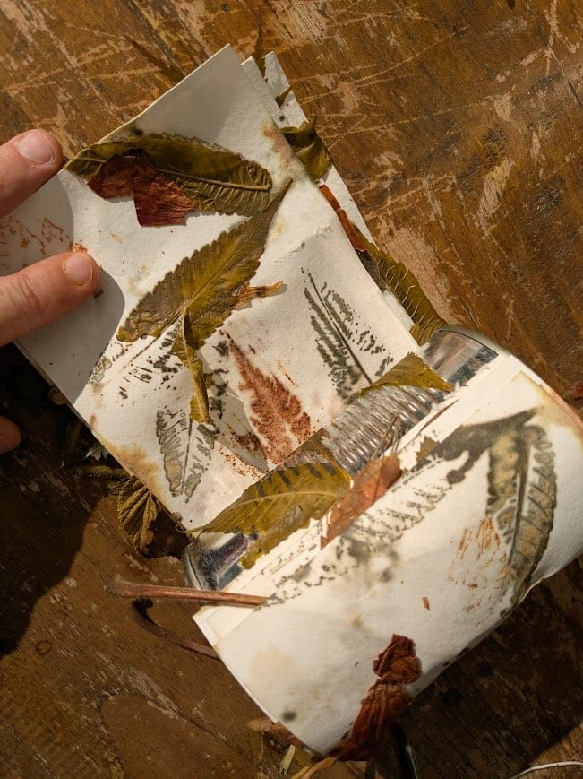
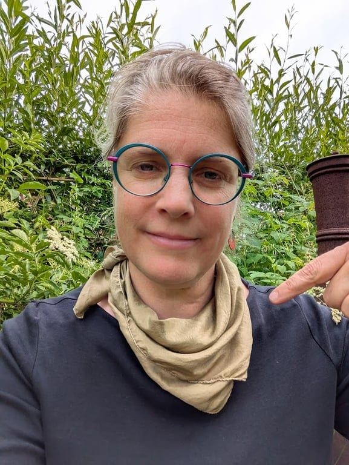
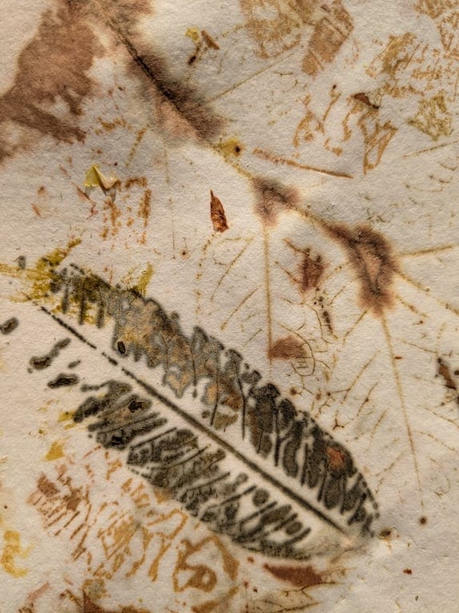
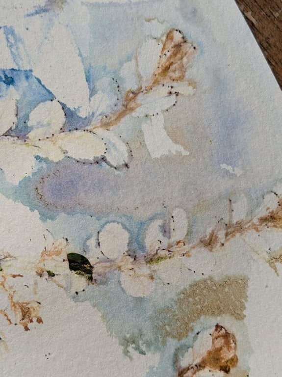
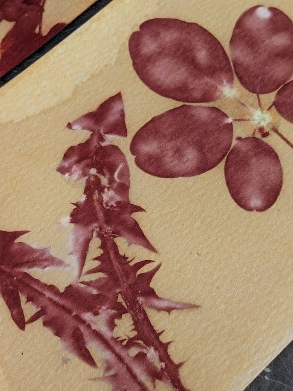
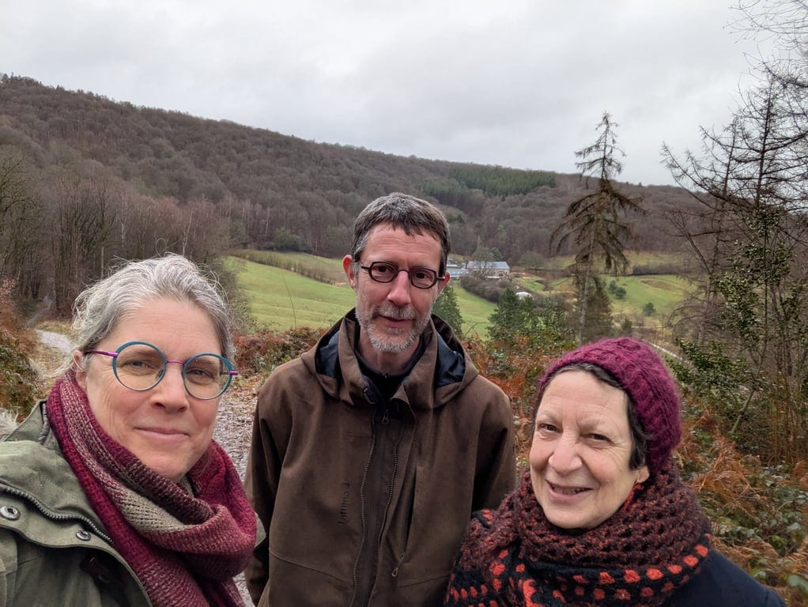

## **Une belle journée - le samedi 3 octobre - pour…**

…cueillir les plantes en pleine nature pour en extraire leurs empreintes et leur silhouette. Aller à la rencontre des pigments végétaux, observer comment ils se déposent sur le papier, comment ils se transforment ou se révèlent selon différents processus. Tester trois techniques différentes (Anthotypes, écoprint et tatakizomé). Terminer en beauté en reliant nos explorations végétales sous forme d’un petit carnet à emporter.

Pas de connaissances requises, viens comme tu es !

<!-- columns -->
<!-- column width="50%" -->

<!-- column width="50%" -->

<!-- /columns -->

<a class="button" href="https://www.billetweb.fr/plantes-papier-pigments">🍃 Je prends ma place !</a>

## Bénédicte, d’Explorations Végétales 🌿

<!-- columns -->
<!-- column width="50%" -->

<!-- column width="50%" -->

<!-- /columns -->

> *Depuis toujours, c’est au calme et dans la nature que je me ressource. Les plantes m’apportent joie, admiration, surprise, questionnement et beaucoup d’autres choses encore. Cet émerveillement et cet enthousiasme débordent à tel point que j’ai choisi de les partager autour de moi. J’anime des balades plantes sauvages comestibles et médicinales mais aussi des ateliers divers et variés autour des plantes via l’herboristerie, les cosmétiques naturels, la saponification à froid, la cuisine sauvage, la teinture végétale et la botanique créative. Biologiste de formation, je chemine de formations en expériences personnelles. Chaque nouvelle saison m’offre son lot de découvertes et d’ancrage dans de plus en plus de pratique. J’ai aussi la joie de donner des cours à l’IFAPME dans les sections de fleuristerie et de guide-nature. Au plaisir de vous rencontrer.*

→ [https://benedictegerard.be](https://benedictegerard.be/)

<!-- columns -->
<!-- column width="50%" -->

<!-- column width="50%" -->

<!-- /columns -->

## **En pratique**

- Au coeur de la clairière des 4 Sources: 📍 Fonds d’Ahinvaux, 1 à Yvoir, entre Namur et Dinant
- Le samedi 3 octobre de 9h30 à 21h
- Maximum 8 participant-es par atelier : 75€ la place
- Clôture le samedi soir avec une Pizza Party (cuisson au feu de bois)
- Apporter son pic-nic et les garnitures pour la pizza 🍕

<a class="button" href="https://www.billetweb.fr/plantes-papier-pigments">🍃 Je prends ma place !</a>

### Cette journée créative est entièrement organisée par nos trois intervenant-es, Bénédicte, Olivier et Marianne

