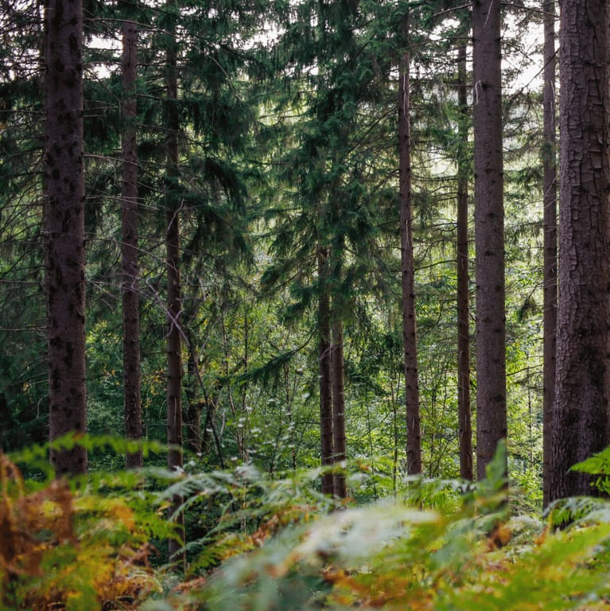
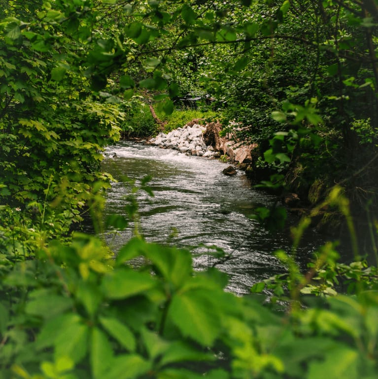
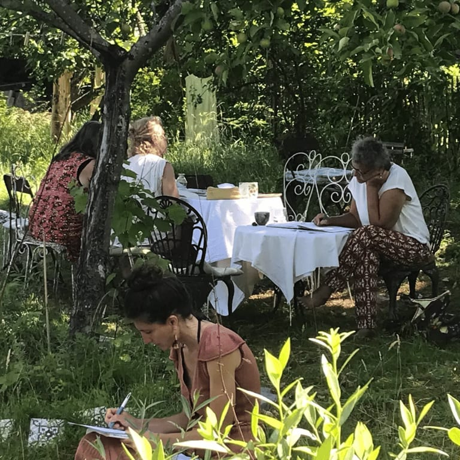
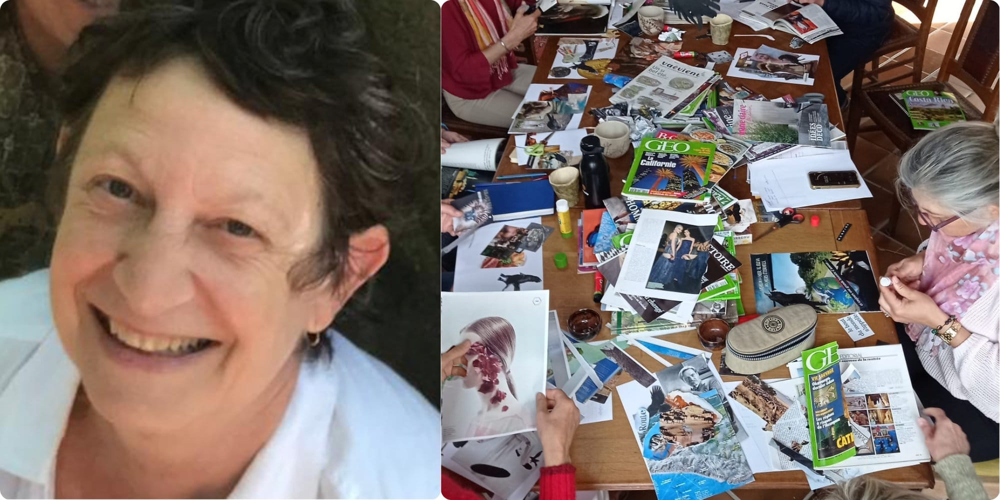

## **Une belle journée - le samedi 3 octobre - pour…**

…un atelier d’écriture sur la thématique **: l’eau, les arbres et moi.** Guidé**·**es par des consignes ludiques, sans stress orthographique ni prétention littéraire.

Apprendre de nouvelles choses sur l'eau, les arbres et leur lien intime et fascinant, grâce à des lectures courtes de textes variés; vous laisser touché.es par vos observations; être stimulé.es par des consignes d'écriture simples qui vont déclencher votre créativité, ouvrir votre sensibilité et générer une réalisation personnelle qui n'attend que ce moment pour éclore...

Voilà quelques-uns des ingrédients de la journée d'exploration que je vous propose autour de l'eau et des arbres. L'atelier est inspiré entre autres par les écrits de Baptiste Morizot et les nouvelles découvertes concernant l'eau douce, bleue et … verte.

Aucun enjeu littéraire, pas de résultat attendu, zéro stress orthographique. Qui sait !? Peut-être un moment de réconciliation avec l'écrit… ou la joie de partager des découvertes et des émotions en sécurité dans un petit groupe.

Allez, plongez ! Offrez-vous ce temps souple et liquide…

[https://www.savoirs-racines.org/leau-les-arbres-et-moi/](https://www.savoirs-racines.org/leau-les-arbres-et-moi/)

<!-- columns -->
<!-- column width="33.3%" -->

<!-- column width="33.3%" -->

<!-- column width="33.3%" -->

<!-- /columns -->

## Avec Marianne, des ateliers de l’Eau Vive 💧

> *Active successivement dans l’édition, la communication et ensuite, l’enseignement et la didactique du français en haute école. Co-fondatrice d’une dynamique de Transition, très engagée dans une épicerie collaborative et coopérative, animatrice d’ateliers d’écriture en lien avec le vivant au sein de Savoirs Racines asbl…*

> *Apprentissages, écologie, permaculture humaine, transition intérieure, féminisme, en fil de trame. Lecture, écriture, couture, un peu de dessin, méditation, ombre et lumière, forêt… en fil de chaine. Voilà les fils qui tissent quelques-uns des motifs de son parcours de vie.*

## **En pratique**

- Au coeur de la clairière des 4 Sources: 📍 Fonds d’Ahinvaux, 1 à Yvoir, entre Namur et Dinant
- Le samedi 3 octobre de 9h30 à 21h
- Maximum 8 participant-es par atelier : 75€ la place
- Clôture le samedi soir avec une Pizza Party (cuisson au feu de bois)
- Apporter son pic-nic et les garnitures pour la pizza 🍕

<a class="button" href="https://www.billetweb.fr/journee-creative-atelier-decriture">Je prends ma place !</a>

### Ce weekend créatif est entièrement organisé par nos trois intervenant-es, Bénédicte, Olivier et Marianne

