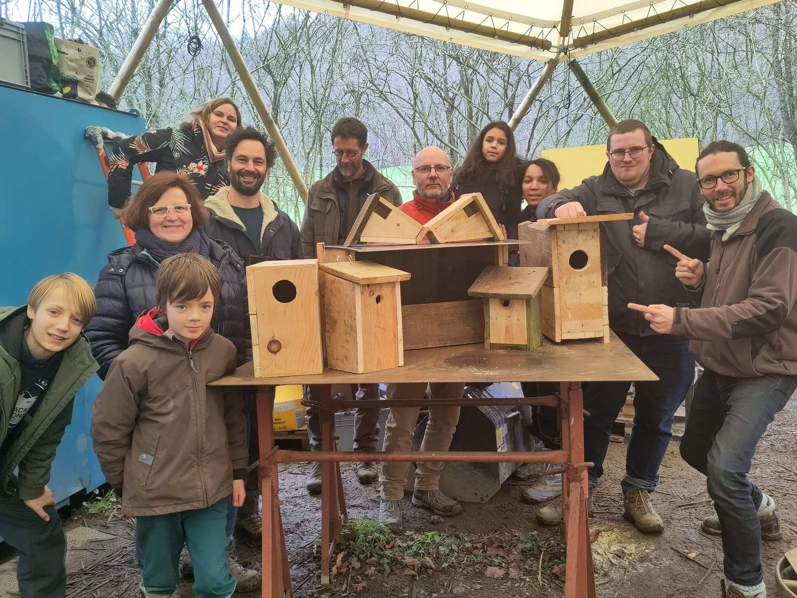
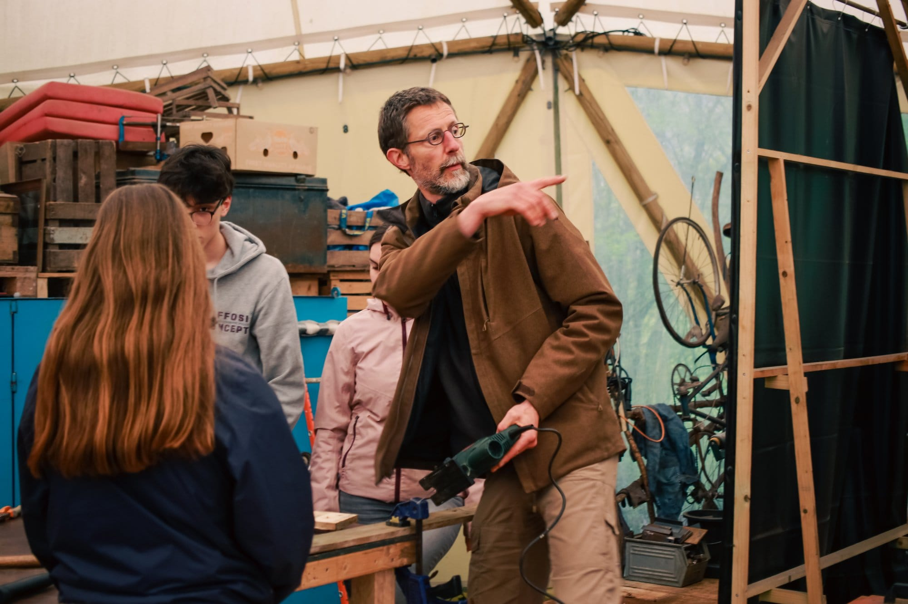

## Une belle journée - le samedi 3 octobre - pour…

…construire l’objet de ton choix en bois de palette. Tu viens avec une idée précise ou tu peux réfléchir le jour J de ce qui est possible de faire avec Olivier. Cela peut être un objet d’aménagement, de déco, de petit mobilier...

Aucune connaissance requise particulière !

Pic-nic le midi et Pizza party au soir pour clôturer en beauté la journée 🍕

**Bien évidemment, tu repars avec l’objet construit de tes mains au terme des trois jours** 🪑

## Avec Olivier, membre des 4 Sources

> *J’ai une formation de base en design industriel. Je me suis aussi formé à la pédagogie, à l’écologie, à l’élagage. Dans mes différents engagements j’ai toujours accordé une grande importance à l’accompagnement dans les apprentissages, aussi bien avec des enfants, des jeunes que des adultes, avec une attention au pouvoir de la créativité.*

Un coup d’oeil sur son site → [https://debranchesenplanches.be](https://debranchesenplanches.be/) 🌳

## En pratique

- Au coeur de la clairière des 4 Sources: 📍 Fonds d’Ahinvaux, 1 à Yvoir, entre Namur et Dinant
- Le samedi 3 octobre de 9h30 à 21h
- Maximum 8 participant-es par atelier : 75€ la place
- Clôture le samedi soir avec une Pizza Party (cuisson au feu de bois)
- Apporter son pic-nic et les garnitures pour la pizza 🍕

### Cette journée créative est entièrement organisée par nos trois intervenant-es : Bénédicte, Olivier et Marianne !

