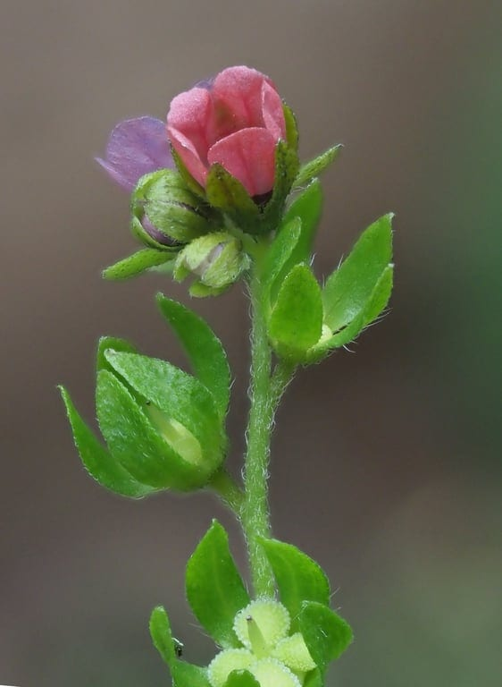
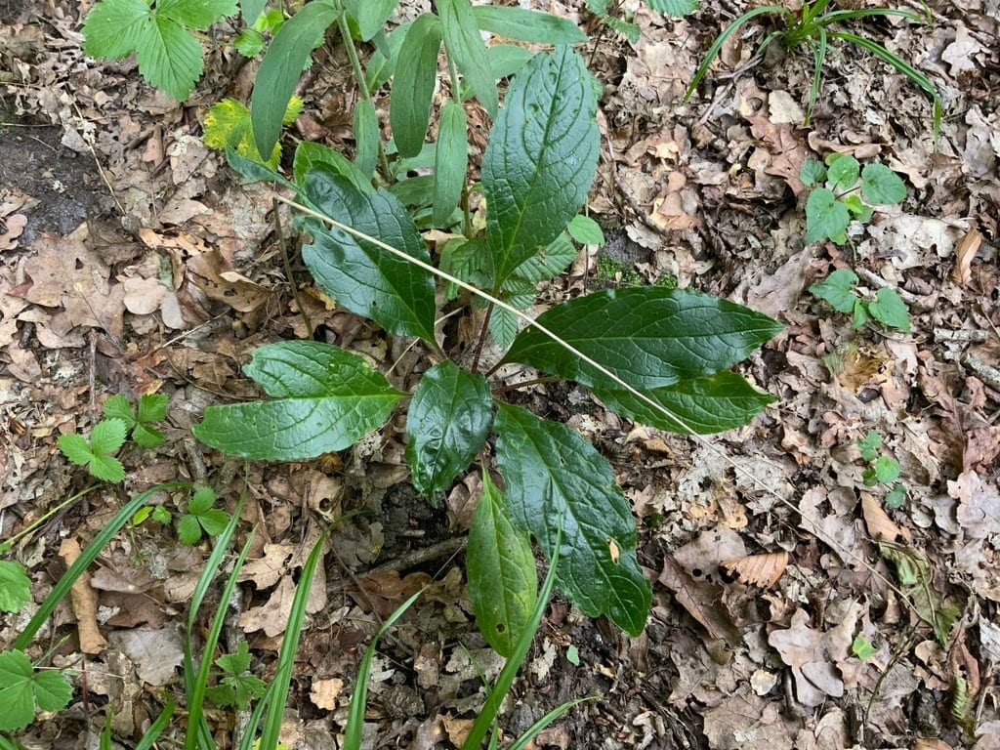

<!-- columns -->
<!-- column width="50%" -->

<!-- column width="50%" -->

*Cynoglosse d’Allemagne*
<!-- /columns -->

Plants bien présents (quelques dizaines en fleurs et bien davantage en rosette : bisannuelle).

Délicat cousin des myosotis, couleur mauve ou framboise.

Plante assez grande mais très petites fleurs semblant éclore une par une, sur le modèle des scrofulaires.

Que cherchons-nous vraiment dans la forêt ?
