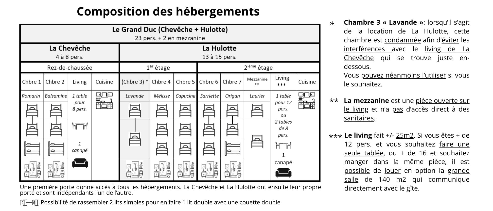

Accueille toute la famille ou tout ton groupe et profite d'une grande terrasse exposée plein sud, entourée de forêts idéales pour de belles randonnées. Immergez-vous tous ensemble dans un cadre naturel magnifique avec des ânes, un lama, un alpaga et Eventy, notre fjord islandais.

Proche d'Yvoir, de Crupet et d'Evrehailles, c'est l'endroit idéal pour une escapade en pleine nature !

## Pour 25 personnes 🛏️

Le Grand-Duc se situe dans une grande bâtisse rénovée et se compose de nos 2 hébergements, disponibles également indépendamment. Le reste du bâtiment, l’ancien corps de ferme, accueille une habitante et une grande salle disponible à la location.

Ce logement pour 25 personnes se situe sur 3 étages et comprend :

### Au rez-de-chaussée

- **Living**
- **Cuisine** équipée avec taques, four et frigo (pas de lave-vaisselle)
- **2 chambres** : la Balsamine et la Romarin, chacune avec 2 lits simples pouvant être réunis en un lit double + 1 lit superposé

### Au premier étage

- **3 chambres** : la Mélisse (3 lits simples), la Capucine (3 lits simples) et la Lavande (2 lits simples pouvant être réunis en un lit double)

### Au deuxième étage

- **2 chambres** : la Sarriette (2 lits simples pouvant être réunis en un lit double + 1 lit superposé) et l’Origan (2 lits simples pouvant être réunis en un lit double + 1 lit simple)
- **Séjour** de 25 m² composé d'un divan-lit et de tables pour 10-12 personnes
- Petite **cuisine** équipée avec taques, four, frigo (pas de lave-vaisselle)
- **Mezzanine** du Laurier, ouverte sur le living du 2ème étage : 2 lits simples (pouvant aussi être utilisés comme espace « salon »), sans sanitaire indépendant

→ [Chambre « Mélisse »](/sejours/hebergements-yvoir/la-hulotte-gite-16-personnes/chambre-mlisse) · [La cuisine (2ème étage)](/sejours/hebergements-yvoir/la-hulotte-gite-16-personnes/la-cuisine) · [Le séjour (2ème étage)](/sejours/hebergements-yvoir/la-hulotte-gite-16-personnes/le-sjour)

## Bon à savoir 🧭

<!-- columns -->
<!-- column width="50%" -->

### Salles de douche 🚿

Chaque chambre dispose d'une salle de douche avec douche, lavabo et WC.

### Draps de lit

Nous vous invitons à venir avec vos propres draps. Si nécessaire, nous fournissons des draps pour 10 €/lit.

### Arrivée et départ

- Arrivée après 16h
- Départ en semaine : 12h
- Départ le dimanche : 20h

<!-- column width="50%" -->

### Accès internet 🛜

Une connexion filaire (par câble réseau) est disponible dans la cuisine et via point d’accès WiFi. Connexion internet de 70 Mbps.

### Carte de balades 🥾

Notre carte de balades, disponible dans la Hulotte, permet de partir majoritairement des 4 Sources et de découvrir les forêts et paysages de la vallée du Bocq.
<!-- /columns -->
