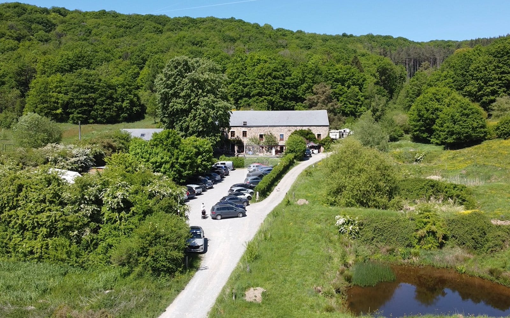
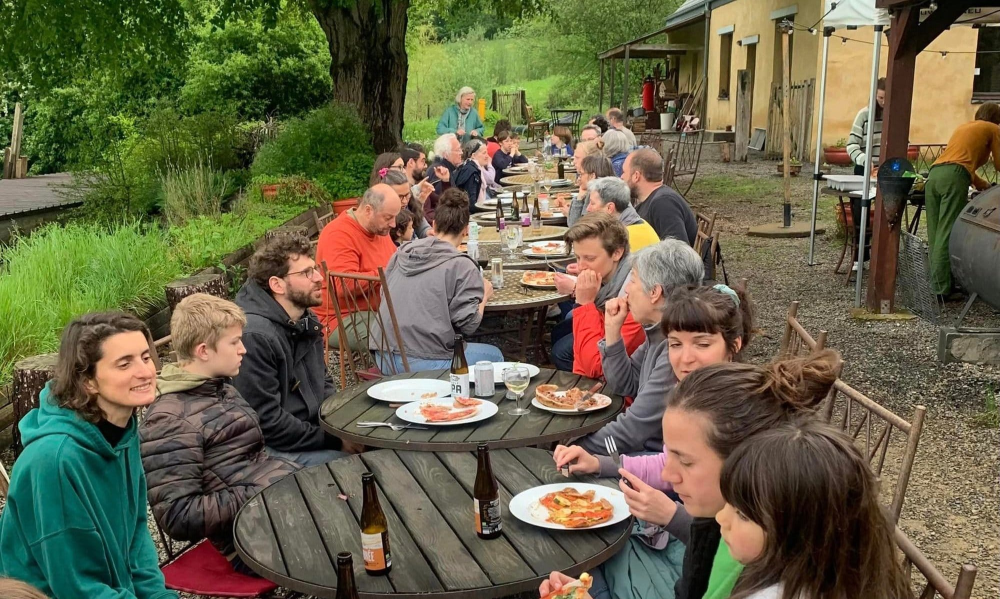
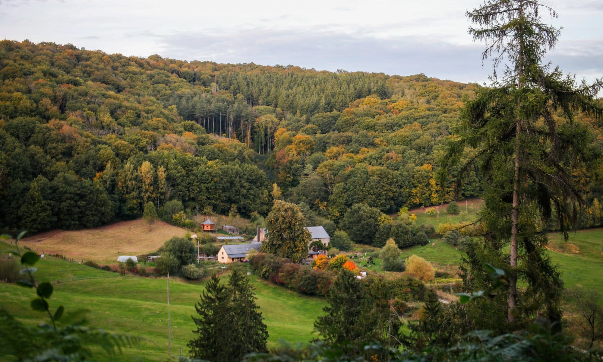
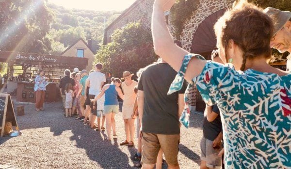
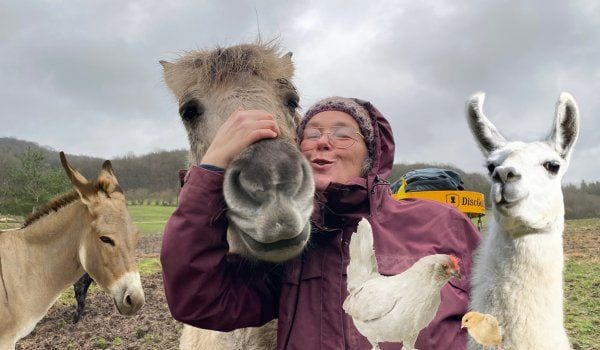
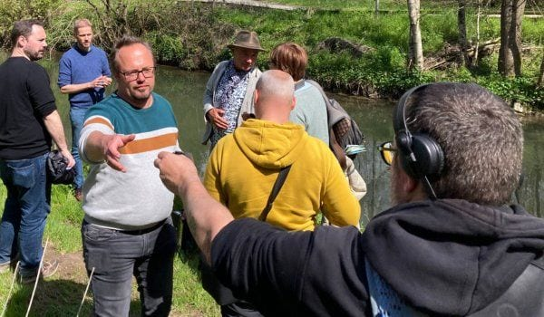
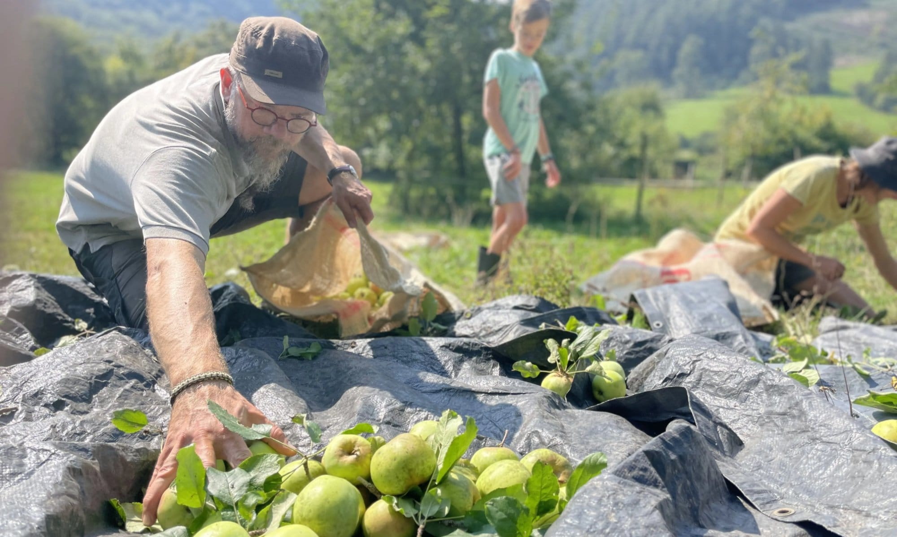

<!-- columns -->
<!-- column width="50%" -->

## [Accéder aux 4 Sources](/a-propos/acces-ahinvaux)

Les 4 Sources sont accessibles à pied, en vélo, à cheval, en train et en voiture depuis Yvoir, Evrehailles, Crupet et la forêt 🌲

<a class="button" href="/a-propos/acces-ahinvaux">Comment accéder aux 4 Sources ?</a>

<!-- column width="50%" -->

## [Raison d’être du projet](/a-propos/notre-projet)

Les 4 Sources, c’est un écolieu / tiers-lieu avec des fondements solides, une raison d’être et une philosophie propre.

**[En savoir plus sur le projet des 4 Sources](/a-propos/notre-projet)**
<!-- /columns -->

<!-- columns -->
<!-- column width="50%" -->

## [Soutenir Les 4 Sources](/nous-soutenir)

Nous mettons notre temps et notre énergie au service des 4 Sources. Tu peux également t’impliquer en nous soutenant financièrement.

**[Comment nous soutenir](/nous-soutenir)**

<!-- column width="50%" -->

## [Notre collectif](/notre-collectif)

6 familles habitent sur le lieu, auxquelles se joignent des personnes extérieures et tout un réseau qui permet au projet des 4 Sources de se déployer.

**[Faisons connaissance](/notre-collectif)** 👋
<!-- /columns -->

<!-- columns -->
<!-- column width="50%" -->

## [Les animaux](/a-propos/les-animaux-des-4-sources)

Ils vivent avec nous aux 4 Sources : 26 ânes, Eventy le cheval, 16 poules et Shiny le coq, un alpaga, un lama et quelques chats.

**[Découvre les animaux](/a-propos/les-animaux-des-4-sources)**

<!-- column width="50%" -->

## [Dans la presse](/a-propos/les-4-sources-dans-la-presse)

Eh oui, il arrive que des journalistes racontent nos expériences dans les journaux, à la radio et à la télévision. De quoi semer de précieuses graines !

**[Les 4 Sources dans les médias](/a-propos/les-4-sources-dans-la-presse)**
<!-- /columns -->

<!-- columns -->
<!-- column width="50%" -->

## [Un tiers-lieu nourricier](/a-propos/jardin-foret-et-verger)

Partons à la découverte du verger conservatoire et du jeune jardin-forêt.

**[En balade parmi les arbres fruitiers](/a-propos/jardin-foret-et-verger)**

<!-- column width="50%" -->

## [Le Domaine d’Ahinvaux](/a-propos/domaine-d-ahinvaux)

<iframe src="https://www.youtube.com/embed/wU9r6iu5HxE?rel=0" title="Le Domaine d’Ahinvaux en vidéo" loading="lazy" allowfullscreen class="embed embed-video"></iframe>

Notre collectif s’est posé dans un lieu unique au cœur d’une région magnifique avec un environnement géographique incroyablement riche.

**[L’histoire-géo du lieu](/a-propos/domaine-d-ahinvaux)**
<!-- /columns -->

## Pour nous contacter 📬

<a class="button" href="/contact">Les infos de contact</a>
