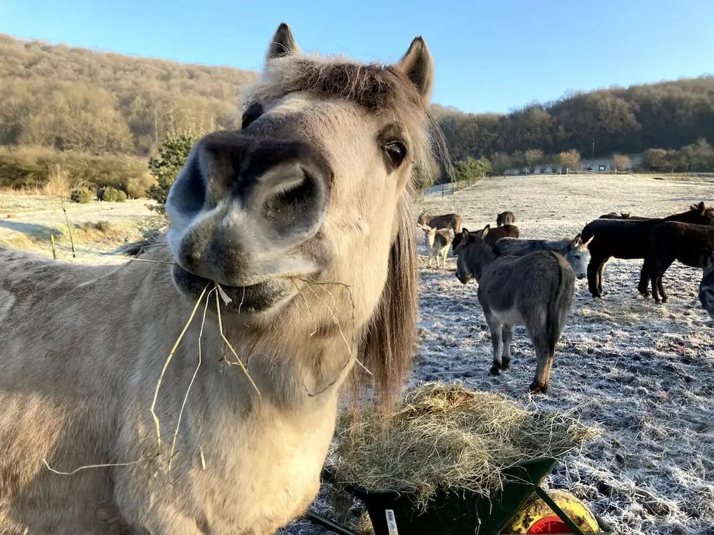
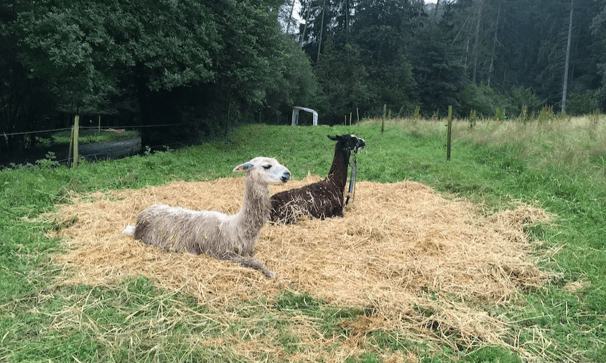
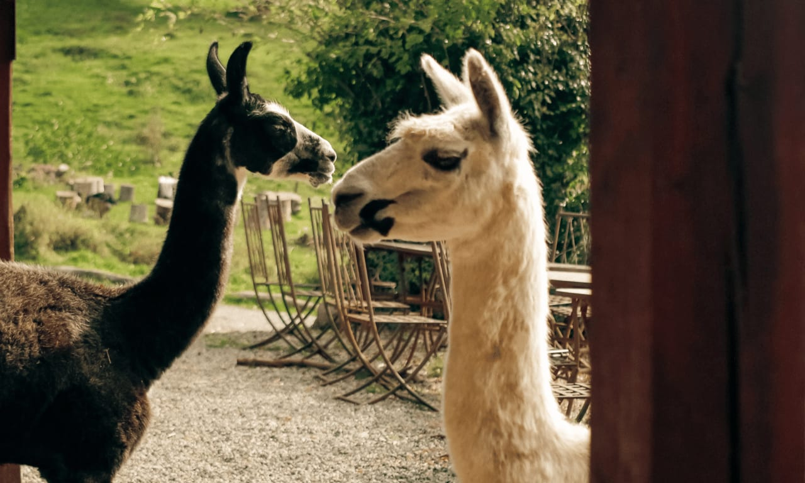
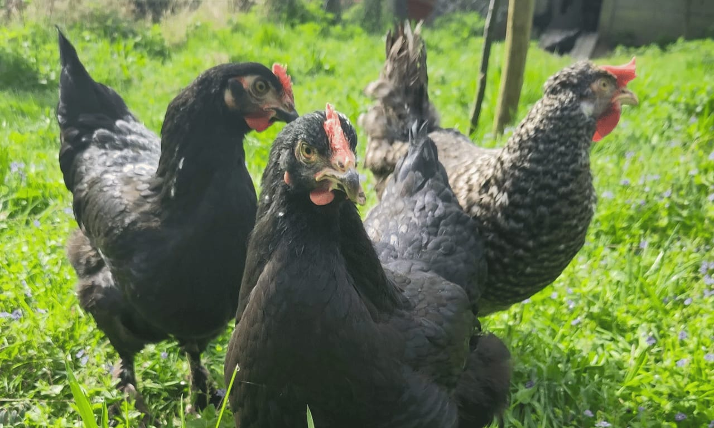
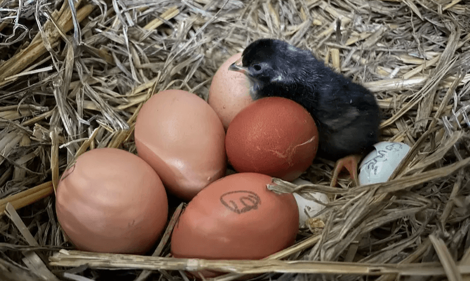
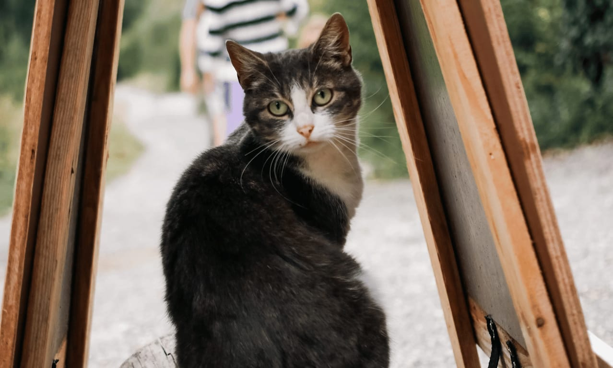
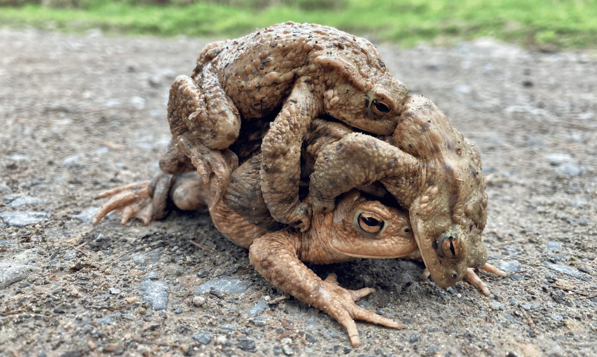
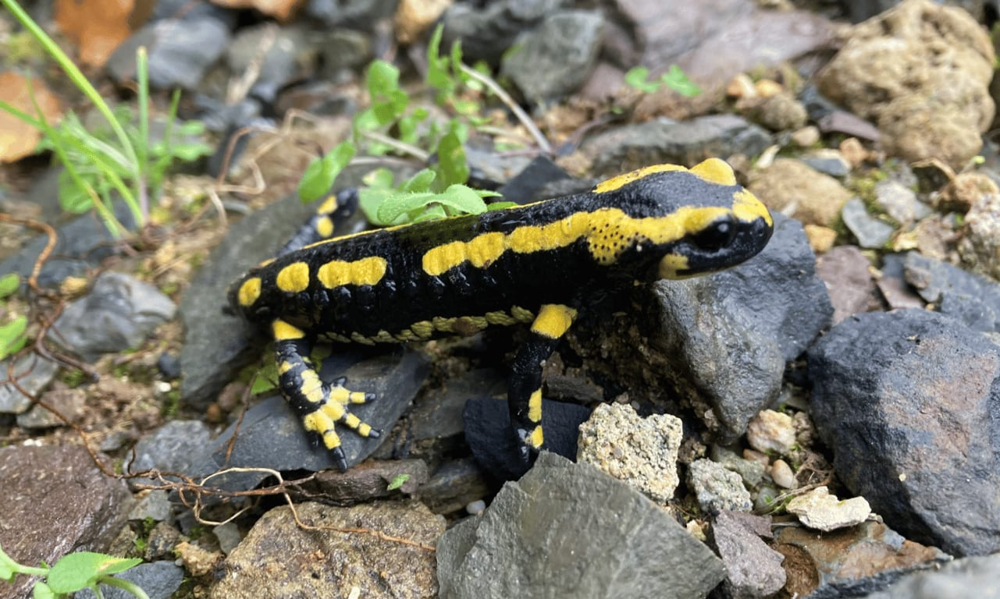

Lors de votre visite, vous aurez l'occasion de faire la rencontre de notre cheptel d’ânes et d’Eventy, notre cheval, mais également de Poncho et Morgane, respectivement alpaga et lama. Vous y entendrez Shiny et ses cocottes et vous pourrez apercevoir quelques chats câlins. Chacun.e d'eux contribue à la vie et à l'énergie de 4 Sources et nous sommes ravi.es de partager leur présence avec vous.

## Les ânes des 4 Sources 🐎

Nous partageons les espaces avec 26 ânes qui passent d’une prairie à l’autre au fil des saisons. Ce sont des partenaires d’entretien des pâtures incroyables qui œuvrent 7 jours sur 7, 24h sur 24h.

## Eventy, the one and only one cheval 🐴

## Poncho et Morgane 🦙

En liberté sur le lieu après avoir vécu dans un refuge, ils font partie des mascottes des 4 Sources. Ne vous étonnez pas si vous les croisez sur la terrasse, leur bac de nourriture se trouve juste derrière le bar.

Poncho et Morgane sur un bon lit de paille fraiche

## Les poules et Shiny 🐔

Nous avons 14 poules et un coq, Shiny. Vous ne pourrez pas le manquer si vous logez sur place, au moins à l’oreille, un vrai tenor !

<!-- columns -->
<!-- column width="50%" -->

<!-- column width="50%" -->

<!-- /columns -->

## Les chats 🐈

Douceurs et câlins au programme avec les chats des 4 Sources…

*Tigresse*

## Mais aussi, en guest stars…

<!-- columns -->
<!-- column width="50%" -->

*La fête aux crapauds*

<!-- column width="50%" -->

*Les magnifiques salamandres*
<!-- /columns -->

→ [Plus de détails sur la biodiversité aux 4 Sources](/biodiversite)
