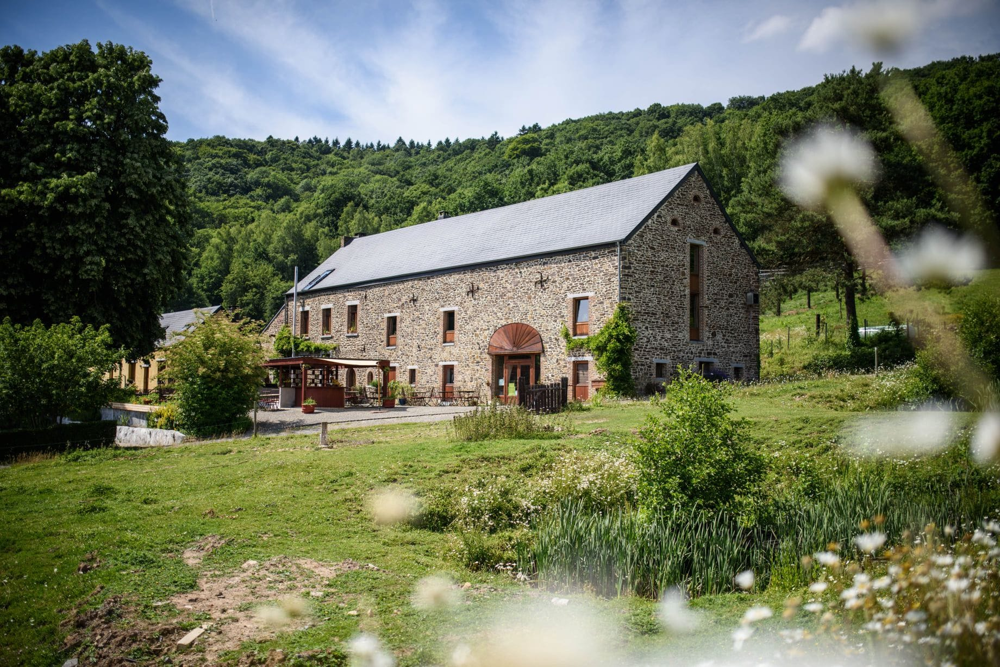

## Un lieu de nature 🌳

15 hectares composés de 13 hectares de prés classés Natura 2000 et de 2 hectares de bois, animés par 2 pôles :

- **[Pôle Biodiversité](/biodiversite)** : préservation et déploiement de la faune et de la flore sur le lieu
- **[Pôle Animaux](/a-propos/les-animaux-des-4-sources)** : soin au troupeau et autres animaux domestiques

## Un lieu d'habitat collectif 🏡

Animé par 1 pôle :

- **[Pôle Habitants](/notre-collectif)** : 6 foyers habitent sur place et comprennent au total 10 adultes et 10 enfants

## Un lieu d'activités 🛠️

Animé par 5 pôles :

- **Pôle Artisanat** : [ferronnerie](/projets/la-ferronnerie), [travail du bois](/projets/de-branches-en-planches), petit artisanat et [activités de transmission](/activites)
- **Pôle Transformation/Production/Ventes** : [bar champêtre](/le-bar-des-4-sources), [production de pain](/projets/tranches-de-vie), verger conservatoire, potager, jardin-forêt et [activités de transmission](/activites)
- **Pôle Ateliers/Événements** : tous nos [ateliers](/activites) et [événements](/agenda)
- **Pôle Hébergements et Salles** : la [location](/sejours) de différents espaces et le soin mis dans l’accueil
- **Pôle Liens Locaux et Inter-Projets** : la création d’espaces de maintien et de développement de liens entre les citoyen·nes, ainsi qu’avec différents projets locaux et/ou partageant notre raison d’être

## Enjeux sociétaux 🌍

À travers le projet des 4 Sources, nous nous penchons sur **différents enjeux sociétaux** et explorons des facettes de :

- **la sobriété**
- **la permaculture**
- **la connexion à soi, aux autres et au Vivant**
- **la co-création**

### Comment explorons-nous ces enjeux dans notre projet ?

- Via l'**expérimentation**
- Via la **transmission**
- En favorisant une **transformation individuelle, sociétale et environnementale**
