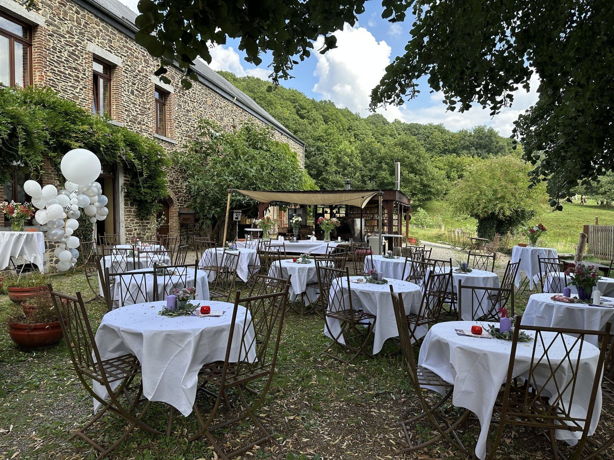
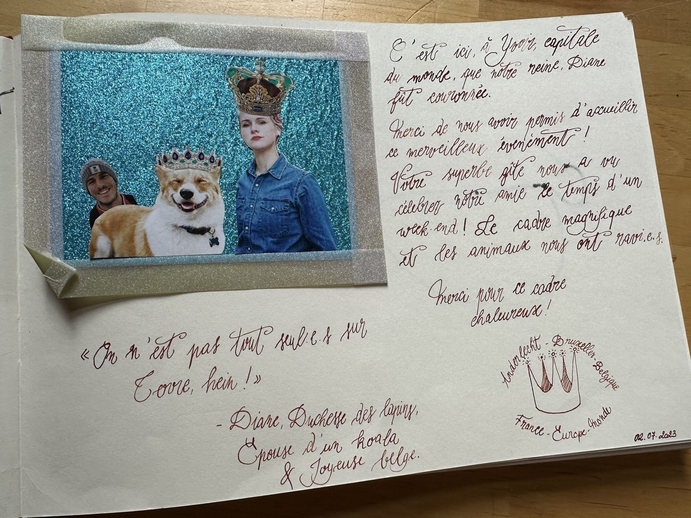

Que vous soyez en famille, entre amis ou en petit collectif, composez votre célébration à la carte avec hébergements, salles conviviales et activités mémorables. Les 4 Sources, c’est 15 hectares de nature classée Natura 2000, un habitat collectif et des valeurs fortes.

## Dormir sur place pour prolonger la fête 🌙

Des gîtes pour 8, 15 ou 25 personnes. Une terrasse plein sud pour boire un verre ou pour un grand repas festif. Une cuisine équipée. Et un espace bivouac pour dormir sous tente, hamac ou en van aménagé.

→ [Découvre nos hébergements](/sejours/hebergements-yvoir)

## Célébrer en beauté dans nos salles 🎉

- Notre grande salle de 145 m² avec bar, sono et vaisselle pour 80 personnes
- Ou notre petite salle cosy pour des ateliers ou repas de groupe (jusqu’à 25 personnes)
- Et la cuisine professionnelle pour préparer les p’tits plats

→ [Nos salles et la cuisine](/sejours/salles)

## Ils l’ont fait ! 📸

## Des expériences enrichissantes pour tous tes invités 🎒

Compose une fête sur-mesure avec des expériences uniques : ateliers d’artisanat ou de cuisine, découverte de la nature et du projet, disc-golf, bain d’ânes…

<a class="button" href="/catalogue">Le catalogue des activités</a>

> 🎂 **Prêt·e à célébrer un anniversaire inoubliable ?** Contacte Malau pour imaginer ensemble la fête qui te ressemble, à [sejours@les4sources.be](mailto:sejours@les4sources.be) ou au +32 (0)490 46 77 10.
