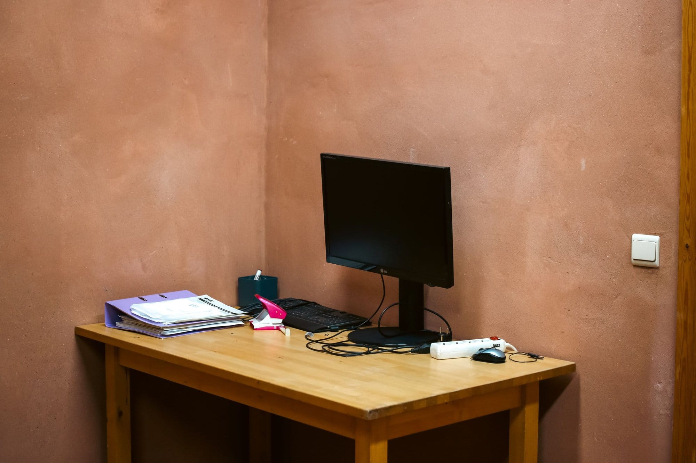
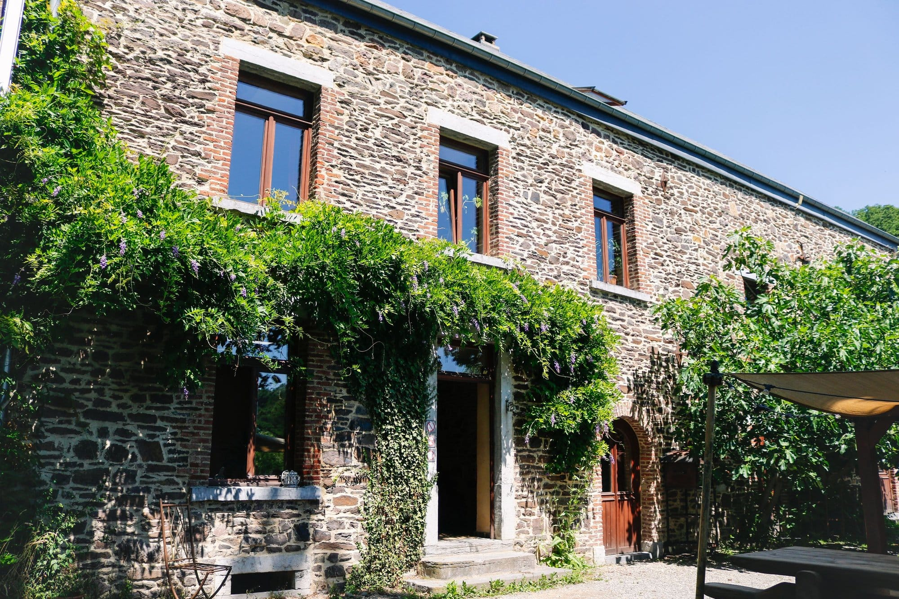
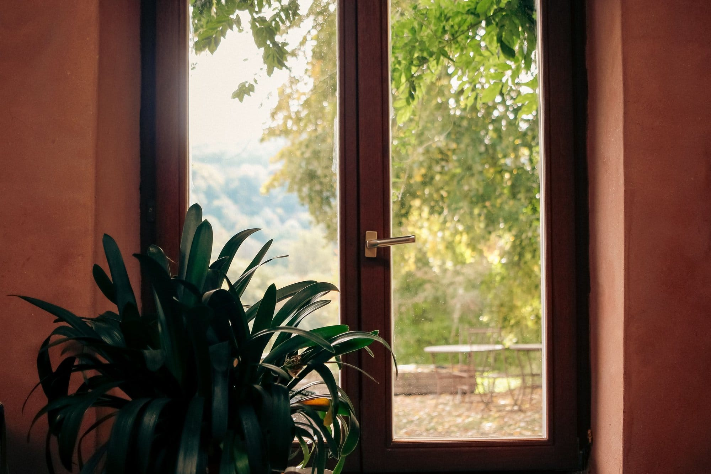

Ici, nous vous proposons un espace avec 3 bureaux disponibles, accessible **du lundi au vendredi (excepté le jeudi) de 8h à 20h**.

## Services inclus 🖥️

Mise à disposition d’un bureau avec câble Ethernet, écran, clavier et souris (pas de tour/ordinateur), ainsi qu’une imprimante-scanner.

- 📶 **Internet** : via un câble Ethernet ou simplement par le WiFi disponible.
- 📇 **Imprimante** : son utilisation se fait de manière éco-responsable. Une petite caisse est disponible au bar en auto-gestion, afin de payer les impressions effectuées (tarifs ci-dessous).
- 🚗 **Parking** : un parking gratuit est à disposition devant le bâtiment.
- 🥪 **Repas et pause** : tu pourras manger ton sandwich ou ta salade sur la terrasse en t’assurant de la laisser propre ensuite. Tasses, verres, couverts… sont disponibles dans la cuisine professionnelle. Merci de les nettoyer et les ranger après utilisation !
- 🧋 **Les consommables** (thé, café, tisanes, sucre, etc.) sont mis à disposition au bar ; ils sont à consommer sur place et de façon raisonnable.

## Tarifs 💶

### Venue ponctuelle ⏰

- 20 €/journée
- 11 €/demi-journée (de 8h à 14h ou de 14h à 20h)

### Venue régulière 🚶🏻‍♀️

- 1 demi-journée par semaine : 40 €/mois
- 1 journée par semaine : 70 €/mois
- 2 journées par semaine : 135 €/mois

Lors d’un engagement semestriel, le 6e mois est offert !

### Imprimante 📇

- Impression en noir et blanc : 0,10 €
- Impression couleurs : 0,50 €

Les paiements peuvent s’effectuer par virement bancaire sur le compte `BE72 5230 8060 1116`, soit en liquide dans notre caisse située dans le bar auto-géré.

## Conditions spécifiques 📋

### Propreté et rangement 🧹

Le nettoyage des parties communes du bâtiment est inclus dans les prestations. Toutefois, les coworkers sont invités à respecter la propreté des espaces, et sont responsables de la propreté des espaces de travail.

### Téléphone, rendez-vous, discussions ☎️

Les coworkers s’engagent à rester le plus discret possible au sein de l’espace de travail et à maintenir une ambiance favorable à la concentration des autres coworkers.

### Respect du matériel 💻

Les coworkers s’engagent à respecter le bon état de fonctionnement du matériel mis à disposition (mobilier, équipements…) et à signaler tout incident ou toute anomalie des machines et du matériel.

### Cigarette et e-cigarette 🚭

L’espace de coworking, tout comme l’ensemble du bâtiment, est non-fumeur.

## Réservations et annulation 📜

### Pour réserver ton créneau

Uniquement par mail à [contact@les4sources.be](mailto:contact@les4sources.be), 48h avant. Il est possible de réserver une salle plus grande pour des réunions jusqu’à 20 personnes.

### Annulation ❌

Toute annulation doit être faite au moins 24h à l’avance. En cas de non-respect, des frais d’annulation seront appliqués (50 % du tarif).
