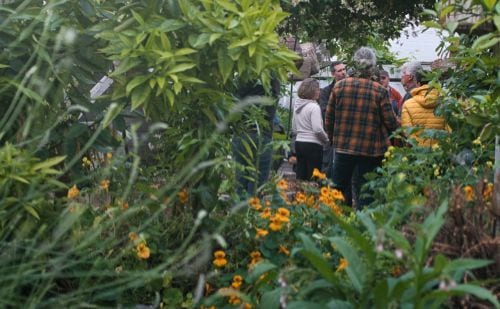
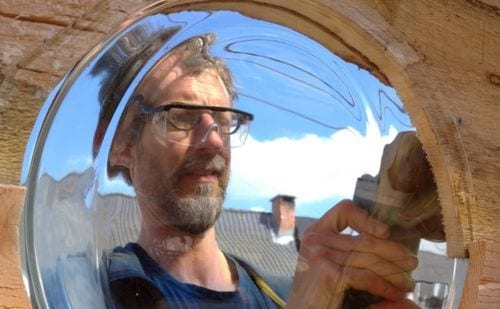
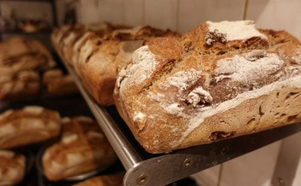
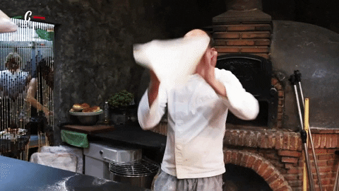
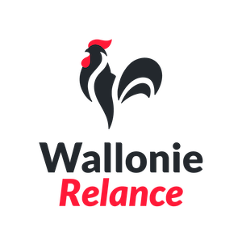
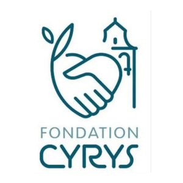

<!-- columns -->
<!-- column width="33.3%" -->

### Lieu d’activités

Un lieu où vivre des expériences innovantes et inspirantes en famille, entre ami·e·s ou entre collègues.

Nos [hébergements et salles](/sejours), [activités](/activites) et [événements](/agenda).

<!-- column width="33.3%" -->

### Lieu de nature

Une clairière de 15 hectares où l’accueil de la biodiversité fait partie intégrante de l’ADN du projet.

[La biodiversité aux 4 Sources](/biodiversite)

<!-- column width="33.3%" -->

### Lieu de vie collective

Un tiers-lieu sur lequel [différents projets](/projets) se déploient et où 5 foyers sont installés.

Découvre [notre collectif](/notre-collectif)
<!-- /columns -->

## Prochainement aux 4 Sources ⛅

**Événements**

- [👷🏻‍♀️ ⚡ COMPLET ! Initiation à la soudure à l’arc](/evenements/initiation-soudure-a-l-arc-5-septembre-2026) — Artisanat · samedi 12 septembre
- [🍕Pizza Party de septembre !](/evenements/pizza-party-septembre-2026) — Liens et convivialité · vendredi 18 septembre
- [🪵 🪓 Créer un objet en bois de palette](/evenements/weekend-ressources) — Ressourcement, Artisanat · samedi 3 octobre
- [🌼 🌻 Plantes Papier Pigments](/evenements/weekend-cratif-1) — Ressourcement, Artisanat · samedi 3 octobre
- [🖊️ 🖋️ Atelier d’écriture](/evenements/weekend-cratif) — Ressourcement, Formation · samedi 3 octobre
- [🍕 Pizza Party d’octobre ! 🍕](/evenements/pizza-party-octobre-2026) — Liens et convivialité · vendredi 9 octobre
- [👷🏻 ⚡ COMPLET ! Initiation à la soudure à l’arc](/evenements/initiation-soudure-a-l-arc-17-octobre-2026) — Artisanat · samedi 17 octobre

## Hébergements, salles polyvalentes et cuisine professionnelle 🏡

<!-- columns -->
<!-- column width="43.8%" -->

<!-- column width="56.3%" -->

Nos nombreux espaces accueillent tes séjours et activités entre collègues, entre amis ou tout simplement en famille.

- **[2 gites](/sejours/hebergements-yvoir)** pouvant accueillir jusqu’à 25 personnes
- **[une grande salle](/sejours/salles)** pour 30 à 100 personnes
- **[une petite salle](/sejours/salles)** pour 10 à 30 personnes
- une **[cuisine professionnelle](/sejours/salles)**
- **[un bivouac](/sejours/bivouac)** pour tentes et hamacs

**[Toutes nos locations](/sejours)**
<!-- /columns -->

## La Guinguette des 4 Sources 🍹

**WOW, nous avons récolté près de 20.000€ grâce à plus de 115 donatrices et donateurs !** Merci de nous avoir soutenu, maintenant à nous de jouer pour sublimer la terrasse 🙂 Et, et et… Saviez-vous qu’il était toujours possible de nous soutenir ?

<a class="button" href="/nous-soutenir">💌 Nous soutenir</a>

## Nos projets 🎴

Aux 4 Sources émergent des projets plein de sens aux valeurs partagées.

<!-- columns -->
<!-- column width="33.3%" -->

#### [Semisto](/projets/semisto)

Un collectif au service de celles et ceux qui rêvent de jardins-forêts : bureau d’études, formations et pépinière-école

<!-- column width="33.3%" -->

#### [De Branches en Planches](/projets/de-branches-en-planches)

Magnifier n’importe quel morceau de bois pour faire du beau, de l’utile et du durable

<!-- column width="33.3%" -->

#### [Tranches de Vie](/projets/tranches-de-vie)

De délicieux pains au levain cuits au feu de bois tous les vendredis
<!-- /columns -->

**[Tous les projets](/projets)**

## Randonneur ou cycliste de passage ? 🚵🏻

<!-- columns -->
<!-- column width="50%" -->

### [Le Bar des 4 Sources](/le-bar-des-4-sources)

Le bar des 4 Sources accueille les marcheur·euse·s et cyclistes du lever au coucher du soleil, ainsi que toutes les personnes de passage sur le lieu pour une activité ou une location.

<!-- column width="50%" -->

### [Carte de balades](/carte-de-balades-vallee-du-bocq)

Télécharge notre carte de randonnées au départ des 4 Sources, avec des balades et randos adaptées aux familles et aux aventuriers.
<!-- /columns -->

## Nos activités pour groupes 👥

<!-- columns -->
<!-- column width="25%" -->

<!-- column width="75%" -->

**🍕** [Une Pizza Party pour ton groupe ?](/catalogue/pizza-ou-camembert-party)

C’est possible le mardi soir et le vendredi soir aux 4 Sources ! Par temps plus frais, couplez votre Pizza Party privée avec la location de notre petite salle !

Révise ton italien et viens chanter Eros Ramazzotti en cuisant de délicieuses pizzas avec tes amis ou ta famille dans notre four à bois.

<a class="button" href="/catalogue/camembert-party">Existe aussi en Camembert Party !</a>
<!-- /columns -->

Nous te proposons **une série d’activités passionnantes** pour tes…

✔️ [Retraites scolaires](/sejours/retraites-scolaires)

✔️ [Mariages](/mariage-champetre)

✔️ [Mises au vert](/sejours/mises-au-vert) (associations et entreprises)

✔️ [Team buildings](/un-team-building-aux-4-sources)

✔️ [Week-ends familiaux et entre amis](/sejours/en-famille-aux-4-sources)

✔️ [Coworking](/coworking)

**[Tout le catalogue d’ateliers pour groupes](/activites)**

**Catalogue des activités**

- [🐎 Bain d’ânes](/catalogue/temps-avec-le-troupeau-d-anes)
- [🪢 Grimpe encadrée dans les arbres](/catalogue/grimpe-encadree-dans-les-arbres)
- [🤾🏻‍♂️ Initiation au Disc-golf](/catalogue/initiation-au-disc-golf)

## Nos soutiens 💚

<!-- columns -->
<!-- column width="33.3%" -->

<!-- column width="33.3%" -->

<!-- column width="33.3%" -->

<!-- /columns -->

[🗓️ L’agenda des 4 Sources](/agenda)

[🏡 Séjours et locations](/sejours)

[⚙️ Nos projets](/projets)

[🧉 Le bar des 4 Sources](/le-bar-des-4-sources)

[🐸 La biodiversité aux 4 Sources](/biodiversite)

[☺️ À propos des 4 Sources](/a-propos)

[📬 La newsletter des 4 Sources](/newsletter)

[📚 Retraites scolaires en pleine nature](/sejours/retraites-scolaires)

[🎂 Fêter son anniversaire en pleine nature aux 4 Sources](/anniversaire)

[💍 Un mariage champêtre aux 4 Sources](/mariage-champetre)

[🍃 Mise au vert aux 4 Sources, pour petites équipes engagées](/sejours/mises-au-vert)

[🏨 Un team building aux 4 Sources ?](/un-team-building-aux-4-sources)

[👪 Un temps en famille aux 4 Sources](/sejours/en-famille-aux-4-sources)

[🤸🏻‍♂️ Nos activités](/activites)

[📬 Nous contacter](/contact)

[📙 Catalogue des activités](/catalogue)

[🗓️ Événements](/evenements)

[🥾 Carte de balades des 4 Sources](/carte-de-balades-vallee-du-bocq)

[💼 Coworking dans la Clairière](/coworking)
