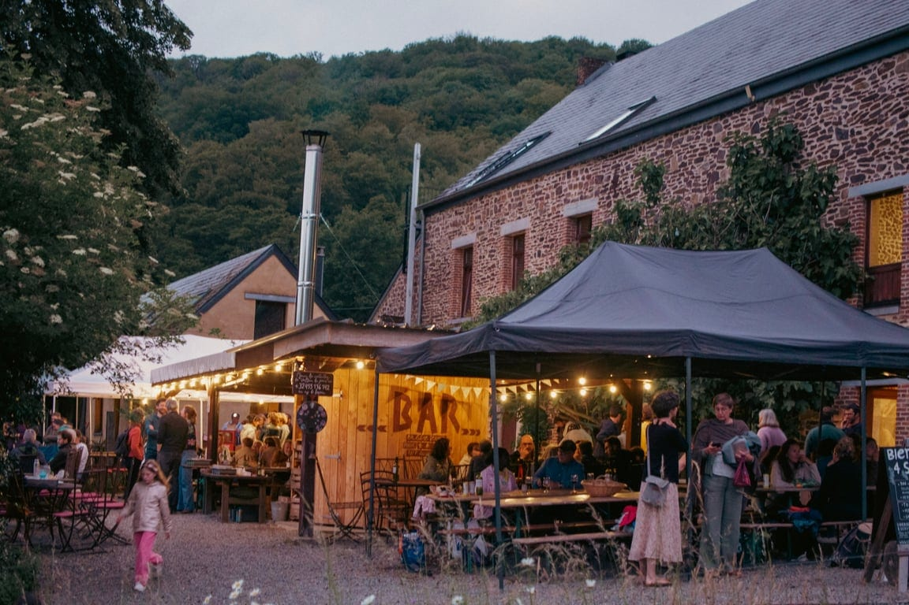
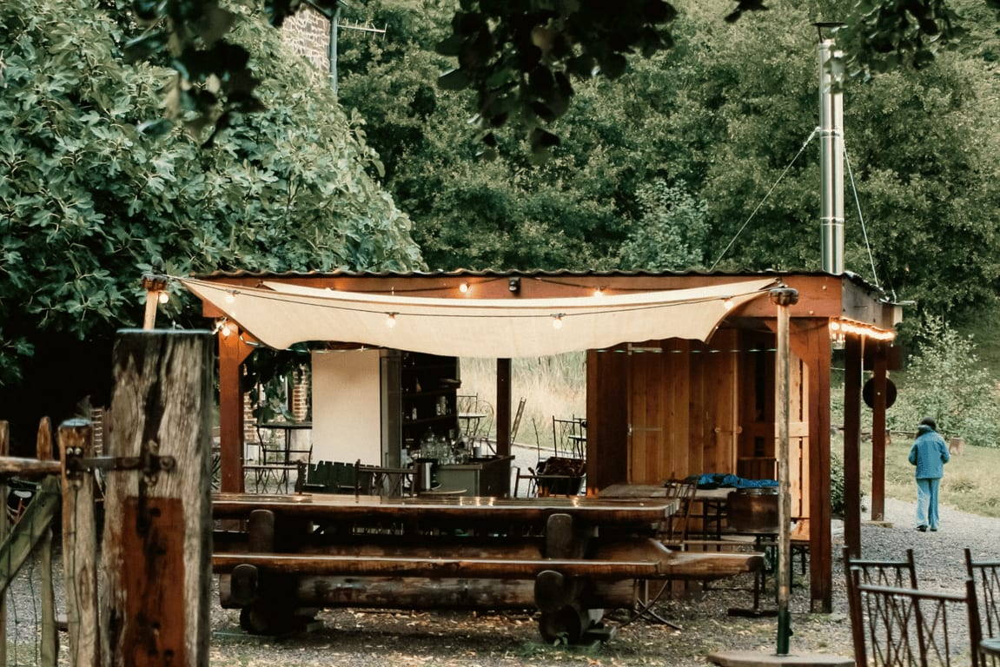
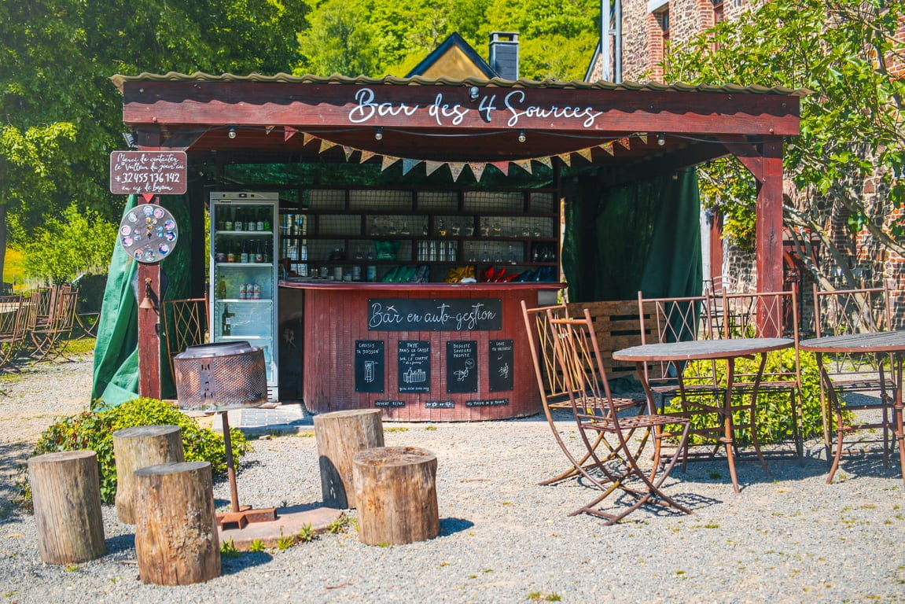
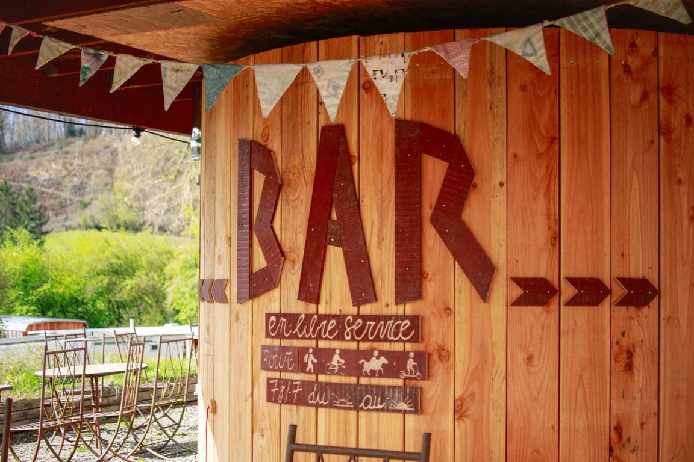

#### Le bar des 4 Sources accueille les marcheur·euse·s et cyclistes du lever au coucher du soleil, ainsi que toutes les personnes de passage sur le lieu pour une activité ou une location.

Implanté au cœur de la clairière, notre bar vous permet de profiter de la magnifique terrasse plein sud. Il est accessible à pied, à cheval ou à vélo, depuis les villages de Bauche, Crupet et Yvoir ainsi qu’à travers la Forêt domaniale de Tricointe.

L’accès en voiture est réservé à celles et ceux qui viennent pour une location ou activité organisée par Les 4 Sources.

> *“C’est magique, merci beaucoup!” P. ”Très belle découverte, concept très apprécié.” D. ”Quel bel endroit et quelle belle ambiance vous mettez dans ce vallon de nature.” S.*

<!-- columns -->
<!-- column width="50%" -->

*Pizza Party de nos 5 ans, juin 2025*

*Le bar en automne…*

<!-- column width="50%" -->

*Le bar avant sa transformation, mai 2025*

*La protection de notre super four à pain !*
<!-- /columns -->

> 🗞️ Pour être informé·e des prochains événements aux 4 Sources, [inscris-toi à notre newsletter mensuelle](/newsletter).
